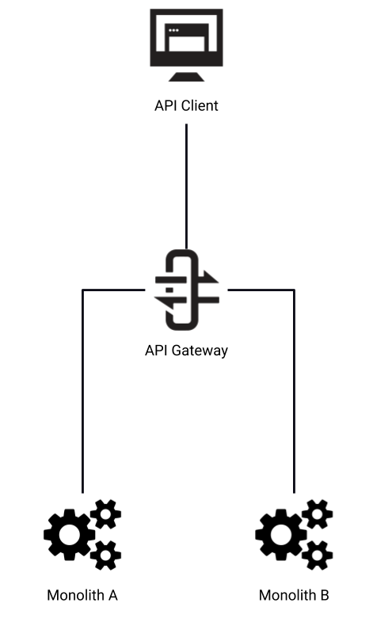
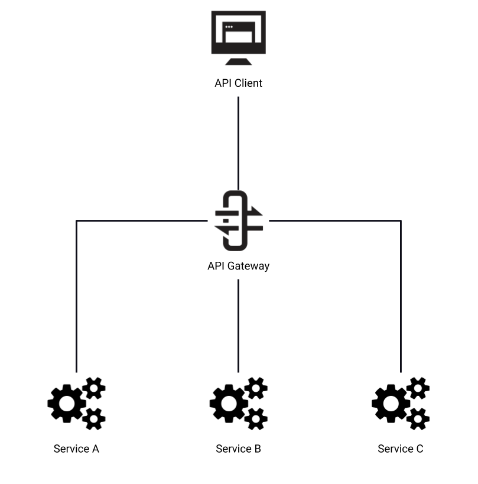
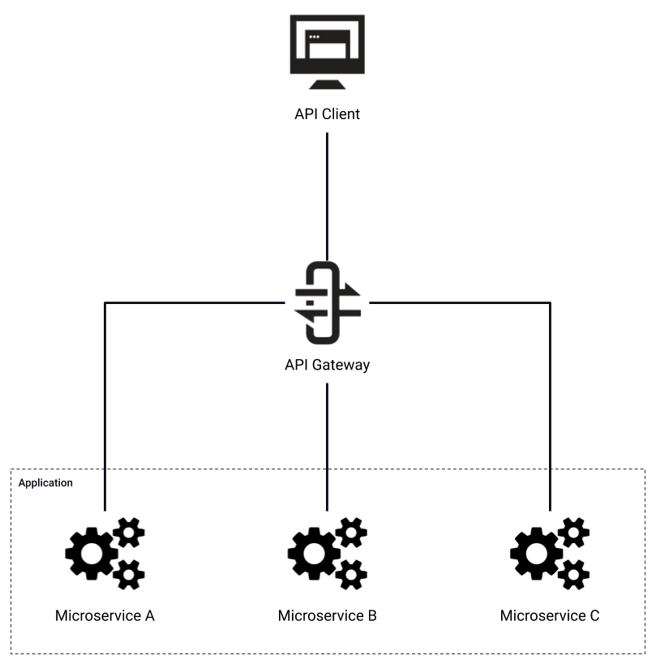
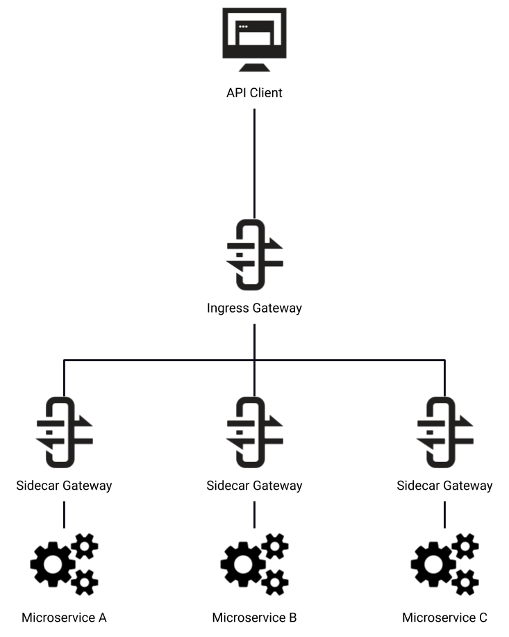

  
  <h1 style="font-size:3.15rem; line-height:1.06; font-weight:800; color:white; margin:0; max-width:420px;">Tyk Architect Certification</h1>
  
Certification Preparation Course

---
layout: default
background: 'linear-gradient(135deg, #8438FA 0%, #8438FA 35%, #BB11FF 100%)'
---

  <h1 style="font-size:3rem; color:white; font-weight:800; margin:0; text-align:center;">Tyk Deployment Models</h1>

---
layout: default
---

<h1 style="font-size:2rem; font-weight:800; color:#0b1020; margin-bottom:1.4rem;">Tyk Deployment Models</h1>

  <ul style="padding-left:1.25rem; margin:0;">
    <li style="margin-bottom:0.85rem;"><strong>On-premise</strong>
      <ul style="margin-top:0.2rem; padding-left:1.3rem;">
        <li>Tyk solution hosted on customer’s infrastructure</li>
      </ul>
    </li>
    <li style="margin-bottom:0.85rem;"><strong>Cloud</strong>
      <ul style="margin-top:0.2rem; padding-left:1.3rem;">
        <li>Tyk solution hosted on Tyk’s infrastructure</li>
      </ul>
    </li>
    <li style="margin-bottom:0.85rem;"><strong>Hybrid Cloud</strong>
      <ul style="margin-top:0.2rem; padding-left:1.3rem;">
        <li>Tyk solution hosting split between Tyk and customer infrastructure</li>
      </ul>
    </li>
    <li><strong>Hybrid On-Premise</strong>
      <ul style="margin-top:0.2rem; padding-left:1.3rem;">
        <li>Tyk solution hosted on customer infrastructure spanning multiple data centers and/or regions</li>
      </ul>
    </li>
  </ul>

---
layout: default
---

<h1 style="font-size:2rem; font-weight:800; color:#0b1020; margin-bottom:1rem;">Tyk Deployment Models: On-Premise</h1>

  <ul style="padding-left:1.25rem; margin:0;">
    <li><strong>Entire solution hosted on customer’s infrastructure</strong></li>
    <li><strong>Full control over how Tyk is deployed and maintained</strong></li>
    <li><strong>Fully customizable developer portal</strong></li>
    <li><strong>Architecture limited to single data center</strong></li>
    <li style="margin-top:0.8rem;"><strong>Install Options</strong>
      <ul style="padding-left:1.3rem; margin-top:0.25rem;">
        <li>Platforms: Docker, Kubernetes, OpenShift</li>
        <li>OS Support: RHEL/Centos, Debian/Ubuntu, Amazon Linux</li>
        <li>Cloud Host(s): Amazon AWS, GCP, Microsoft Azure, Heroku</li>
      </ul>
    </li>
  </ul>

---
layout: default
---

<h1 style="font-size:2rem; font-weight:800; color:#0b1020; margin-bottom:0.6rem;">Tyk Deployment Models: On-Premise Architecture</h1>

  <OnPremArchitecture />

---
layout: default
---

<h1 style="font-size:2rem; font-weight:800; color:#0b1020; margin-bottom:1rem;">Tyk Deployment Models: Cloud</h1>

  <ul style="padding-left:1.25rem; margin:0;">
    <li><strong>Solution hosted within Tyk infrastructure</strong></li>
    <li><strong>SaaS product, no installation required</strong></li>
    <li><strong>Single tenant, cloud infrastructure not shared with other clients</strong></li>
    <li><strong>Customer can choose which AWS region(s) to host solution</strong>
      <ul style="padding-left:1.3rem; margin-top:0.25rem;">
        <li>Regions: Singapore (ap-southeast-1), Frankfurt (eu-central-1), London (eu-west-2), N. Virginia (us-east-1), and Oregon (us-west-2)</li>
      </ul>
    </li>
    <li>Dashboard and Gateway(s) can be deployed to different regions</li>
  </ul>

---
layout: default
---

<h1 style="font-size:2rem; font-weight:800; color:#0b1020; margin-bottom:0.55rem;">Tyk Deployment Models: Cloud Architecture</h1>

  <CloudArchitecture />

---
layout: default
---

<h1 style="font-size:2rem; font-weight:800; color:#0b1020; margin-bottom:1rem;">Tyk Deployment Models: Hybrid Cloud</h1>

  <ul style="padding-left:1.25rem; margin:0;">
    <li><strong>Hosting split between Tyk and customer’s infrastructure</strong></li>
    <li><strong>Tyk Hosts:</strong> Dashboard, Portal, MongoDB, and the primary Redis instance</li>
    <li><strong>Customer Hosts:</strong> Gateways and local Redis instance(s)</li>
    <li>Allows customers to put their gateways in closer proximity to their upstream endpoints</li>
    <li>Gateways and local Redis instance(s) is/are ephemeral so these can be spun up and down without worry about the loss of data, as all data is persisted on the primary Redis instance</li>
    <li>All API traffic is routed via client’s infrastructure, no API traffic passes through Tyk’s network</li>
    <li><strong>Requires the Multi Data Centre Bridge component</strong></li>
  </ul>

---
layout: default
---

<h1 style="font-size:2rem; font-weight:800; color:#0b1020; margin-bottom:0.55rem;">Tyk Deployment Models: Hybrid Cloud Architecture</h1>

  <HybridArchitecture />

<!-- Notes: All API traffic is routed through client’s infrastructure.
Only Tyk specific data (API configurations, Policy Defs, Rate Limits, Analytics) is transferred between Gateway instances.
The Gateway instance that sits in the Tyk infrastructure is only used by the Dashboard for key generation; it does not proxy any API traffic.
MDCB and Hybrid clients, instead of writing data to a temporary Redis list, send it directly to the MDCB server, which processes them similar to Pump. -->

---
layout: default
---

<h1 style="font-size:2rem; font-weight:800; color:#0b1020; margin-bottom:1rem;">Tyk Deployment Models: On-Premise</h1>

  <ul style="padding-left:1.25rem; margin:0;">
    <li><strong>Solution hosted entirely on client’s infrastructure with no reliance on Tyk Cloud</strong></li>
    <li><strong>Clients responsible for hosting of master and slave clusters</strong></li>
    <li><strong>Can span multiple data centers and work across multiple regions</strong></li>
    <li><strong>Requires the Multi Data Centre Bridge component</strong></li>
  </ul>

---
layout: default
---

<h1 style="font-size:2rem; font-weight:800; color:#0b1020; margin-bottom:0.55rem;">Tyk Deployment Models: On-Premise Architecture</h1>

  <MultiDcArchitecture />

---
layout: default
background: 'linear-gradient(135deg, #8438FA 0%, #8438FA 35%, #BB11FF 100%)'
---

  <h1 style="font-size:3rem; color:white; font-weight:800; margin:0; text-align:center;">Software Architectures</h1>

---
layout: default
---

<h1 style="font-size:2rem; font-weight:800; color:#0b1020; margin-bottom:0.9rem;">Software Architectures: Monolith</h1>

  

    <ul style="padding-left:1.25rem; margin:0; list-style:disc;">
      <li><strong>Monoliths are self-contained systems</strong></li>
      <li><strong>API Gateway enables communication between consumers and monolithic applications</strong></li>
      <li><strong>Transformation of protocols and data</strong></li>
      <li><strong>Integration with legacy applications</strong></li>
    </ul>
  

  

    
  

<!-- Notes: Monoliths contain all of their functionality within a single, self-contained application.
Since monoliths are single applications, they typically do not have any requirements for intra-service communication. However, they may need to communicate with other monoliths or, more commonly, have external systems communicate with them. In these scenarios, the API Gateway can provide the typical API Gateway functionality of authentication and authorisation.
In addition to this, for older monolithic applications which do not support modern protocols or data formats, the Gateway can provide protocol and data transformation to make it easier to access and work with them.
The Gateway can also utilise custom middleware to provide a means of integrating with legacy applications, which would have otherwise operated within a silo. -->

---
layout: default
---

<h1 style="font-size:2rem; font-weight:800; color:#0b1020; margin-bottom:0.9rem;">Software Architectures: Service Oriented Architecture</h1>

  

    <ul style="padding-left:1.25rem; margin:0; list-style:disc;">
      <li><strong>Services are discrete units of functionality</strong></li>
      <li><strong>Centralised Gateway manages all traffic between consumers and services</strong></li>
      <li><strong>Gateway implements common controls, such as authentication, authorisation, rate limiting and quotas</strong></li>
      <li><strong>Service Discovery used to locate services</strong></li>
    </ul>
  

  

    
  

<!-- Notes: The next step from monoliths are service oriented architectures (or SOA). This technique breaks applications into separate services, which perform discrete units of functionality. These units are designed to be accessed remotely, creating interconnected systems and services which are dependant on each other.
In this scenario the Gateway manages traffic between both consumers and the services themselves.
Since SOA promotes an increased number of applications communicating over the network, there is greater benefit in implementing common functionality at the API Gateway level, such as authentication, authorisation, rate limiting and quotas.
The Gateway can use Service Discovery to automatically adapt to changes in the services to which it is proxying. -->

---
layout: default
---

<h1 style="font-size:2rem; font-weight:800; color:#0b1020; margin-bottom:0.9rem;">Software Architectures: Microservices</h1>

  

    <ul style="padding-left:1.25rem; margin:0; list-style:disc;">
      <li><strong>Architecturally similar to SOA, but services are decomposed to a smaller scope</strong></li>
      <li><strong>Higher interconnectivity between systems</strong></li>
      <li><strong>Benefits for Microservice architectures:</strong>
        <ul style="padding-left:1.2rem; margin-top:0.2rem;">
          <li>Distributed tracing</li>
          <li>Centralised logging</li>
          <li>Centralised analytics</li>
          <li>Access control</li>
        </ul>
      </li>
    </ul>
  

  

    
  

<!-- Notes: Microservices are a variant of the SOA approach, but the services have a smaller scope, with lightweight protocols and data formats. A single application may contain tens, hundreds or thousands of individual services.
This results in higher interconnectivity between systems and reliance on the network.
The increased number of systems and connections can present problems, which the API Gateway can solve:
Tracing of traffic between services
Centralised application logging
Centralised usage analytics
Access control between services -->

---
layout: default
---

<h1 style="font-size:2rem; font-weight:800; color:#0b1020; margin-bottom:0.9rem;">Software Architectures: Service Mesh</h1>

  

    <ul style="padding-left:1.25rem; margin:0; list-style:disc;">
      <li><strong>Services are paired with Sidecar Gateways</strong>
        <ul style="padding-left:1.2rem; margin-top:0.2rem;">
          <li>Deployed within the same container</li>
          <li>Controlled by 3rd party tooling, such as Istio</li>
        </ul>
      </li>
      <li><strong>Ingress Gateway controlled by Tyk</strong></li>
      <li><strong>Benefits for Service Mesh architectures:</strong>
        <ul style="padding-left:1.2rem; margin-top:0.2rem;">
          <li>Automation of traffic flows</li>
          <li>Centralised policy enforcement and monitoring</li>
        </ul>
      </li>
    </ul>
  

  

    
  

<!-- Notes: Service mesh is a variant of the microservices approach. It adds additional Gateways, called Sidecar Gateways, which are paired with Services.
This approach is often deployed with container orchestration and service mesh tooling, such as Kubernetes and Istio, with each Sidecar Gateway and Service pair deployed into the same container.
Tyk’s part of this architecture is as the Ingress Gateway, controlling access into the service mesh from external API Clients.
The benefit of a service mesh architecture is that it automates how traffic flows over the network. The Sidecar Gateways handle all the routing and authentication between services, so this information does not need to be included in the Service’s logic, making them simpler. The tooling around the service mesh also gives centralised policy enforcement and monitoring services, which are especially useful when dealing with large quantities of services. -->
