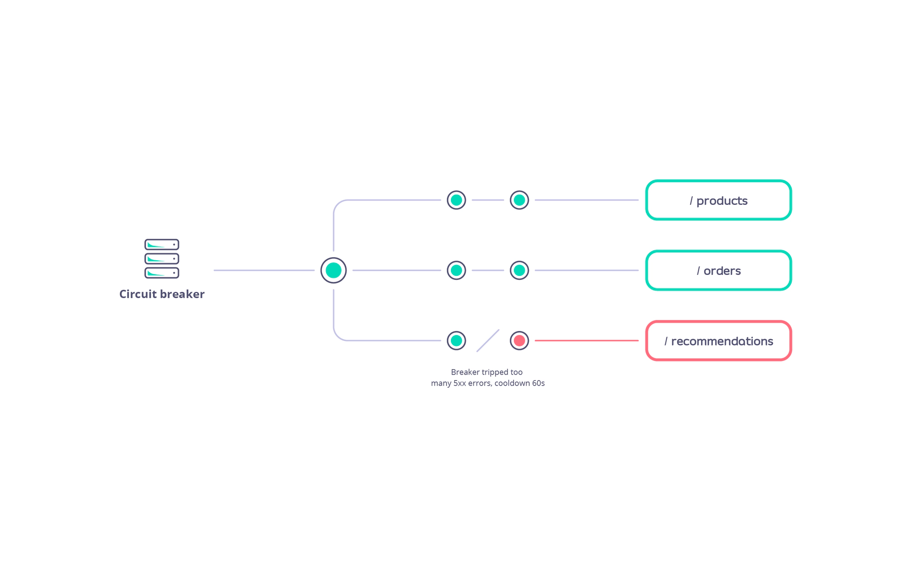

# Circuit Breakers

---
layout: default
---

# Circuit Breakers

## What is a Circuit Breaker?

- A protective mechanism that maintains system stability.
- Prevents repeated failures and overloading of failing services.
- Temporarily blocks calls to unstable services, allowing them time to recover.
- Ensures overall system continues functioning during partial failures.

## Circuit Breakers in Tyk

- Configurable per endpoint.
- Monitors HTTP 500+ response rates from upstream services.
- If failures exceed a threshold:
  - Circuit breaker trips.
  - Tyk blocks further requests to that endpoint.
  - Returns HTTP 503 to clients.
- After a defined cooldown period, the breaker resets and resumes traffic.

<!-- Notes: In distributed systems, failure is inevitable—but system-wide failure doesn't have to be. This is where circuit breakers come in. They act as a protective mechanism, stopping repeated calls to a service that's already failing. This prevents overload and gives the faulty service time to recover, helping the rest of the system remain operational.
Tyk offers powerful circuit breaker capabilities that can be configured at the endpoint level. It tracks how often upstream services return error responses—specifically those with HTTP status codes of 500 and above. If the failure rate crosses a predefined threshold, the circuit breaker trips. Tyk will then block any more requests to that endpoint, returning a 503 response to clients instead. This block remains in place for a set cooldown period. -->

---
layout: default
---

  

  

    
  

<!-- Notes: GraphQL is a modern way to work with APIs. It lets clients define exactly what data they need, which means we're no longer over-fetching or under-fetching like we often do with REST.
One of the biggest advantages is the ability to make a single request for complex, nested data — instead of stitching together multiple REST calls. This leads to cleaner, more efficient frontends, especially in mobile and data-rich applications.
Flexibility is another win — GraphQL is backend-agnostic, and works across languages and data sources.
Strong typing and introspection allow developers to confidently build and explore APIs. Combined with the ability to evolve schemas without breaking clients, GraphQL is not just powerful — it's sustainable for growing teams and complex systems. -->

---
layout: default
---

# Circuit Breakers

## Event Integration

**Tyk can emit events:**

- When the circuit breaker trips.
- When it resets.

**Use these events for:**

- Monitoring & alerting.
- Automation of recovery workflows.

<!-- Notes: What's more, Tyk can trigger events when the breaker trips and resets. These events can be consumed by your monitoring or alerting systems—or even used to automate recovery processes. This feature strengthens your observability and reinforces the resilience of your API architecture. -->

---
layout: default
---

# Circuit Breakers

## 1. Protection of Critical API Endpoints

- Prevents overload of essential APIs
- Ensures uptime and responsiveness under failure scenarios

## 2. Handling Temporary Issues

- Automatically detects and responds to service degradation
- Opens and closes the circuit based on health, allowing recovery

## 3. Implementing Retry Logic

- Manages retries after a cooldown period
- Avoids flooding unstable services with repeated calls

## 4. Enabling Fallback Mechanisms

- Triggers alternate flows when primary services fail
- Supports graceful degradation of service

<!-- Notes: Circuit breakers are an essential pattern when building resilient APIs, especially in distributed systems.
First, they're ideal for protecting critical endpoints. If an upstream service starts failing, circuit breakers stop repeated calls from overwhelming it. This helps maintain availability and responsiveness of essential APIs.
Second, they're useful for handling temporary issues—like a service momentarily going down or slowing due to high load. The breaker opens when things are bad and closes once stability returns, letting the system recover naturally.
Third, circuit breakers play a key role in managing retry logic. Instead of flooding a failing service with retries, they enforce a cooldown period before trying again—this increases the chance of success without overloading the backend.
Finally, circuit breakers can help you implement fallback mechanisms. If a service fails, the breaker can trigger alternative workflows or degraded responses—keeping the user experience intact even during partial failures. -->
