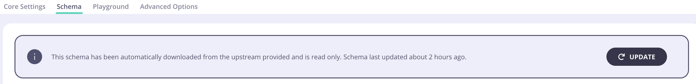

  <h1 style="position:absolute; left:84px; top:40px; margin:0; font-size:58px; line-height:1; font-weight:800; letter-spacing:-1px; color:#5A16D6;">Managing Schema</h1>

  

    
Keeping Your Schema in Sync:

    
Schema updates may be needed when your upstream GraphQL service changes.

    
The Tyk Dashboard displays the last sync timestamp for your API schema.

  

  

    
  

  

    
Syncing the Schema:

    
Click "Get latest version" to fetch the schema via introspection query.

    
Then, click "Update" (top right) to apply the new schema.

  

  

    
Upstream Authentication (if protected):

    
Navigate to: API &gt; Advanced Options &gt; Upstream Auth Headers

    
Add your Authorization Header (e.g., bearer token or basic auth).

  

  

    
  

<!-- Notes: Once your GraphQL Proxy Only API is set up, it’s important to keep the schema in sync with your upstream service. Over time, your upstream GraphQL service may evolve — maybe new queries are added, fields are removed, or types are renamed. Tyk doesn’t automatically update the schema on your behalf — you’ll need to manually re-sync it to reflect those changes. To help with this, the Tyk Dashboard displays the last sync timestamp for the schema. This makes it easy to tell if it’s been a while since the last update. Go to your API in the Tyk Dashboard. Click “Get latest version” — this will run a fresh introspection query against your upstream. Once the schema loads, click “Update” in the top-right corner to apply the new schema to your Tyk API. And just like that, your API is now working with the latest schema from your backend. Now, if your upstream service is protected — for example, it requires an authorization token — you need to make sure Tyk can authenticate before fetching the schema. To do this: Navigate to your API in the Dashboard. Go to Advanced Options > Upstream Auth Headers. Add your Authorization header — for example, a Bearer token or Basic Auth credentials. Tyk will then include this header whenever it runs an introspection query or forwards requests to the upstream — ensuring everything continues to work securely. -->