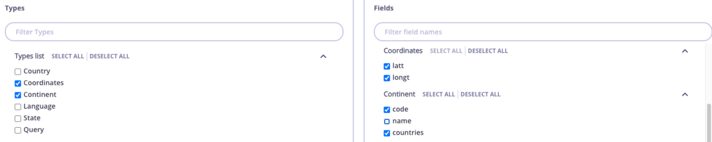
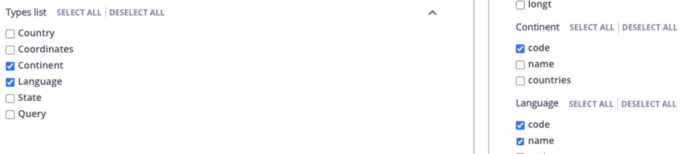

<h1 style="color:#5900CB; font-size:1.8rem; font-weight:bold; margin-bottom:0.8rem;">Understanding the GraphQL Schema</h1>

  

    
GraphQL Schema

    <pre style="color:#e0e0e0; font-size:0.6rem; margin:0; font-family:monospace; line-height:1.5; white-space:pre;">type Query {
  accounts: [Account!]
}
type Account {
  owner: String!
  number: ID!
  balance: Float!
}</pre>
  

  

    
Query: The entry point of your API

    
accounts returns a list of Account objects

    
Account Type:

    <ul style="padding-left:1.2rem; margin-top:0.3rem;">
      <li><strong>owner:</strong> Name of account holder</li>
      <li><strong>number:</strong> Unique account number</li>
      <li><strong>balance:</strong> Sensitive field showing current balance</li>
    </ul>
  

<!-- Notes: Let's take a look at a basic GraphQL query structure for our API.
The entry point for this API is a query called accounts.
When this query is executed, it returns a list of Account objects.

Now, what does an Account object look like?
Here are its key fields:
owner: This is the name of the account holder — a simple string field.
number: This is the unique account number, which identifies the account.
balance: This is a sensitive field — it shows the current balance in the account.

Depending on your use case, you may want to apply fine-grained access control to fields like balance, especially if different users or roles should see different levels of information.
This is where Tyk's GraphQL security features — like field-level permissions and policies — can really shine. -->

---
layout: default
---

<h1 style="color:#5900CB; font-size:1.8rem; font-weight:bold; margin-bottom:0.8rem;">Why Use Field-Based Permissions?</h1>

  

    
Not every API consumer should see everything.

    
Internal user can query:

    

      
GraphQL Query

      <pre style="color:#e0e0e0; font-size:0.55rem; margin:0; font-family:monospace; line-height:1.5; white-space:pre;">query {
  accounts {
    owner
    number
    balance
  }
}</pre>
    

  

  

    
External user tries to access balance and gets:

    

      
Error Response

      <pre style="color:#e0e0e0; font-size:0.55rem; margin:0; font-family:monospace; line-height:1.5; white-space:pre;">{
  "errors": [
    {
      "message": "field: balance is restricted on type: Account"
    }
  ]
}</pre>
    

  

<!-- Notes: In GraphQL, it's easy to request only the data you need — which is a powerful feature.
But with that power comes a risk: Not every API consumer should be able to see everything.
For example:
An internal user — like a back-office system — might be allowed to query all fields of the Account type, including sensitive data like the account balance.

query {
  accounts {
    owner
    number
    balance
  }
}

This is perfectly fine for trusted internal users.

However, when an external user — say, a third-party developer — tries to run the same query, they may not be authorized to see sensitive fields like balance.
Instead of getting the data, they get a clear error message:

{
  "errors": [
    {
      "message": "field: balance is restricted on type: Account"
    }
  ]
}

This is the result of field-based permissions configured in Tyk.

Why This Matters:
It enforces least privilege access — consumers only see what they're allowed to.
It reduces the risk of data leakage.
And it helps you comply with data protection and regulatory requirements, especially when exposing APIs to third parties.

So, field-based permissions are an essential part of a secure and well-governed GraphQL API strategy. -->

---
layout: default
---

<h1 style="color:#5900CB; font-size:1.8rem; font-weight:bold; margin-bottom:0.8rem;">Setting Up Field Based Permissions</h1>

  
Restricted and allowed types and fields can also be set up via Tyk Dashboard.

  

    

      

        
Optional: Configure a Policy

        
System Management &gt; Policies &gt; Add Policy

      

    

    

      

        
Apply to a Key

        
System Management &gt; Keys &gt; Add Key — select a policy or configure directly for the key.

      

    

  

  

    
Key Points:

    <ul style="padding-left:1.2rem; margin:0.3rem 0 0 0;">
      <li>Select your GraphQL API (marked as <strong>GraphQL</strong>).</li>
      <li>Enable either <strong>Block list</strong> or <strong>Allow list</strong>. By default, both are disabled.</li>
      <li>It's not possible to have both enabled at the same time — enabling one switch automatically disables the other.</li>
    </ul>
  

<!-- Notes: Tyk makes it easy to manage field-level permissions for your GraphQL APIs — right from the Dashboard.
You can restrict or allow access to specific types and fields using either a block list or an allow list.
Here's how you can set it up:

Step 1: Define Access via a Policy (Optional)
Navigate to: System Management > Policies > Add Policy
In the policy, select your GraphQL API — it'll be marked clearly as a GraphQL type.
You'll see two switches: Block list and Allow list.
Important note: You can enable either the block list or the allow list — not both. Turning on one will automatically disable the other.
Use the UI to select which fields or types to block or allow.

Step 2: Apply the Policy to a Key
Go to: System Management > Keys > Add Key
You can either:
Attach the policy you just created, or
Directly define GraphQL permissions for this key in the interface.

This allows you to customize access per client, ensuring internal and external users only see what they're allowed to.

Why This Matters
This approach gives you fine-grained control without changing your upstream service — all access logic is handled by Tyk at the gateway level.
It's a great way to enforce privacy, protect sensitive data, and customize access based on user roles or API clients. -->

---
layout: default
---

<h1 style="color:#5900CB; font-size:1.8rem; font-weight:bold; margin-bottom:0.8rem;">Setting Up Field Based Permissions - Blocklist</h1>

  
By default all Types and Fields will be unchecked. By checking a Type or Field you will <strong>disallow</strong> to use it for any GraphQL operation associated with the key.

  
For example, the settings illustrated below would block the following:

  <ul style="padding-left:1.2rem; margin-top:0.3rem;">
    <li><strong>code</strong> and <strong>countries</strong> fields in <code style="background:#E8E0FF; padding:2px 6px; border-radius:3px;">Continent</code> type.</li>
    <li><strong>latt</strong> and <strong>longt</strong> fields in <code style="background:#E8E0FF; padding:2px 6px; border-radius:3px;">Coordinates</code> type.</li>
  </ul>

  

<!-- Notes: By default, all Types and Fields are unchecked in the permissions settings.
This means everything is allowed unless you explicitly block something.
When you check a Type or Field, you're telling Tyk to disallow access to that part of the schema for any GraphQL operations made using the associated API key.
For example, in the settings shown here:
The fields code and countries on the Continent type are blocked.
The fields latt and longt on the Coordinates type are blocked as well.
So if a client tries to query these blocked fields, they will get an error — access will be denied.
This allows you to precisely control which parts of your GraphQL API clients can access, helping secure sensitive or irrelevant data without modifying your backend. -->

---
layout: default
---

<h1 style="color:#5900CB; font-size:1.8rem; font-weight:bold; margin-bottom:0.8rem;">Setting Up Field Based Permissions - Allowlist</h1>

  
By default all Types and Fields will be unchecked. By checking a Type or Field you will <strong>allow</strong> it to be used for any GraphQL operation associated with the key.

  
For example, the settings illustrated below would only allow the following:

  <ul style="padding-left:1.2rem; margin-top:0.3rem;">
    <li><strong>code</strong> field in <code style="background:#E8E0FF; padding:2px 6px; border-radius:3px;">Continent</code> type.</li>
    <li><strong>code</strong> and <strong>name</strong> fields in <code style="background:#E8E0FF; padding:2px 6px; border-radius:3px;">Language</code> type.</li>
  </ul>

  

<!-- Notes: By default, all Types and Fields are unchecked in the permissions settings.
In this case, that means nothing is allowed until you explicitly allow access.
When you check a Type or Field, you are granting permission for that part of the schema to be used in any GraphQL operation associated with the API key.
For example, in the settings shown here:
Only the code field on the Continent type is allowed.
And for the Language type, only the code and name fields are allowed.
Any attempt by the client to query fields outside of these allowed ones will be blocked.
This approach is useful when you want a strict allow-list policy to tightly control what data clients can access, ensuring maximum security and compliance. -->
