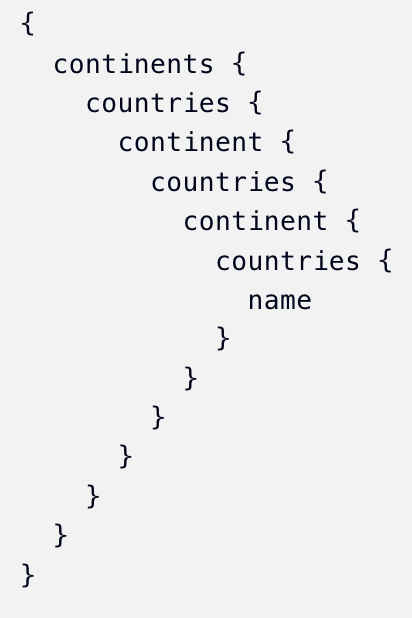

  
Complexity Limiting

  

    
GraphQL Complexity Limiting

    
Even with a simple schema, deeply nested or resource-heavy operations can overload your upstream services.

  

  
type Query { &nbsp;&nbsp;continents: [Continent!]! }  type Continent { &nbsp;&nbsp;name: String! &nbsp;&nbsp;countries: [Country!]! }  type Country { &nbsp;&nbsp;name: String! &nbsp;&nbsp;continent: Continent! }

  

    

    
Tyk

  

<!-- Notes: "GraphQL is incredibly powerful and flexible, allowing clients to request exactly the data they need. However, this flexibility comes with a risk — even with a simple schema, clients can craft deeply nested queries or request large amounts of data in a single operation. Such complex or resource-heavy queries can put significant strain on your upstream services, leading to slow response times, increased server load, and potentially downtime. To prevent this, GraphQL complexity limiting is a vital safeguard. It helps us define thresholds for query depth and resource usage, effectively protecting our backend from expensive or malicious queries. By enforcing complexity limits, we ensure our API remains responsive and stable for all users, while still giving clients the flexibility they need. In the next section, we’ll explore how Tyk Universal Data Graph lets you set and enforce these complexity limits easily." -->

---
layout: default
---

  
Complexity Limiting

  
Deeply Nested Query Example

  
  
This query is valid, but heavily recursive and can stress your backend.

  

    

    
Tyk

  

---
layout: default
---

  
Complexity Limiting

  

    
Limit query depth by setting a max depth in:

    
•A Policy

    
•An Individual Key

  

  

    
Query Depth = 2

    
{ &nbsp;&nbsp;continents { &nbsp;&nbsp;&nbsp;&nbsp;name &nbsp;&nbsp;} }

  

  

    
Query Depth = 3

    
{ &nbsp;&nbsp;continents { &nbsp;&nbsp;&nbsp;&nbsp;countries { &nbsp;&nbsp;&nbsp;&nbsp;&nbsp;&nbsp;name &nbsp;&nbsp;&nbsp;&nbsp;} &nbsp;&nbsp;} }

  

  

    
When Depth Limit is Exceeded:

    
Tyk will block the query and respond with:

    
{ &nbsp;&nbsp;&quot;error&quot;: &quot;depth limit &nbsp;&nbsp;exceeded&quot; }

  

  

    

    
Tyk

  

<!-- Notes: To protect your GraphQL API from overly complex or expensive queries, you can limit the query depth. This helps prevent performance issues and potential abuse. You can set a maximum query depth in two places: At the Policy level, which applies to all keys associated with that policy. Or at the individual API Key level, for more granular control. Setting these limits ensures your API stays performant and secure by restricting how deeply clients can nest their queries. -->
