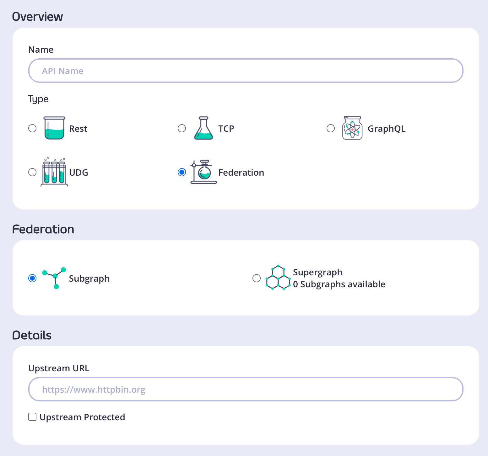
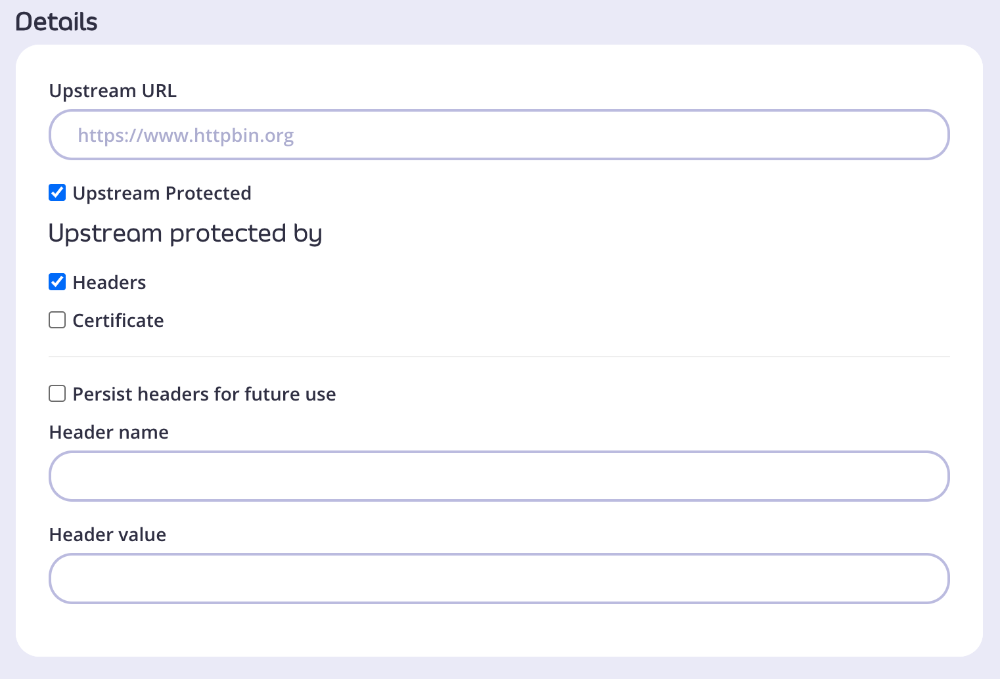
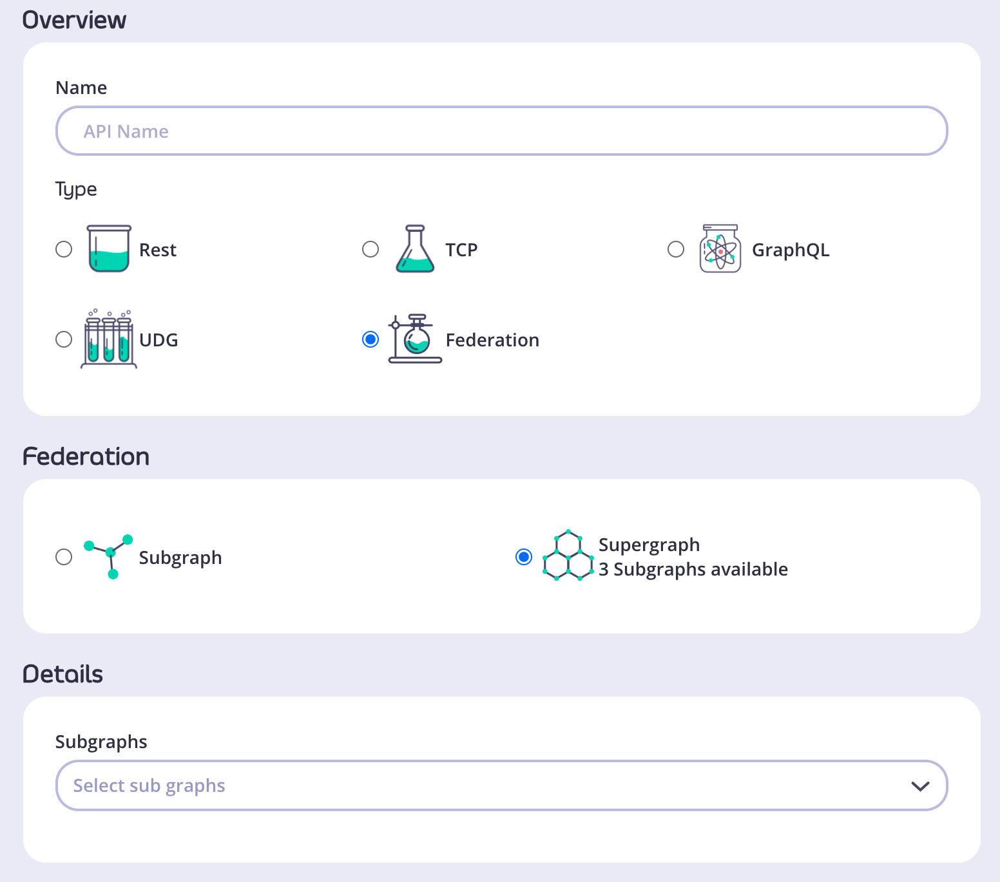
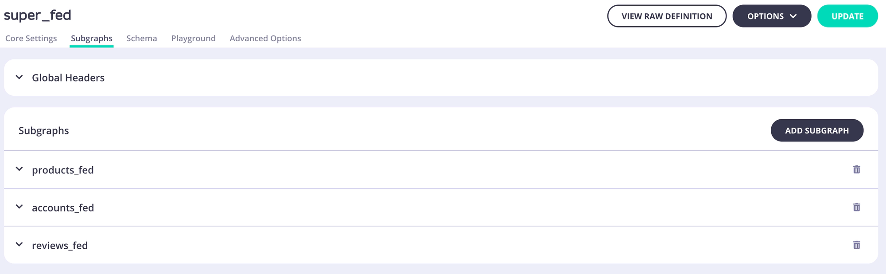

  
Module 2

  <h1 style="color:white; font-size:3.6rem; line-height:0.96; font-weight:700; margin:0; max-width:420px;">GraphQL Federation</h1>

---
layout: default
---

<h2 style="color:#5900CB; font-size:1.8rem; font-weight:bold; margin-bottom:1.5rem;">What is GraphQL Federation</h2>

<ul style="font-size:1.05rem; line-height:1.7; color:#03031C; padding-left:1.2rem;">
  <li>GraphQL Federation solves the complexity of scaling GraphQL in large enterprises.</li>
  <li>Allows you to break down monolithic GraphQL services into multiple backend services.</li>
  <li>Tyk (v4.0+) supports federation to expose multiple services as a single, unified graph.</li>
  <li>Simplifies maintenance and encourages service ownership.</li>
</ul>

<!-- Notes: When enterprises adopt GraphQL, they quickly realize that centralizing everything into a single GraphQL service doesn't scale well—it becomes hard to manage, and teams step on each other's toes. GraphQL Federation addresses this by enabling multiple services to define parts of the graph independently. With Tyk's federation support, you can stitch these services into a unified API surface—making it easier for teams to work independently while offering a seamless experience to API consumers. -->

---
layout: default
---

  

<!-- Notes: What you're looking at is the architecture enabled by GraphQL Federation in Tyk. In the center, we have the Supergraph, which represents the unified GraphQL schema exposed to consumers. It acts as a single endpoint but is actually composed of several Subgraphs—each one backed by a different backend service or domain team. All these subgraphs are stitched together within the Tyk Gateway. This is key: Tyk is not just routing requests. It acts as the control layer that applies essential API management features like Authentication, Authorization, Rate Limiting, Monitoring & Tracing. At the bottom, you see arrows going to mobile apps, web clients, and other consumers. From their perspective, it's just one GraphQL API. But behind the scenes, it's a cleanly separated and scalable architecture. This setup empowers teams to own and deploy their own subgraphs independently, while Tyk stitches everything together securely and reliably. -->

---
layout: default
---

<h2 style="color:#5900CB; font-size:1.8rem; font-weight:bold; margin-bottom:1.5rem;">Subgraphs and Supergraphs</h2>

<ul style="font-size:1.05rem; line-height:1.7; color:#03031C; padding-left:1.2rem;">
  <li style="margin-bottom:0.8rem;">Subgraph is a representation of a back-end service and defines a distinct GraphQL schema. It can be queried directly as a separate service or it can be federated into a larger schema of a supergraph.</li>
  <li>Supergraph is a composition of several subgraphs that allows the execution of a query across multiple services in the backend.</li>
</ul>

---
layout: default
---

<h2 style="color:#5900CB; font-size:2.25rem; font-weight:700; margin-bottom:0.95rem;">Subgraph Examples</h2>

  

    
Users

    <pre style="color:#4b5563; font-size:0.82rem; margin:0; font-family:monospace; line-height:1.55; white-space:pre;">extend type Query {
  me: User
}
type User @key(fields: "id") {
  id: ID!
  username: String!
}</pre>
  

  

    
Products

    <pre style="color:#4b5563; font-size:0.72rem; margin:0; font-family:monospace; line-height:1.5; white-space:pre;">extend type Query {
  topProducts(first: Int = 5): [Product]
}
extend type Subscription {
  updatedPrice: Product!
  updateProductPrice(upc: String!): Product!
  stock: [Product!]
}
type Product @key(fields: "upc") {
  upc: String!
  name: String!
  price: Int!
  inStock: Int!
}</pre>
  

<!-- Notes: Let's walk through a couple of subgraph examples that demonstrate how teams can independently define parts of a federated schema. First, the Users subgraph: We're extending the Query type with a new field called me, which returns a User. The User type is marked with @key(fields: "id"). This tells the federation system that id is the unique identifier for this entity, and other subgraphs can reference or resolve this user using the id field. This subgraph might be owned by the Identity or Auth team, focused solely on user data. Now the Products subgraph: Here, the Query type is extended again, this time with a topProducts field that returns a list of products. This subgraph also extends Subscription with live updates like updatedPrice and stock—so you can enable real-time features in the same graph. The Product type is defined with a @key(fields: "upc"), meaning the unique product code (UPC) identifies each product entity across the supergraph. This subgraph is likely owned by the eCommerce or Inventory team. By breaking these definitions out into subgraphs and federating them, we maintain team autonomy, deployment flexibility, and a unified API interface for consumers—this is the real power of GraphQL Federation with Tyk. -->

---
layout: default
---

<h2 style="color:#5900CB; font-size:1.8rem; font-weight:bold; margin-bottom:1rem;">Subgraph Examples</h2>

  
Reviews

  <pre style="color:#e0e0e0; font-size:0.55rem; margin:0; font-family:monospace; line-height:1.45; white-space:pre;">type Review {
  body: String!
  author: User! @provides(fields: "username")
  product: Product!
}
extend type User @key(fields: "id") {
  id: ID! @external
  username: String! @external
  reviews: [Review]
}
extend type Product @key(fields: "upc") {
  upc: String! @external
  reviews: [Review]
}</pre>

<!-- Notes: Now let's look at an example that highlights how subgraphs interact with each other—using the Review subgraph. We start with the Review type, which defines fields for the review body, its author, and the related product. Notice the use of @provides(fields: "username") on the author field—this tells the supergraph that the Review subgraph can provide the username field from the User entity, even though it doesn't own the User type. Below that, we see how the User type is extended from another subgraph: It's marked with @key(fields: "id"), meaning id is used to uniquely identify a User across subgraphs. Both id and username are marked @external, because they are owned by the original User subgraph. The reviews field is added by this subgraph to enrich the User entity with related reviews. Similarly, the Product type is also extended: It uses the same pattern with @key and @external to integrate fields like upc, which is owned by the Products subgraph. Then, it adds a new reviews field to the Product entity. These patterns follow subgraph conventions in GraphQL Federation: Subgraphs can reference types defined in other subgraphs. Subgraphs can extend those types with additional fields. To make this work, any entity being shared across subgraphs must use the @key directive—this makes it an entity that others can build on. This modular, team-owned design allows you to scale your GraphQL architecture without building one giant monolithic schema. -->

---
layout: default
---

  
After federating all subgraphs in Tyk, the unified supergraph schema looks like:

  <pre style="color:#e0e0e0; font-size:0.48rem; margin:0; font-family:monospace; line-height:1.4; white-space:pre;">type Query {
  topProducts(first: Int = 5): [Product]
  me: User
}
type Subscription {
  updatedPrice: Product!
  updateProductPrice(upc: String!): Product!
  stock: [Product!]
}
type Review {
  body: String!
  author: User!
  product: Product!
}
type Product {
  upc: String!
  name: String!
  price: Int!
  inStock: Int!
  reviews: [Review]
}
type User {
  id: ID!
  username: String!
  reviews: [Review]
}</pre>

<!-- Notes: Once we've defined and registered all our subgraphs—like Users, Products, and Reviews—we federate them into a single supergraph within the Tyk Gateway. Here, you can see the complete schema that gets exposed to the client. It merges the capabilities of each subgraph: topProducts and subscriptions come from the Products subgraph, me and user details from the Users subgraph, Review ties it all together—pulling user and product data from other subgraphs. All this is made possible through federation. And the best part? The client doesn't know or care which subgraph the data came from—they query one unified schema. Tyk manages all the complexity behind the scenes. -->

---
layout: default
---

<h2 style="color:#5900CB; font-size:1.8rem; font-weight:bold; margin-bottom:1.5rem;">Subgraph and Supergraphs</h2>

<ul style="font-size:1.05rem; line-height:1.7; color:#03031C; padding-left:1.2rem;">
  <li>Split your schema across multiple subgraphs for modularity</li>
  <li>Use @key, @external, and @provides to link types across services</li>
  <li>All subgraphs unified and governed via Tyk Gateway</li>
  <li>Benefits: Faster development, clear service ownership, centralized security</li>
  <li>One supergraph = One entry point for all consumers</li>
</ul>

<!-- Notes: Let's summarize what we've learned: Federation allows us to break up our GraphQL schema into multiple subgraphs, each maintained by different teams or services. This enables faster development and clearer ownership. We use directives like @key, @external, and @provides to establish relationships across these subgraphs. This makes the overall schema composable and flexible. All these subgraphs are unified at the Tyk Gateway level, which handles cross-cutting concerns like authentication, authorization, rate limiting, and more—ensuring governance and performance. The end result is a single supergraph exposed to clients—whether they're web apps, mobile apps, or other consumers—offering one consistent API entry point. Tyk's federation support gives you the flexibility of a distributed architecture with the simplicity of a unified GraphQL interface. -->

---
layout: default
---

<h2 style="color:#5900CB; font-size:2.08rem; line-height:1.03; font-weight:700; margin-bottom:0.45rem; max-width:640px;">Creating a Subgraph via the Dashboard UI</h2>

<ul style="font-size:0.95rem; line-height:1.45; color:#03031C; padding-left:1.15rem; margin:0 0 0.7rem 0; max-width:860px;">
  <li>Log in to Dashboard → APIs &gt; Add New API &gt; Federation &gt; Subgraph</li>
  <li>Choose a name and provide an upstream URL</li>
  <li>If upstream is protected, select "Upstream Protected" and provide auth details (Header or Certificate)</li>
</ul>

  
  

<!-- Notes: To start creating a subgraph in Tyk, log into the Dashboard and navigate to APIs, then add a new API. Select Federation, then Subgraph. Give your subgraph a name and specify the upstream URL where your backend service is hosted. If the upstream URL requires authentication, make sure to enable protection and add either header-based or certificate credentials. -->

---
layout: default
---

<h2 style="color:#5900CB; font-size:1.8rem; font-weight:bold; margin-bottom:1rem;">Creating a Subgraph via the Dashboard UI</h2>

<ul style="font-size:1.05rem; line-height:1.7; color:#03031C; padding-left:1.2rem; margin-bottom:1rem;">
  <li>Log in to Dashboard → APIs > Add New API > Federation > Subgraph</li>
  <li>Choose a name and provide an upstream URL</li>
  <li>If upstream is protected, select "Upstream Protected" and provide auth details (Header or Certificate)</li>
</ul>

  
  

<!-- Notes: To start creating a subgraph in Tyk, log into the Dashboard and navigate to APIs, then add a new API. Select Federation, then Subgraph. Give your subgraph a name and specify the upstream URL where your backend service is hosted. If the upstream URL requires authentication, make sure to enable protection and add either header-based or certificate credentials. -->

---
layout: default
---

<h2 style="color:#5900CB; font-size:1.8rem; font-weight:bold; margin-bottom:1rem;">Creating a Supergraph via the Dashboard UI</h2>

<ul style="font-size:1.05rem; line-height:1.7; color:#03031C; padding-left:1.2rem; margin-bottom:1rem;">
  <li>Go to APIs > Add New API > Federation > Supergraph</li>
  <li>In Details, select subgraphs to include</li>
  <li>Configure supergraph settings like any other API</li>
  <li>Save → supergraph is available in the API list</li>
</ul>

  
  

<!-- Notes: To combine subgraphs, create a supergraph in the Dashboard under Federation. Select which subgraphs you want to federate into the supergraph. Configure it with policies, throttling, and any other gateway features. When saved, your supergraph acts as a single unified API for your consumers. -->

---
layout: default
---

<h2 style="color:#5900CB; font-size:2.08rem; line-height:1.03; font-weight:700; margin-bottom:0.45rem; max-width:660px;">Defining Global Headers for Supergraphs</h2>

<ul style="font-size:0.95rem; line-height:1.42; color:#03031C; padding-left:1.15rem; margin:0 0 0.65rem 0; max-width:520px;">
  <li>Open supergraph API in Dashboard</li>
  <li>Go to Subgraphs tab → Global Headers</li>
  <li>Add header name and value</li>
  <li>Click Update, then Update API to save changes</li>
  <li>Headers are forwarded to all relevant subgraphs</li>
</ul>

  

<!-- Notes: Global headers can be added on the supergraph level to pass consistent information like auth tokens to all subgraphs. This is useful for authentication or tracing headers that must be included in every subgraph request. Headers can be added, updated, or deleted anytime via the Dashboard. -->

---
layout: default
---

<h2 style="color:#5900CB; font-size:1.8rem; font-weight:bold; margin-bottom:1rem;">Defining Global Headers for Supergraphs</h2>

<ul style="font-size:1.05rem; line-height:1.7; color:#03031C; padding-left:1.2rem; margin-bottom:1rem;">
  <li>Open supergraph API in Dashboard</li>
  <li>Go to Subgraphs tab → Global Headers</li>
  <li>Add header name and value</li>
  <li>Click Update, then Update API to save changes</li>
  <li>Headers are forwarded to all relevant subgraphs</li>
</ul>

  

<!-- Notes: Global headers can be added on the supergraph level to pass consistent information like auth tokens to all subgraphs. This is useful for authentication or tracing headers that must be included in every subgraph request. Headers can be added, updated, or deleted anytime via the Dashboard. -->

---
layout: default
---

<h2 style="color:#5900CB; font-size:1.8rem; font-weight:bold; margin-bottom:1rem;">Entities – Defining the Base Entity</h2>

<ul style="font-size:1.05rem; line-height:1.7; color:#03031C; padding-left:1.2rem; margin-bottom:1rem;">
  <li>Base entity must have @key directive with fields that uniquely identify it</li>
  <li>Multiple primary keys allowed</li>
</ul>

Example:

  <pre style="color:#4b5563; font-size:0.82rem; margin:0; font-family:monospace; line-height:1.55; white-space:pre;">type MyEntity @key(fields: "id") @key(fields: "name") {
  id: ID!
  name: String!
}</pre>

<!-- Notes: In federation, entities represent core objects shared across subgraphs. A base entity is defined in one subgraph with the @key directive to specify unique identifiers. You can define multiple keys for flexibility in referencing entities. -->

---
layout: default
---

<h2 style="color:#5900CB; font-size:1.8rem; font-weight:bold; margin-bottom:1rem;">Entities – Extending Entities</h2>

<ul style="font-size:1.05rem; line-height:1.7; color:#03031C; padding-left:1.2rem; margin-bottom:1rem;">
  <li>Extensions add fields to base entities in other subgraphs</li>
  <li>Must use @key with the same primary key fields</li>
  <li>Primary keys referenced with @external directive</li>
</ul>

Example:

  <pre style="color:#e0e0e0; font-size:0.65rem; margin:0; font-family:monospace; line-height:1.5; white-space:pre;">extend type MyEntity @key(fields: "id") {
  id: ID! @external
  newField: String!
}</pre>

<!-- Notes: Other subgraphs can extend base entities to add new fields. They must declare the primary key with @external to indicate it's defined elsewhere. This allows subgraphs to share and build on common entities without duplication. -->

---
layout: default
---

<h2 style="color:#5900CB; font-size:1.8rem; font-weight:bold; margin-bottom:1rem;">Entities – Entity Stubs</h2>

<ul style="font-size:1.05rem; line-height:1.7; color:#03031C; padding-left:1.2rem; margin-bottom:1rem;">
  <li>Stubs reference an entity without adding fields</li>
  <li>Minimal info needed to identify the entity</li>
</ul>

Example:

  <pre style="color:#e0e0e0; font-size:0.65rem; margin:0; font-family:monospace; line-height:1.5; white-space:pre;">extend type MyEntity @key(fields: "id") {
  id: ID! @external
}</pre>

<!-- Notes: Sometimes a subgraph only needs to reference an entity without adding new fields; this is called a stub. It ensures the subgraph can refer to the entity while maintaining schema integrity in the supergraph. -->

---
layout: default
---

<h2 style="color:#5900CB; font-size:1.8rem; font-weight:bold; margin-bottom:1rem;">Shared Types &amp; Extending Shared Types</h2>

<ul style="font-size:1.05rem; line-height:1.7; color:#03031C; padding-left:1.2rem; margin-bottom:1rem;">
  <li>Shared types have the same name and structure in multiple subgraphs</li>
  <li>Extensions allowed only if normalized resolutions are identical</li>
</ul>

Example enums with extensions:

  

    
Subgraph 1

    <pre style="color:#4b5563; font-size:0.8rem; margin:0; font-family:monospace; line-height:1.55; white-space:pre;">enum Example { A, B }
extend enum Example { C }</pre>
  

  

    
Subgraph 2

    <pre style="color:#4b5563; font-size:0.8rem; margin:0; font-family:monospace; line-height:1.55; white-space:pre;">enum Example { A, B, C }</pre>
  

<!-- Notes: Shared types must be consistent across subgraphs for federation to work. You can extend shared types, like enums, only if all subgraphs resolve identically after normalization. Any inconsistency will cause federation to fail. -->

---
layout: default
---

<h2 style="color:#5900CB; font-size:1.8rem; font-weight:bold; margin-bottom:1rem;">Extension Orphans</h2>

<ul style="font-size:1.05rem; line-height:1.7; color:#03031C; padding-left:1.2rem; margin-bottom:1rem;">
  <li>Orphans occur when extensions are unresolved in federation</li>
  <li>Happens if base type is missing or defined in multiple subgraphs</li>
  <li>Example error: extending a type defined in zero or multiple subgraphs</li>
</ul>

  <pre style="color:#e0e0e0; font-size:0.65rem; margin:0; font-family:monospace; line-height:1.5; white-space:pre;">extend type Person {
  name: String!
}</pre>

Federation fails with an error

<!-- Notes: An extension orphan is an unresolved extension causing federation failure. This happens if you extend a type that isn't defined in exactly one subgraph. Make sure every type extension has a clear base type in only one subgraph to avoid errors. For example, the type named Person does not need to be defined in Subgraph 1, but it must be defined in exactly one subgraph (see Shared Types: extension of shared types is not possible, so extending a type that is defined in multiple subgraphs will produce an error). -->
