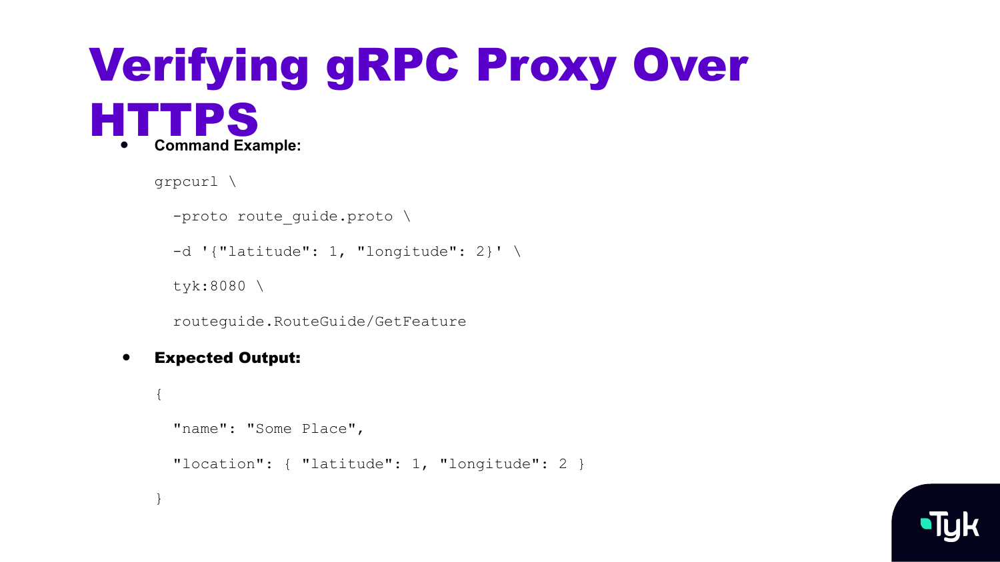

  <h1 style="font-size:3.55rem; line-height:1.08; font-weight:800; color:#ffffff; margin:0; border:0; max-width:820px; letter-spacing:-0.02em;">gRPC Proxy Example Using HTTPS</h1>
  

---
layout: default
---

  <h1 style="font-size:2.78rem; line-height:1.08; font-weight:800; color:#5D16D7; margin:0 0 1.2rem 0; border:0; max-width:860px; letter-spacing:-0.02em;">Secure gRPC Proxy Setup with Tyk and HTTPS</h1>

  <ul style="margin:0 0 0 1.1rem; padding-left:1.35rem; font-size:1.04rem; line-height:1.42; max-width:820px;">
    <li style="margin-bottom:0.3rem;">Leverages HTTPS (TLS) for encrypted transport</li>
    <li style="margin-bottom:0.3rem;">Useful for production or public-facing services</li>
    <li style="margin-bottom:0.2rem;">Required components:
      <ul style="list-style-type:circle; margin:0.32rem 0 0 1rem; padding-left:1.35rem; line-height:1.3;">
        <li style="margin-bottom:0.12rem;">gRPC server with TLS enabled</li>
        <li style="margin-bottom:0.12rem;">gRPC client (<code style="font-size:0.96em;">grpcurl</code> or app)</li>
        <li style="margin-bottom:0.12rem;">SSL certificate</li>
        <li>Tyk Gateway and Dashboard</li>
      </ul>
    </li>
  </ul>

  
gRPC client → Tyk Gateway (HTTPS) → gRPC server (H2C connection)

  

<!-- Notes: This example demonstrates how to set up a secure gRPC proxy using HTTPS via Tyk. This is particularly useful for production environments or when exposing your gRPC services externally. We’ll use a gRPC server that supports TLS, connect it to Tyk Gateway over HTTPS, and expose it to a client using the grpcurl tool. -->

---
layout: default
---

  <h1 style="font-size:2.78rem; line-height:1.08; font-weight:800; color:#5D16D7; margin:0 0 1.0rem 0; border:0; max-width:860px; letter-spacing:-0.02em;">Prerequisites for Secure gRPC Proxy</h1>

  <ul style="margin:0 0 0 1.1rem; padding-left:1.35rem; font-size:1.03rem; line-height:1.36; max-width:840px;">
    <li style="margin-bottom:0.14rem;">Start the gRPC server with TLS support
      <ul style="list-style-type:circle; margin:0.18rem 0 0 1rem; padding-left:1.35rem; line-height:1.27;">
        <li style="margin-bottom:0.08rem;">For example: <code style="font-size:0.96em;">go run server.go -tls=true</code></li>
        <li>Expose at: <code style="font-size:0.96em;">grpc.test.example.com:10000</code></li>
      </ul>
    </li>
    <li style="margin-bottom:0.14rem;">Have a valid certificate for HTTPS</li>
    <li style="margin-bottom:0.14rem;">Tyk Gateway &amp; Dashboard running</li>
    <li>gRPC client installed (<code style="font-size:0.96em;">grpcurl</code> or equivalent)</li>
  </ul>

  

<!-- Notes: First, ensure your gRPC server is up and running with TLS. In our case, we’re using the route_guide example server which accepts a -tls=true flag. This server listens at grpc.test.example.com:10000. Also, make sure Tyk Gateway is up and that you have a valid certificate available for HTTPS termination. -->

---
layout: default
---

  <h1 style="font-size:2.78rem; line-height:1.08; font-weight:800; color:#5D16D7; margin:0 0 0.9rem 0; border:0; max-width:900px; letter-spacing:-0.02em;">Configure Secure gRPC Proxy in Tyk</h1>

  <ol style="margin:0 0 0 1.5rem; padding-left:1.25rem; font-size:1.01rem; line-height:1.34; max-width:850px;">
    <li style="margin-bottom:0.11rem;">Create a new API in the Tyk Dashboard</li>
    <li style="margin-bottom:0.11rem;">Set Protocol to <code style="font-size:0.96em;">HTTPS</code></li>
    <li style="margin-bottom:0.11rem;">Uncheck <code style="font-size:0.96em;">Strip Listen Path</code></li>
    <li style="margin-bottom:0.11rem;">Upload the SSL certificate</li>
    <li style="margin-bottom:0.11rem;">Set Custom Domain (e.g., <code style="font-size:0.96em;">tyk</code>)</li>
    <li style="margin-bottom:0.11rem;">Set Listen Path: <code style="font-size:0.96em;">/routeguide.RouteGuide</code></li>
    <li style="margin-bottom:0.11rem;">Set Target URL: <code style="font-size:0.96em;">https://grpc.test.example.com:10000</code></li>
    <li>Save and reload Gateway</li>
  </ol>

  

<!-- Notes: Inside the Tyk Dashboard, define a new API. Set the protocol to HTTPS and upload the certificate that will be used to secure this API. Uncheck 'strip listen path' to preserve the full gRPC method name. Then point the target URL to your gRPC server's secure endpoint. -->

---
layout: default
---

  

<!-- Notes: To test the setup, use grpcurl without the -plaintext flag. This ensures you're connecting over TLS. If everything is configured properly, you'll get a successful response from the gRPC server through the Tyk Gateway, confirming your secure proxy is working. -->
