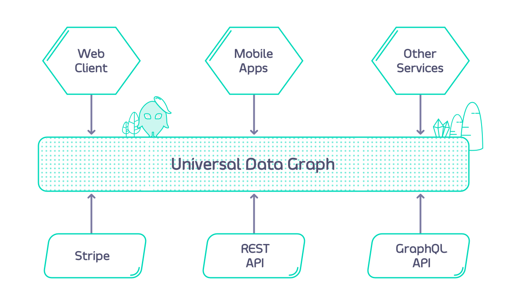
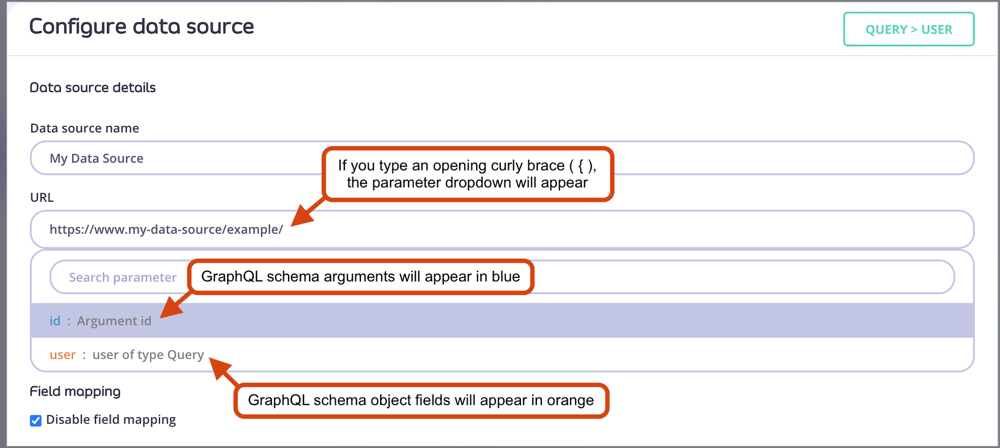

  
Module 3

  <h1 style="margin:0; color:white; font-size:2.95rem; line-height:1.08; font-weight:800; text-align:center;">Universal Data Graph</h1>
  

    
  

---
layout: default
---

  <h1 style="margin:0 0 0.5rem 0; color:#5B11D9; font-size:3.5rem; line-height:0.98; font-weight:900;">What is the Universal Data Graph (UDG)?</h1>
  <ul style="margin:0.6rem 0 0 1.1rem; padding-left:1.2rem; color:#10122c; font-size:1rem; line-height:1.75; max-width:860px;">
    <li>Combine multiple APIs into one universal GraphQL interface</li>
    <li>Query multiple APIs with a single request</li>
    <li>No need to build your own GraphQL server — just configure your existing REST APIs</li>
    <li>Becomes the central integration point for internal and external APIs</li>
    <li>Inherits all Tyk capabilities: security, middleware, and governance</li>
  </ul>
  

    
  

<!-- Notes: The Universal Data Graph, or UDG, is a powerful feature in Tyk that allows you to consolidate multiple APIs—whether REST or GraphQL—into a single GraphQL interface.

What’s unique here is that you don’t need to spin up or maintain a GraphQL server of your own. Instead, UDG lets you map and configure your existing REST APIs directly through Tyk.

This means that Tyk becomes the hub for all your API integration needs—both internal microservices and external APIs—under one query layer.

Even better, because this is built on Tyk, your Graph inherits all the benefits: authentication, rate limiting, monitoring, and extensible middleware, making it not only powerful but also secure and scalable by design. -->

---
layout: default
---

  

    
  

  

    
Currently supported DataSources:

    <ul style="margin:0.25rem 0 0 0.85rem; padding-left:0.9rem; color:#121533; font-size:0.74rem; line-height:1.24;">
      <li>REST</li>
      <li>GraphQL</li>
      <li>SOAP (through the REST datasource)</li>
      <li>Kafka</li>
    </ul>
  

  

    
  

<!-- Notes: An extension orphan is an unresolved extension causing federation failure.
This happens if you extend a type that isn’t defined in exactly one subgraph.
Make sure every type extension has a clear base type in only one subgraph to avoid errors.
For example, the type named Person does not need to be defined in Subgraph 1, but it must be defined in exactly one subgraph (see Shared Types: extension of shared types is not possible, so extending a type that is defined in multiple subgraphs will produce an error). -->

---
layout: default
---

  <h1 style="margin:0 0 0.6rem 0; color:#5B11D9; font-size:3.1rem; line-height:1.02; font-weight:900;">Key Concepts - DataSources</h1>
  

    
Resolvers vs. DataSources

    <ul style="margin:0 0 0.55rem 1rem; padding-left:1rem;">
      <li>Resolvers: Functions that return data for a field (typical in GraphQL)</li>
      <li>DataSources: Config-driven way to fetch data for fields</li>
      <li>No code required — just configuration</li>
    </ul>
    
🔗 Types of DataSources in Tyk

    
Internal:

    <ul style="margin:0.05rem 0 0.3rem 1rem; padding-left:1rem;">
      <li>REST/SOAP APIs already managed in Tyk</li>
      <li>➜ Use middleware to validate and transform data</li>
    </ul>
    
External:

    <ul style="margin:0.05rem 0 0 1rem; padding-left:1rem;">
      <li>APIs not (yet) managed in Tyk</li>
      <li>➜ Easily included in your data graph</li>
      <li>➜ Can transition to internal when needed</li>
    </ul>
  

  

    
  

<!-- Notes: In traditional GraphQL, you often write resolvers — small functions that handle fetching data for each field in your schema. These need to be implemented manually and tied to specific types and fields.
Tyk’s Universal Data Graph replaces resolvers with a more streamlined approach: DataSources. These are config-based, meaning you don’t have to write code — you just tell the engine where and how to get the data.
There are two kinds of DataSources:
Internal: These are your existing Tyk-managed APIs, like REST or SOAP. You can apply Tyk’s built-in middleware — for example, for auth, transformation, or rate limiting.
External: These are APIs you haven’t added to Tyk yet. UDG allows you to include them in your graph right away. Later, if you want to bring them into Tyk to use middleware or analytics, that transition is easy.
This flexibility gives you a low-code way to build powerful, secure, and scalable GraphQL endpoints. -->

---
layout: default
---

  <h1 style="margin:0 0 0.65rem 0; color:#5B11D9; font-size:3.1rem; line-height:1.02; font-weight:900;">Key Concepts - Arguments</h1>
  
GraphQL Arguments → REST Calls

  
Schema example:

  
type Query {\n    user(id: Int!): User\n}\n\ntype User {\n    id: Int!\n    name: String\n}</pre>`" />
  
Goal: Map the id argument in a GraphQL query to the correct REST API path

  

    
  

<!-- Notes: Let’s revisit a common use case: querying a user by ID.
In GraphQL, we define a field like user(id: Int!) that returns a User object.
The question is — how do we take that id argument and pass it into our REST API URL?
This is where Tyk’s Universal Data Graph (UDG) becomes powerful. It allows you to inject GraphQL arguments directly into the REST call using simple templating. -->

---
layout: default
---

  <h1 style="margin:0 0 0.65rem 0; color:#5B11D9; font-size:3.1rem; line-height:1.02; font-weight:900;">Key Concepts - Arguments</h1>
  
Injecting Arguments into REST Paths

  
Templating REST URLs

  
In the “Configure Data Source” tab:

  
Use this template in the path field:

  <pre v-pre style="margin:0 0 0.55rem 0; background:transparent; color:#171932; font-size:0.84rem; line-height:1.38; font-family:'SFMono-Regular', Menlo, Monaco, Consolas, monospace; white-space:pre;">https://example.com/user/{{ .arguments.id }}</pre>
  
Type { to access a dropdown of available fields and arguments.

  
Tip: You can dynamically inject any GraphQL argument or field this way.

  

    
  

<!-- Notes: When configuring your DataSource, Tyk provides a flexible way to map GraphQL arguments into your REST call.
In this case, to hit an endpoint like /user/123, you use templating like this: https://example.com/user/{{ .arguments.id }}
As you type the curly brace {, Tyk shows a dropdown with all the arguments and fields you can use — it’s very intuitive.
This setup allows your UDG to resolve data dynamically and efficiently, making it easier to integrate with your existing APIs without writing extra code. -->

---
layout: default
---

  <h1 style="margin:0 0 0.7rem 0; color:#5B11D9; font-size:3.1rem; line-height:1.02; font-weight:900;">Key Concepts - Arguments</h1>
  

    
  

  

    
  

---
layout: default
---

  <h1 style="margin:0 0 0.65rem 0; color:#5B11D9; font-size:3.1rem; line-height:1.02; font-weight:900;">Key Concepts - Field Mappings</h1>
  
Field Mappings – When Are They Needed

  
Automatic Field Mapping

  <ul style="margin:0 0 0.38rem 1rem; padding-left:1rem; font-size:0.78rem;">
    <li>When the GraphQL schema mirrors the REST API response, no manual field mapping is required.</li>
  </ul>
  

    

      
Example REST response:

      <pre v-pre style="margin:0; background:transparent; color:#171932; font-size:0.79rem; line-height:1.55; font-family:'SFMono-Regular', Menlo, Monaco, Consolas, monospace; white-space:pre;">{
  "id": 1,
  "name": "Martin Buhr"
}</pre>
    

    

      
Matching GraphQL schema:

      
type Query {\n    user(id: Int!): User\n}\n\ntype User {\n    id: Int!\n    name: String\n}</pre>`" />
    

  

  

    
  

<!-- Notes: In Universal Data Graph, field mappings are automatic if your GraphQL schema matches the structure of your REST API’s JSON response.
This is the ideal scenario. As shown here, if the API returns id and name, and those fields are present in your GraphQL schema, no extra configuration is required — UDG will resolve them automatically. -->

---
layout: default
---

  <h1 style="margin:0 0 0.65rem 0; color:#5B11D9; font-size:3.1rem; line-height:1.02; font-weight:900;">Key Concepts - Field Mappings</h1>
  
Field Mappings – Handling Different Field Names

  <ul style="margin:0 0 0.35rem 1rem; padding-left:1rem; font-size:0.78rem;">
    <li>If the REST response uses a different field name, field mapping is required.</li>
  </ul>
  

    

      
Example REST response:

      <pre v-pre style="margin:0; background:transparent; color:#171932; font-size:0.79rem; line-height:1.55; font-family:'SFMono-Regular', Menlo, Monaco, Consolas, monospace; white-space:pre;">{
  "id": 1,
  "user_name": "Martin Buhr"
}</pre>
    

    

      
GraphQL schema:

      <pre v-pre style="margin:0; background:transparent; color:#171932; font-size:0.79rem; line-height:1.55; font-family:'SFMono-Regular', Menlo, Monaco, Consolas, monospace; white-space:pre;">{
  "id": 1,
  "user_name": "Martin Buhr"
}</pre>
    

  

  
In this case, manual mapping is needed:

  <ul style="margin:0 0 0 1rem; padding-left:1rem; font-size:0.78rem; line-height:1.45;">
    <li>Uncheck "Disable field mapping"</li>
    <li>Set name field path to user_name</li>
    <li>Nested fields can use dot notation: user.full_name</li>
  </ul>
  

    
  

<!-- Notes: When the field names don’t match, UDG cannot automatically resolve the response. In this example, the API returns user_name, but your schema defines the field as name. To fix this, enable field mapping manually and point the name field to user_name. For nested JSON fields, use dot notation like user.full_name. -->

---
layout: default
---

  <h1 style="margin:0 0 0.65rem 0; color:#5B11D9; font-size:2.78rem; line-height:1.04; font-weight:900;">Key Concepts - Reusing response fields</h1>
  
Chaining Data Across APIs

  
You can use data from one API response to call another API.

  
Example APIs:

  <ul style="margin:0 0 0 1rem; padding-left:1rem; font-size:0.78rem; line-height:1.5;">
    <li>People List: https://people-api.dev/people</li>
    <li>Person Details: https://people-api.dev/people/{person_id}</li>
    <li>Driver Licenses: https://driver-license-api.dev/driver-licenses/{driver_license_id}</li>
  </ul>
  

    
  

<!-- Notes: With Universal Data Graph, you can chain API responses using fields from one API to query another. In this example, we start with the People API, which gives us a driverLicenseID. That field becomes the key to fetch full driver license details from a separate API. -->

---
layout: default
---

  <h1 style="margin:0; color:#5B11D9; font-size:3rem; line-height:0.98; font-weight:900;">Key Concepts - Defining Data Source URLs</h1>
  

    

      
Static and Dynamic URL Templates

      <ul style="margin:0 0 0.12rem 1rem; padding-left:1rem; font-size:0.78rem;">
        <li>Query.people</li>
      </ul>
      
Static URL for retrieving the list of people:

      <pre v-pre style="margin:0 0 0.5rem 0; background:transparent; color:#171932; font-size:0.76rem; line-height:1.35; font-family:'SFMono-Regular', Menlo, Monaco, Consolas, monospace; white-space:pre-wrap;">https://people-api.dev/people</pre>
      <ul style="margin:0 0 0.12rem 1rem; padding-left:1rem; font-size:0.78rem;">
        <li>Query.person</li>
      </ul>
      
Uses the id argument dynamically in the URL:

      <pre v-pre style="margin:0 0 0.5rem 0; background:transparent; color:#171932; font-size:0.71rem; line-height:1.32; font-family:'SFMono-Regular', Menlo, Monaco, Consolas, monospace; white-space:pre-wrap;">https://people-api.dev/people/{{.arguments.id}}</pre>
      <ul style="margin:0 0 0.12rem 1rem; padding-left:1rem; font-size:0.78rem;">
        <li>Person.driverLicense</li>
      </ul>
      
Uses data from the parent object via .object placeholder:

      <pre v-pre style="margin:0; background:transparent; color:#171932; font-size:0.66rem; line-height:1.28; font-family:'SFMono-Regular', Menlo, Monaco, Consolas, monospace; white-space:pre-wrap;">https://driver-license-api.dev/driver-licenses/{{.object.driverLicenseID}}</pre>
    

    

      
Reminder:

      <ul style="margin:0 0 0 0.9rem; padding-left:1rem; font-size:0.78rem; line-height:1.35;">
        <li>Use .object to reference fields from the parent object.</li>
        <li>Use .arguments to reference query arguments.</li>
      </ul>
    

  

  

    
  

<!-- Notes: Now that we’ve defined our schema, the next step is to connect each field to the appropriate data source using URLs.
For simple fields like people, you can use a static URL. But when arguments are involved — like the id in person(id: Int!) — you use the .arguments placeholder to inject the argument into the URL.
For nested objects like driverLicense, we want to use a field (driverLicenseID) from the parent object (Person). This is where .object.driverLicenseID comes in — it tells Tyk to use a property from the parent object when forming the request URL. -->

---
layout: default
---

  <h1 style="margin:0; color:#5B11D9; font-size:3rem; line-height:0.98; font-weight:900;">Key Concepts - Defining Data Source URLs</h1>
  
GraphQL Query:

  <pre v-pre style="margin:0; background:transparent; color:#171932; font-size:0.88rem; line-height:1.56; font-family:'SFMono-Regular', Menlo, Monaco, Consolas, monospace; white-space:pre;">{
  people {
    id
    name
    age
    driverLicense {
      id
      issuedBy
      validUntil
    }
  }
}</pre>
  

    
  

<!-- Notes: Now that we’ve defined our schema, the next step is to connect each field to the appropriate data source using URLs.
For simple fields like people, you can use a static URL. But when arguments are involved — like the id in person(id: Int!) — you use the .arguments placeholder to inject the argument into the URL.
For nested objects like driverLicense, we want to use a field (driverLicenseID) from the parent object (Person). This is where .object.driverLicenseID comes in — it tells Tyk to use a property from the parent object when forming the request URL. -->

---
layout: default
---

  
Response Example:

  <pre v-pre style="margin:0.05rem 0 0 0; background:transparent; color:#171932; font-size:0.72rem; line-height:1.38; font-family:'SFMono-Regular', Menlo, Monaco, Consolas, monospace; white-space:pre;">{
  "data": {
    "people": [
      {
        "id": 1,
        "name": "User 1",
        "age": 40,
        "driverLicense": {
          "id": "DL1234",
          "issuedBy": "United Kingdom",
          "validUntil": "2040-01-01"
        }
      },
      {
        "id": 2,
        "name": "User 2",
        "age": 30,
        "driverLicense": {
          "id": "DL5555",
          "issuedBy": "United Kingdom",
          "validUntil": "2035-01-01"
        }
      }
    ]
  }
}</pre>
  

    
  

<!-- Notes: This is the final result of our setup.
Using only a single GraphQL query, Tyk's Universal Data Graph engine makes multiple backend calls — first to the People API, then to the Driver License API — and stitches the data together automatically.
The end user sees a clean, unified response, while the complexity of backend integrations is abstracted away. This is the core power of UDG: connecting distributed APIs into a single queryable graph. -->

---
layout: default
---

  <h1 style="margin:0 0 0.65rem 0; color:#5B11D9; font-size:3.1rem; line-height:1.02; font-weight:900;">UDG Header Management</h1>
  
Two levels of header control:

  
Global Headers

  <ul style="margin:0.06rem 0 0.6rem 1rem; padding-left:1rem; font-size:0.78rem; line-height:1.45;">
    <li>Defined in graphql.engine.global_headers</li>
    <li>Sent to all data sources</li>
    <li>Can include request context variables</li>
  </ul>
  
Data Source Headers

  <ul style="margin:0.06rem 0 0.55rem 1rem; padding-left:1rem; font-size:0.78rem; line-height:1.45;">
    <li>Defined in graphql.engine.data_sources[].config.headers</li>
    <li>Specific to individual data sources</li>
    <li>Also supports context variables like JWT claims</li>
  </ul>
  <pre v-pre style="margin:0; background:transparent; color:#171932; font-size:0.66rem; line-height:1.3; font-family:'SFMono-Regular', Menlo, Monaco, Consolas, monospace; white-space:pre;">{
  "global_headers": [
    { "key": "global-header", "value": "example-value" },
    { "key": "request-id", "value": "$tyk_context.request_id" }
  ]
}</pre>
  

    
  

<!-- Notes: With Tyk v5.2, you now have fine-grained control over HTTP headers for both the overall UDG and specific data sources.
Global headers are useful when you want to apply something like a request ID or an org-wide auth token across all upstream APIs.
These headers can include request context variables — for example, $tyk_context.request_id — so you can inject runtime values into the request.
We define these inside the global_headers section of the API definition. -->

---
layout: default
---

  <h1 style="margin:0 0 0.65rem 0; color:#5B11D9; font-size:3.1rem; line-height:1.02; font-weight:900;">UDG Header Management</h1>
  
Data Source Headers and Context Variables

  
Example - Data Source Header Config:

  <pre v-pre style="margin:0 0 0.7rem 0; background:transparent; color:#171932; font-size:0.72rem; line-height:1.36; font-family:'SFMono-Regular', Menlo, Monaco, Consolas, monospace; white-space:pre;">{
  "headers": {
    "data-source-header": "data-source-header-value",
    "datasource1-jwt-claim": "$tyk_context.jwt_claims_datasource1"
  }
}</pre>
  
Key Notes:

  <ul style="margin:0 0 0 1rem; padding-left:1rem; font-size:0.78rem; line-height:1.5;">
    <li>Defined per data source</li>
    <li>Ideal for individual API authentication needs</li>
    <li>Can also access JWT claims and request context values</li>
  </ul>
  

    
  

<!-- Notes: Data source headers work similarly but are scoped more narrowly — they apply only to the specific data source you define them under.
This is especially useful when you're dealing with multiple APIs that require different credentials, JWT claims, or custom headers.
Just like global headers, these can use context variables like JWT claims — so you can pass identity or tenant info dynamically. -->

---
layout: default
---

  <h1 style="margin:0 0 0.65rem 0; color:#5B11D9; font-size:3.1rem; line-height:1.02; font-weight:900;">UDG Header Management</h1>
  
Header Precedence Rules

  
When header keys overlap, Tyk applies priority:

  

    <table style="width:100%; border-collapse:collapse; font-size:0.78rem; color:#11142d;">
      <thead>
        <tr>
          <th style="padding:0.85rem 1rem; text-align:left; font-weight:900; border-right:2px solid #7B2FF2; border-bottom:2px solid #11142d; width:34%;">Header name</th>
          <th style="padding:0.85rem 1rem; text-align:left; font-weight:900; border-right:2px solid #7B2FF2; border-bottom:2px solid #11142d; width:40%;">Header value</th>
          <th style="padding:0.85rem 1rem; text-align:left; font-weight:900; border-bottom:2px solid #11142d; width:26%;">Defined on level</th>
        </tr>
      </thead>
      <tbody>
        <tr>
          <td style="padding:0.95rem 1rem; border-right:2px solid #7B2FF2; border-bottom:2px solid #7B2FF2;">example-header</td>
          <td style="padding:0.95rem 1rem; border-right:2px solid #7B2FF2; border-bottom:2px solid #7B2FF2;">data-source-value</td>
          <td style="padding:0.95rem 1rem; border-bottom:2px solid #7B2FF2;">data source</td>
        </tr>
        <tr>
          <td style="padding:0.95rem 1rem; border-right:2px solid #7B2FF2; border-bottom:2px solid #7B2FF2;">datasource1</td>
          <td style="padding:0.95rem 1rem; border-right:2px solid #7B2FF2; border-bottom:2px solid #7B2FF2;">$tyk_context.jwt_claims_datasource1</td>
          <td style="padding:0.95rem 1rem; border-bottom:2px solid #7B2FF2;">data source</td>
        </tr>
        <tr>
          <td style="padding:0.95rem 1rem; border-right:2px solid #7B2FF2;">request-id</td>
          <td style="padding:0.95rem 1rem; border-right:2px solid #7B2FF2;">$tyk_context.request_id</td>
          <td style="padding:0.95rem 1rem;">global</td>
        </tr>
      </tbody>
    </table>
  

  
Data Source header overrides Global header if both define the same key.

  

    
  

<!-- Notes: Now, if you define the same header at both the global and data source levels, the data source version takes precedence.
This gives you flexibility — you can set broad headers by default, but override them where needed for specific upstream APIs.
In this example, example-header is defined at both levels, but the data source’s value wins.
This rule helps prevent conflicts and gives you precise control over how each API call is formed. -->
