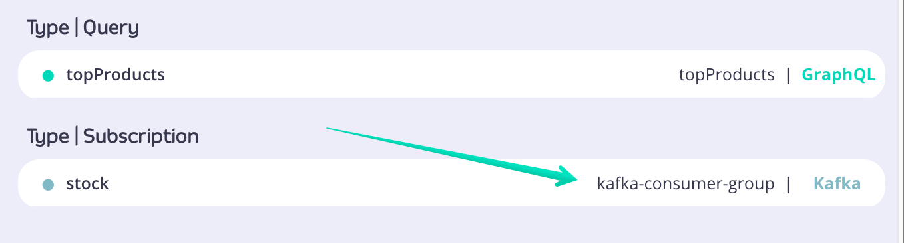
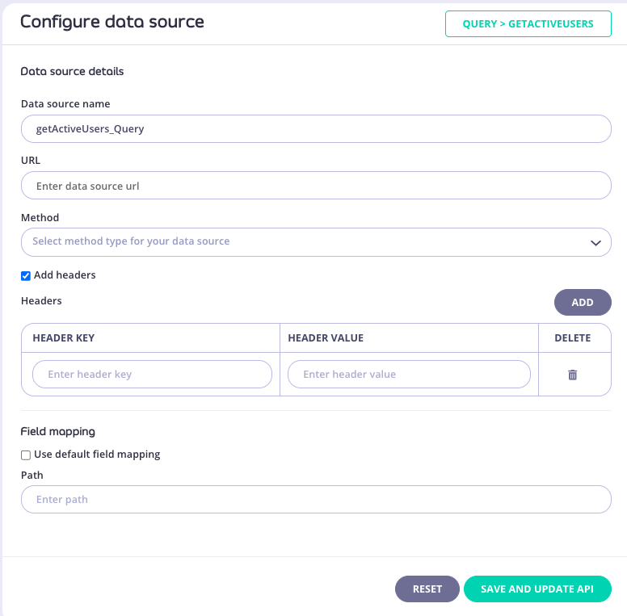
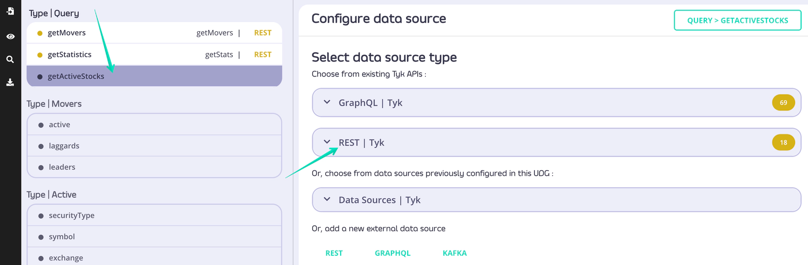

  
Module 4

  
DataSources

  <TykCornerBadge />

---
layout: default
---

  <h1 style="position:absolute; left:36px; top:24px; margin:0; color:#5c21d4; font-size:2.8rem; line-height:1.05; font-weight:800;">Connect Data Sources</h1>

  

    
Unified Data Graph (UDG) – Datasource Overview

    
Datasources power your UDG and its schema

    <ul style="margin:0 0 0.38rem 0; padding-left:1.4rem;">
      <li>Can be attached to any field in the UDG schema</li>
      <li>Support nested configuration</li>
    </ul>

    
Quick Start vs Full Control

    <ul style="margin:0 0 0.38rem 0; padding-left:1.4rem;">
      <li>You can add datasources directly to UDG without registering them as APIs in Tyk</li>
      <li>For advanced features (rate limits, quotas, transformations), import the API into Tyk first</li>
    </ul>

    
Supported Datasource Types:

    <ul style="margin:0; padding-left:1.4rem;">
      <li>REST</li>
      <li>GraphQL</li>
      <li>SOAP (via REST Datasource)</li>
      <li>Kafka</li>
    </ul>
  

  <TykCornerBadge />

<!-- Notes: Unified Data Graph in Tyk relies on datasources — these are your backend systems that provide the actual data.
You can attach a datasource to any field in the UDG schema, and even nest them, enabling complex data compositions.
While you can add datasources quickly for testing or prototyping without creating a full Tyk API, this limits your access to key API management features.
For things like quotas, transformations, and security policies, it’s best to register the API first and then connect it as a datasource.
Tyk supports multiple datasource types, including REST, GraphQL, SOAP through REST wrappers, and Kafka. -->

---
layout: default
---

  <h1 style="position:absolute; left:36px; top:24px; margin:0; color:#5c21d4; font-size:2.8rem; line-height:1.05; font-weight:800;">GraphQL Datasource Overview</h1>

  

    <ul style="margin:0; padding-left:1.35rem;">
      <li>Makes GraphQL queries to upstream GraphQL services</li>
      <li>Configured similarly to REST Datasource</li>
      <li>Handles query and response specifics automatically</li>
    </ul>
  

  

    
Schema Example:

    <pre v-pre style="margin:0; white-space:pre; font-size:0.84rem; line-height:1.34;">type Query {
    employee(id: Int!): Employee
}
type Employee {
    id: Int!
    name: String!
}</pre>
  

  

    
Example Query:

    <pre v-pre style="margin:0; white-space:pre; font-size:0.84rem; line-height:1.34;">query TykCEO {
    employee(id: 1) {
        id
        name
    }
}</pre>
  

  <TykCornerBadge />

<!-- Notes: Tyk supports GraphQL Datasources which allow querying upstream GraphQL services. While the configuration is nearly identical to REST Datasources, there's a subtle but key difference in how GraphQL responses are handled, which we’ll explore next.
Let’s walk through a typical example. This schema and query target an employee by ID. The query asks for id and name fields. -->

---
layout: default
---

  <h1 style="position:absolute; left:36px; top:24px; margin:0; color:#5c21d4; font-size:2.8rem; line-height:1.05; font-weight:800;">GraphQL Datasource Overview</h1>

  
GraphQL Response Parsing

  

    
Actual Response:

    <pre v-pre style="margin:0; white-space:pre; font-size:0.84rem; line-height:1.34;">{
  "data": {
    "employee": {
        "id": 1,
        "name": "Martin Buhr"
    }
  }
}</pre>
  

  

    
Tyk Extracts:

    <pre v-pre style="margin:0; white-space:pre; font-size:0.84rem; line-height:1.34;">{
  "employee": {
    "id": 1,
    "name": "Martin Buhr"
  }
}</pre>
  

  <TykCornerBadge />

<!-- Notes: Unlike REST, GraphQL wraps responses inside a data object. Tyk automatically unwraps this for you, simplifying field mapping. -->

---
layout: default
---

  <h1 style="position:absolute; left:36px; top:24px; margin:0; color:#5c21d4; font-size:2.8rem; line-height:1.05; font-weight:800;">GraphQL Datasource Overview</h1>

  

    
REST vs GraphQL

    <ul style="margin:0 0 0.5rem 0; padding-left:1.35rem;">
      <li>REST APIs do not wrap responses</li>
      <li>GraphQL APIs wrap responses in root fields (like data, employee)</li>
      <li>GraphQL field mapping is enabled by default</li>
    </ul>

    
Why Use GraphQL Datasource?

    <ul style="margin:0 0 0.5rem 0; padding-left:1.35rem;">
      <li>Specification-compliant GraphQL requests</li>
      <li>Supports nested REST &amp; GraphQL APIs in a single schema</li>
      <li>Query planner sends correct queries to upstreams</li>
    </ul>

    
How the Query Planner Works

    <ul style="margin:0; padding-left:1.35rem;">
      <li>Checks if a field has a datasource</li>
      <li>That datasource resolves the field and its children</li>
      <li>If a nested field has its own datasource, ownership shifts</li>
    </ul>
  

  <TykCornerBadge />

<!-- Notes: One key takeaway: GraphQL responses include a wrapping field, while REST typically does not. Because of this, GraphQL field mapping is turned on by default.
Tyk’s GraphQL engine sends standard-compliant queries. You can mix multiple REST and GraphQL datasources—even nested—and Tyk will handle query composition and resolution automatically.
The query planner follows field ownership: when it hits a field with a datasource, that datasource becomes responsible for resolving that field and its children until ownership shifts again. -->

---
layout: default
---

  <h1 style="position:absolute; left:36px; top:24px; margin:0; color:#5c21d4; font-size:2.8rem; line-height:1.05; font-weight:800;">GraphQL Datasource Overview</h1>

  

    
Summary

    <ul style="margin:0; padding-left:1.35rem;">
      <li>Tyk supports full GraphQL Datasource configuration</li>
      <li>Automatic unwrapping of data field</li>
      <li>Query planner handles mixed datasources</li>
    </ul>
  

  <TykCornerBadge />

<!-- Notes: In summary, Tyk makes it simple to use GraphQL APIs as datasources, with support for automatic parsing, field-level attachments, and flexible query planning across services. -->

---
layout: default
---

  <h1 style="position:absolute; left:36px; top:24px; margin:0; color:#5c21d4; font-size:2.8rem; line-height:1.05; font-weight:800;">Kafka Datasource Overview</h1>

  

    <ul style="margin:0 0 0.45rem 0; padding-left:1.35rem;">
      <li>Enables subscribing to Kafka topics and querying events with GraphQL.</li>
      <li>Integrates Kafka's powerful pub/sub model into your Universal Data Graph.</li>
      <li>Operates based on Kafka’s consumer group mechanism.</li>
    </ul>

    
Kafka Consumer Groups

    <ul style="margin:0; padding-left:1.35rem;">
      <li>A group of cooperating consumers that share processing load.</li>
      <li>Kafka automatically manages membership and rebalances partitions.</li>
      <li>Allows for horizontal scaling and fault tolerance.</li>
    </ul>
  

  <TykCornerBadge />

<!-- Notes: Kafka is a distributed messaging system used for building real-time data pipelines and streaming applications. In Tyk, we can treat Kafka as a data source in our Universal Data Graph. This means developers can subscribe to topics and access streamed data using GraphQL queries. This is incredibly powerful for use cases involving live data such as product updates, financial tickers, IoT data, or live dashboards. -->

---
layout: default
---

  <h1 style="position:absolute; left:36px; top:24px; margin:0; color:#5c21d4; font-size:2.8rem; line-height:1.05; font-weight:800;">Kafka Datasource Overview</h1>

  

    
Basic Kafka Configuration

    <ul style="margin:0; padding-left:1.35rem;">
      <li><code>broker_addresses</code>: Kafka broker hosts</li>
      <li><code>topics</code>: Kafka topics to subscribe to</li>
      <li><code>group_id</code>: Consumer group identifier</li>
      <li><code>client_id</code>: Optional identifier for logging and debugging</li>
    </ul>
  

  <TykCornerBadge />

<!-- Notes: To configure a Kafka DataSource in Tyk, the following fields are required:

broker_addresses: This is where your Kafka brokers live. It’s enough to supply just one broker; Kafka will discover the rest.
topics: These are the Kafka topics you want to subscribe to. All events must match the GraphQL schema.
group_id: This defines your consumer group. Multiple APIs can share this ID, which lets them cooperate and balance partitions.
client_id: This is optional, but useful for identifying consumers in logs and debugging sessions. -->

---
layout: default
---

  <h1 style="position:absolute; left:36px; top:24px; margin:0; color:#5c21d4; font-size:2.8rem; line-height:1.05; font-weight:800;">Kafka Datasource Overview</h1>

  

    
Configuring via Tyk Dashboard

    <ul style="margin:0 0 0.22rem 0; padding-left:1.35rem;">
      <li>Click the field to attach Kafka DataSource.</li>
      <li>In Configure Data Source, choose KAFKA.</li>
      <li>Provide:
        <ul style="margin:0.18rem 0 0 0; padding-left:1.25rem; list-style-type:circle;">
          <li>Data source name</li>
          <li>Broker addresses</li>
          <li>Topics</li>
          <li>Group ID</li>
          <li>Client ID</li>
          <li>(Optional) Kafka version, balance strategy, field mappings</li>
        </ul>
      </li>
      <li>Click Save.</li>
    </ul>
  

  <TykCornerBadge />

<!-- Notes: Tyk provides an intuitive UI to configure Kafka DataSources. Simply select a field in your schema and choose the Kafka data source type. You’ll be asked to input essential information like broker address and topic names.
Optional fields let you further customize how the consumer behaves. These settings allow for advanced balancing and mapping if your data structure is more complex. Once saved, your GraphQL field becomes a live view into that Kafka topic. -->

---
layout: default
---

  <h1 style="position:absolute; left:36px; top:24px; margin:0; color:#5c21d4; font-size:2.8rem; line-height:1.05; font-weight:800;">Kafka Datasource Overview</h1>
  
  <TykCornerBadge />

<!-- Notes: Tyk provides an intuitive UI to configure Kafka DataSources. Simply select a field in your schema and choose the Kafka data source type. You’ll be asked to input essential information like broker address and topic names.
Optional fields let you further customize how the consumer behaves. These settings allow for advanced balancing and mapping if your data structure is more complex. Once saved, your GraphQL field becomes a live view into that Kafka topic. -->

---
layout: default
---

  <h1 style="position:absolute; left:36px; top:24px; margin:0; color:#5c21d4; font-size:2.8rem; line-height:1.05; font-weight:800;">Kafka Datasource Overview</h1>

  
Once done the field you just configured will show information about data source type and name:

  

  <TykCornerBadge />

<!-- Notes: Tyk provides an intuitive UI to configure Kafka DataSources. Simply select a field in your schema and choose the Kafka data source type. You’ll be asked to input essential information like broker address and topic names.
Optional fields let you further customize how the consumer behaves. These settings allow for advanced balancing and mapping if your data structure is more complex. Once saved, your GraphQL field becomes a live view into that Kafka topic. -->

---
layout: default
---

  <h1 style="position:absolute; left:36px; top:24px; margin:0; color:#5c21d4; font-size:2.8rem; line-height:1.05; font-weight:800;">Kafka Datasource Overview</h1>

  

    
GraphQL Subscriptions with Kafka

    
Real-Time Subscriptions

    
Use GraphQL subscription queries to listen to Kafka events.

    
Define Subscription type in your schema:

    

      type Product { 
      &nbsp;name: String 
      &nbsp;price: Int 
      &nbsp;inStock: Int 
      } 
       
      type Subscription { 
      &nbsp;productUpdated: Product 
      }
    

    
Subscribers will get real-time updates on every event.

  

  

    
Example Subscription Query

    

      subscription Products { 
      &nbsp;&nbsp;&nbsp;&nbsp;productUpdated { 
      &nbsp;&nbsp;&nbsp;&nbsp;&nbsp;&nbsp;&nbsp;&nbsp;name 
      &nbsp;&nbsp;&nbsp;&nbsp;&nbsp;&nbsp;&nbsp;&nbsp;price 
      &nbsp;&nbsp;&nbsp;&nbsp;&nbsp;&nbsp;&nbsp;&nbsp;inStock 
      &nbsp;&nbsp;&nbsp;&nbsp;} 
      }
    

    <ul style="margin:0; padding-left:1.25rem;">
      <li>Automatically receives new product data when Kafka publishes an event.</li>
      <li>Compatible with most GraphQL clients.</li>
    </ul>
  

  <TykCornerBadge />

<!-- Notes: GraphQL subscriptions are a powerful way to deliver real-time updates to clients. In Tyk, we can map Kafka topics to GraphQL subscription fields.
When an event is published to the topic, all subscribed clients will receive the update instantly. This is done using the standard GraphQL subscription query type. Clients can use any compliant GraphQL client or library to consume these updates — no need for special tooling. -->

---
layout: default
---

  <h1 style="position:absolute; left:36px; top:24px; margin:0; color:#5c21d4; font-size:2.8rem; line-height:1.05; font-weight:800;">Kafka Datasource Overview</h1>

  

    
Publishing Test Events

    
Simulating Kafka Events

    
Publish event to <code>product-updates</code> topic:

    <pre v-pre style="margin:0 0 0.18rem 0; white-space:pre; font-size:0.78rem; line-height:1.26;">{
    "productUpdated": {
        "name": "product1",
        "price": 1624,
        "inStock": 219
    }
}</pre>
    <ul style="margin:0; padding-left:1.25rem;">
      <li>Use any Kafka producer or GUI tool.</li>
      <li>Useful for testing subscriptions and schema mappings.</li>
    </ul>
  

  <TykCornerBadge />

<!-- Notes: To test your setup, you can publish events manually to Kafka using tools like Kafka CLI, Postman + Kafka REST Proxy, or a Kafka GUI.
Here we’re sending a JSON message to the product-updates topic. When this happens, all GraphQL clients subscribed to productUpdated will receive the new product info instantly. This is a great way to validate your data mappings, consumer group configuration, and client behavior before going live. -->

---
layout: default
---

  <h1 style="position:absolute; left:36px; top:24px; margin:0; color:#5c21d4; font-size:2.8rem; line-height:1.05; font-weight:800;">Kafka Datasource Overview</h1>

  

    
Summary

    
Kafka DataSource in Tyk

    <ul style="margin:0; padding-left:1.35rem;">
      <li>Seamlessly integrates Kafka with GraphQL APIs.</li>
      <li>Allows real-time streaming via GraphQL subscriptions.</li>
      <li>Scalable via Kafka consumer groups.</li>
      <li>Easy setup via Tyk Dashboard or API Definition.</li>
    </ul>
  

  <TykCornerBadge />

<!-- Notes: To wrap up: Tyk’s Kafka DataSource is a powerful way to bring live streaming data into your Universal Data Graph. It leverages Kafka’s proven scalability and fault-tolerance while giving developers a modern, flexible API layer using GraphQL.
It’s ideal for dynamic use cases — from IoT and supply chain systems to product catalogs and user behavior tracking. You can manage everything in one place — your GraphQL schema — while Kafka handles delivery and scale behind the scenes. -->

---
layout: default
---

  <h1 style="position:absolute; left:36px; top:24px; margin:0; color:#5c21d4; font-size:2.8rem; line-height:1.05; font-weight:800;">REST Datasource Overview</h1>

  

    <ul style="margin:0; padding-left:1.35rem;">
      <li>REST DataSources connect REST APIs to your GraphQL schema</li>
      <li>Enables field-level resolution via REST endpoints</li>
      <li>Supported for both external APIs and Tyk-managed APIs</li>
    </ul>
  

  <TykCornerBadge />

<!-- Notes: REST DataSources act as connectors between your GraphQL schema and existing REST endpoints. Instead of rewriting your APIs, you attach a REST DataSource to a GraphQL field, allowing that field to be resolved via a REST call. These can be external APIs or APIs already managed in your Tyk Gateway. -->

---
layout: default
---

  <h1 style="position:absolute; left:36px; top:24px; margin:0; color:#5c21d4; font-size:2.8rem; line-height:1.05; font-weight:800;">REST Datasource Overview</h1>

  

    <ul style="margin:0; padding-left:1.35rem;">
      <li>Select the field in your schema</li>
      <li>Configure as External REST DataSource
        <ul style="margin:0.2rem 0 0 0; padding-left:1.25rem; list-style-type:circle;">
          <li>Name</li>
          <li>URL</li>
          <li>Method (GET, POST, etc.)</li>
          <li>Optional: Headers, Field Mapping</li>
        </ul>
      </li>
    </ul>
  

  

  <TykCornerBadge />

<!-- Notes: To attach an external REST API to a GraphQL field, start by selecting the field in the schema editor. Use the right-side configuration panel to define your DataSource details. This includes naming it, entering the REST URL, HTTP method, and optionally setting request headers and field mapping to align the response with your schema. -->

---
layout: default
---

  <h1 style="position:absolute; left:36px; top:24px; margin:0; color:#5c21d4; font-size:2.8rem; line-height:1.05; font-weight:800;">REST Datasource Overview</h1>

  

    
Attaching Tyk REST API

    <ul style="margin:0 0 0.3rem 0; padding-left:1.35rem;">
      <li>Select the field</li>
      <li>Choose REST | Tyk from the dropdown</li>
      <li>Pick from existing Tyk APIs</li>
      <li>Provide endpoint and method</li>
      <li>Optional headers and mapping</li>
    </ul>

    
Save and Generate Resolver

    <ul style="margin:0; padding-left:1.35rem;">
      <li>Click &quot;Save &amp; Update API&quot;</li>
      <li>Resolver is auto-generated</li>
      <li>GraphQL runtime will call the REST endpoint when the field is queried</li>
    </ul>
  

  

  <TykCornerBadge />

<!-- Notes: If your REST API is already managed by Tyk, the integration is even easier. Choose from the list of available Tyk APIs in the dropdown, then configure which endpoint and method to use. This method promotes reuse of existing API definitions and policies.

Once the DataSource configuration is complete, saving it will generate a resolver function under the hood. This resolver ensures that when your GraphQL field is queried, Tyk knows exactly how to fetch that data from the REST API. -->

---
layout: default
---

  <h1 style="position:absolute; left:36px; top:24px; margin:0; color:#5c21d4; font-size:2.8rem; line-height:1.05; font-weight:800;">REST Datasource Overview</h1>

  

    
Auto-generate REST DataSource via OAS

    <ul style="margin:0 0 0.22rem 0; padding-left:1.35rem;">
      <li>Use Tyk Dashboard API</li>
      <li>Endpoint: <code>POST /api/data-graphs/data-sources/import</code></li>
      <li>Request Body:</li>
    </ul>
    <pre v-pre style="margin:0 0 0.22rem 1.35rem; white-space:pre; font-size:0.78rem; line-height:1.24;">{
    "type": "string",
    "data": "string"
}</pre>
    
type is an enum with the following possible values:

    <ul style="margin:0 0 0.2rem 0; padding-left:1.35rem;">
      <li>openapi</li>
      <li>Asyncapi</li>
    </ul>
    
To import an OAS specification you need to choose <code>openapi</code>

  

  <TykCornerBadge />

<!-- Notes: To save time, Tyk allows you to auto-generate DataSource configurations from an OpenAPI (OAS) document. Just call the Dashboard API with the OAS content, and Tyk will generate and publish the corresponding GraphQL configuration. This is particularly useful for onboarding large REST APIs quickly. -->

---
layout: default
---

  <h1 style="position:absolute; left:36px; top:24px; margin:0; color:#5c21d4; font-size:2.8rem; line-height:1.05; font-weight:800;">REST Datasource Overview</h1>

  

    
Summary

    <ul style="margin:0; padding-left:1.35rem;">
      <li>REST DataSources make it easy to integrate legacy REST APIs</li>
      <li>Both external and internal APIs are supported</li>
      <li>Automatic configuration possible with OAS</li>
    </ul>
  

  <TykCornerBadge />

<!-- Notes: To wrap up, REST DataSources provide a powerful way to integrate legacy REST APIs into your modern GraphQL layer. You can attach them to any field, choose external or internal APIs, and even use OpenAPI specs to automate the setup. This enhances development agility while leveraging existing infrastructure. -->
