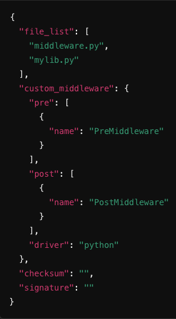

<div style="position:relative; height:100%; color:white;">
  
  <div style="position:absolute; left:2rem; top:7.3rem; width:24rem;">
    <h1 style="font-size:2.5rem; line-height:1.05; font-weight:800; color:white; margin:0; border:0;">Tyk<br>Onboarding</h1>
    <p style="margin-top:2rem; font-size:0.95rem; color:white; opacity:0.9;">Rahmat - Sr. Customer Solutions Architect</p>
  </div>
</div>

---
layout: cover
background: 'linear-gradient(135deg, #8438FA 0%, #8438FA 45%, #BB11FF 100%)'
---

<div style="position:relative; display:flex; flex-direction:column; justify-content:center; align-items:center; height:100%; text-align:center; color:white;">
  <h1 style="font-size:2.6rem; font-weight:800; color:white; margin:0; border:0;">Custom Plugins</h1>
  <p style="margin-top:0.9rem; font-size:1rem; color:white; opacity:0.9;">Exploring custom plugins in Tyk</p>
  
</div>

---
layout: default
---

<h1 style="font-size:2rem; font-weight:800; color:#5900CB; margin-bottom:1.4rem;">Custom Plugins in Tyk</h1>

<div style="font-size:1.1rem; color:#03031C; line-height:1.9; padding-right:0.5rem;">
  <ul style="margin:0; padding-left:1.4rem;">
    <li>Custom Plugins enable execution of specific custom code for unique tasks, beyond Tyk’s standard middleware.</li>
    <li>Users can hook plugins into various phases of the API lifecycle.</li>
    <li>Tyk includes 7 hooks for custom plugins across the middleware execution order.</li>
  </ul>
</div>

<!-- Notes: Introduction:
“Custom Plugins in Tyk allow users to extend the Tyk Gateway beyond its built-in middleware.
You can write custom code to solve specific use cases like:
Custom authentication against external services.
Request/response transformations.
Advanced rate-limiting or logging logic.
The key idea is flexibility—Tyk processes the API request, and at certain points in the lifecycle, it can execute your plugin code.
Tyk provides 7 hooks that let you run custom plugins at different middleware stages.
This means you can intercept and modify the request or response as needed.
In summary, Custom Plugins help you extend Tyk’s behavior for use cases that go beyond the standard features, such as custom authentication, custom analytics, or real-time request and response transformation.” -->

---
layout: default
---

<h1 style="font-size:2rem; font-weight:800; color:#5900CB; margin-bottom:1rem;">Custom Middleware</h1>

<table style="width:100%; border-collapse:collapse; font-size:0.66rem; color:#03031C;">
  <thead>
    <tr style="background:#6d6d6d; color:white;">
      <th style="padding:0.45rem; text-align:left; border:1px solid #cfcfcf;">Hook Type</th>
      <th style="padding:0.45rem; text-align:left; border:1px solid #cfcfcf;">Plugin Type</th>
      <th style="padding:0.45rem; text-align:left; border:1px solid #cfcfcf;">Phase</th>
      <th style="padding:0.45rem; text-align:left; border:1px solid #cfcfcf;">Execution</th>
      <th style="padding:0.45rem; text-align:left; border:1px solid #cfcfcf;">Details</th>
      <th style="padding:0.45rem; text-align:left; border:1px solid #cfcfcf;">Common Use Case</th>
    </tr>
  </thead>
  <tbody>
    <tr>
      <td style="padding:0.42rem; border:1px solid #d8d8d8;">Pre (Request)</td>
      <td style="padding:0.42rem; border:1px solid #d8d8d8;">Request Plugin</td>
      <td style="padding:0.42rem; border:1px solid #d8d8d8;">HTTP Request</td>
      <td style="padding:0.42rem; border:1px solid #d8d8d8;">Before reverse proxy</td>
      <td style="padding:0.42rem; border:1px solid #d8d8d8;">First middleware to execute before proxying.</td>
      <td style="padding:0.42rem; border:1px solid #d8d8d8;">IP rate limiting or request enrichment.</td>
    </tr>
    <tr style="background:#fafafa;">
      <td style="padding:0.42rem; border:1px solid #d8d8d8;">Authentication</td>
      <td style="padding:0.42rem; border:1px solid #d8d8d8;">Auth Plugin</td>
      <td style="padding:0.42rem; border:1px solid #d8d8d8;">HTTP Request</td>
      <td style="padding:0.42rem; border:1px solid #d8d8d8;">Before reverse proxy</td>
      <td style="padding:0.42rem; border:1px solid #d8d8d8;">Replaces default authentication flow.</td>
      <td style="padding:0.42rem; border:1px solid #d8d8d8;">Custom auth against identity providers or legacy systems.</td>
    </tr>
    <tr>
      <td style="padding:0.42rem; border:1px solid #d8d8d8;">Post-Auth (Request)</td>
      <td style="padding:0.42rem; border:1px solid #d8d8d8;">Auth Plugin</td>
      <td style="padding:0.42rem; border:1px solid #d8d8d8;">HTTP Request</td>
      <td style="padding:0.42rem; border:1px solid #d8d8d8;">Before reverse proxy</td>
      <td style="padding:0.42rem; border:1px solid #d8d8d8;">Runs after authentication for extra checks.</td>
      <td style="padding:0.42rem; border:1px solid #d8d8d8;">Authorization and role or permission validation.</td>
    </tr>
    <tr style="background:#fafafa;">
      <td style="padding:0.42rem; border:1px solid #d8d8d8;">Post (Request)</td>
      <td style="padding:0.42rem; border:1px solid #d8d8d8;">Request Plugin</td>
      <td style="padding:0.42rem; border:1px solid #d8d8d8;">HTTP Request</td>
      <td style="padding:0.42rem; border:1px solid #d8d8d8;">Before reverse proxy</td>
      <td style="padding:0.42rem; border:1px solid #d8d8d8;">Final request phase before upstream.</td>
      <td style="padding:0.42rem; border:1px solid #d8d8d8;">Header injection, payload transforms, tracking IDs.</td>
    </tr>
    <tr>
      <td style="padding:0.42rem; border:1px solid #d8d8d8;">Response</td>
      <td style="padding:0.42rem; border:1px solid #d8d8d8;">Response Plugin</td>
      <td style="padding:0.42rem; border:1px solid #d8d8d8;">HTTP Response</td>
      <td style="padding:0.42rem; border:1px solid #d8d8d8;">After reverse proxy</td>
      <td style="padding:0.42rem; border:1px solid #d8d8d8;">Modifies upstream response before client delivery.</td>
      <td style="padding:0.42rem; border:1px solid #d8d8d8;">Masking sensitive data, formatting JSON, adding cache headers.</td>
    </tr>
    <tr style="background:#fafafa;">
      <td style="padding:0.42rem; border:1px solid #d8d8d8;">Analytics</td>
      <td style="padding:0.42rem; border:1px solid #d8d8d8;">Analytics Plugin</td>
      <td style="padding:0.42rem; border:1px solid #d8d8d8;">Request/Response</td>
      <td style="padding:0.42rem; border:1px solid #d8d8d8;">After reverse proxy</td>
      <td style="padding:0.42rem; border:1px solid #d8d8d8;">Final middleware for logging and analytics.</td>
      <td style="padding:0.42rem; border:1px solid #d8d8d8;">Obfuscating sensitive data in logs.</td>
    </tr>
  </tbody>
</table>

<!-- Notes: Overview of the Table:
“Here, I’ve summarized the key middleware hooks, their purpose, and common use cases.
Pre (Request) runs before reverse proxying and is often used for rate limiting or request enrichment.
Authentication lets you replace Tyk’s default auth flow with your own.
Post-Auth runs after auth but before proxying, which is useful for extra authorization checks.
Post (Request) is the last chance to modify a request before it goes upstream.
Response runs after the upstream sends data back, letting you shape the response.
Analytics is for logging and analytics logic, often including data masking.
By using these hooks, you gain control over the full request and response lifecycle.” -->

---
layout: default
---

<h1 style="font-size:2rem; font-weight:800; color:#5900CB; margin-bottom:1rem;">Plugin Types</h1>

<table style="width:100%; border-collapse:collapse; font-size:0.72rem; color:#03031C;">
  <thead>
    <tr style="background:#6d6d6d; color:white;">
      <th style="padding:0.5rem; text-align:left; border:1px solid #cfcfcf; width:22%;">Plugin Type</th>
      <th style="padding:0.5rem; text-align:left; border:1px solid #cfcfcf;">Description</th>
    </tr>
  </thead>
  <tbody>
    <tr>
      <td style="padding:0.48rem; border:1px solid #d8d8d8; font-weight:700;">Go Plugin</td>
      <td style="padding:0.48rem; border:1px solid #d8d8d8;">Native plugins implemented in Go, the same language Tyk Gateway uses. Best for high-performance production workloads.</td>
    </tr>
    <tr style="background:#fafafa;">
      <td style="padding:0.48rem; border:1px solid #d8d8d8; font-weight:700;">gRPC Plugins</td>
      <td style="padding:0.48rem; border:1px solid #d8d8d8;">Executed remotely on a gRPC server, enabling development in any gRPC-compatible language.</td>
    </tr>
    <tr>
      <td style="padding:0.48rem; border:1px solid #d8d8d8; font-weight:700;">JavaScript (JSVM)</td>
      <td style="padding:0.48rem; border:1px solid #d8d8d8;">Lightweight ECMAScript 5 plugins that run in Tyk’s JavaScript virtual machine for fast customizations.</td>
    </tr>
    <tr style="background:#fafafa;">
      <td style="padding:0.48rem; border:1px solid #d8d8d8; font-weight:700;">Python Plugins</td>
      <td style="padding:0.48rem; border:1px solid #d8d8d8;">Embedded directly into Tyk Gateway, allowing Python code to run inside the same process.</td>
    </tr>
  </tbody>
</table>

<div style="margin-top:1rem; font-size:0.82rem; color:#555; line-height:1.6;">
  Choose the plugin type that aligns with your team’s expertise, deployment model, and performance requirements.
</div>

<!-- Notes: Go Plugins run natively in Tyk and give you the best performance.
gRPC Plugins let you write plugin logic in any gRPC-compatible language and execute it remotely.
JavaScript Plugins are lightweight and good for quick customizations or prototyping.
Python Plugins are useful for teams already comfortable with Python and wanting fast iteration.
Choose based on your use case, team skills, and performance needs. -->

---
layout: default
---

<h1 style="font-size:2rem; font-weight:800; color:#5900CB; margin-bottom:1rem;">How it works</h1>

<div style="display:flex; gap:1.2rem; align-items:flex-start; height:78%;">
  <div style="flex:1.05; font-size:0.93rem; color:#03031C; line-height:1.7;">
    <ol style="margin:0; padding-left:1.15rem;">
      <li>The client sends request to API on Tyk Gateway.</li>
      <li>Tyk processes the request and forwards it to one or more plugins implemented and configured for that API.</li>
      <li>A plugin performs operations such as custom authentication or data transformation.</li>
      <li>The processed request is returned to Tyk Gateway, which forwards it upstream.</li>
      <li>Finally, the upstream response is sent back to the client.</li>
    </ol>
  </div>
  <div style="flex:1.2; position:relative; height:100%; min-height:290px;">
    <div style="position:absolute; left:20px; top:92px; width:88px; height:88px; border:2px solid #e2e2e2; border-radius:14px; background:white; display:flex; align-items:center; justify-content:center; color:#555; font-size:0.78rem; box-shadow:0 2px 8px rgba(0,0,0,0.06);">Client</div>
    <div style="position:absolute; left:152px; top:92px; width:98px; height:88px; border:2px solid #e2e2e2; border-radius:14px; background:white; display:flex; align-items:center; justify-content:center; color:#8438FA; font-weight:700; font-size:0.78rem; box-shadow:0 2px 8px rgba(0,0,0,0.06);">Tyk Gateway</div>
    <div style="position:absolute; left:292px; top:92px; width:88px; height:88px; border:2px solid #e2e2e2; border-radius:14px; background:white; display:flex; align-items:center; justify-content:center; color:#555; font-size:0.78rem; box-shadow:0 2px 8px rgba(0,0,0,0.06);">Plugin</div>
    <div style="position:absolute; left:292px; top:224px; width:88px; height:88px; border:2px solid #e2e2e2; border-radius:14px; background:white; display:flex; align-items:center; justify-content:center; color:#555; font-size:0.74rem; text-align:center; box-shadow:0 2px 8px rgba(0,0,0,0.06);">Payload / Auth / Transform</div>
    <div style="position:absolute; left:422px; top:92px; width:102px; height:88px; border:2px solid #e2e2e2; border-radius:14px; background:white; display:flex; align-items:center; justify-content:center; color:#555; font-size:0.78rem; box-shadow:0 2px 8px rgba(0,0,0,0.06);">Upstream</div>
    <div style="position:absolute; left:110px; top:132px; width:34px; height:4px; background:#d7d7d7;"></div>
    <div style="position:absolute; left:141px; top:126px; width:0; height:0; border-top:8px solid transparent; border-bottom:8px solid transparent; border-left:12px solid #d7d7d7;"></div>
    <div style="position:absolute; left:252px; top:132px; width:34px; height:4px; background:#8438FA;"></div>
    <div style="position:absolute; left:283px; top:126px; width:0; height:0; border-top:8px solid transparent; border-bottom:8px solid transparent; border-left:12px solid #8438FA;"></div>
    <div style="position:absolute; left:336px; top:182px; width:4px; height:32px; background:#d7d7d7;"></div>
    <div style="position:absolute; left:330px; top:211px; width:0; height:0; border-left:8px solid transparent; border-right:8px solid transparent; border-top:12px solid #d7d7d7;"></div>
    <div style="position:absolute; left:382px; top:132px; width:34px; height:4px; background:#d7d7d7;"></div>
    <div style="position:absolute; left:413px; top:126px; width:0; height:0; border-top:8px solid transparent; border-bottom:8px solid transparent; border-left:12px solid #d7d7d7;"></div>
  </div>
</div>

<!-- Notes: Let’s walk through a typical request flow in Tyk.
A client sends a request to an API managed by the Tyk Gateway.
The Gateway evaluates configured policies like authentication or rate limiting.
Configured custom plugins are then executed to run custom logic such as authentication, data transformation, or rate-limit enforcement.
After processing, the request is forwarded upstream.
The upstream response comes back through Tyk and then returns to the client.
The key point is that Tyk acts as a smart intermediary, not just a proxy. -->

---
layout: default
---

<h1 style="font-size:1.86rem; font-weight:800; color:#5900CB; margin-bottom:1rem;">Plugin Deployment Options in Tyk</h1>

<div style="font-size:0.93rem; color:#03031C; line-height:1.75;">
  <div style="margin-bottom:0.9rem;">
    <div style="font-weight:800; color:#03031C;">Local Plugins</div>
    <div>The plugin source code and configuration are stored locally on the same file system as the Tyk Gateway.</div>
    <div>Configuration is specified within the API Definition.</div>
  </div>
  <div style="margin-bottom:0.9rem;">
    <div style="font-weight:800; color:#03031C;">Plugin Bundles (Remote)</div>
    <div>Plugin source code and configuration are bundled into a zip file and uploaded to a remote web server.</div>
    <div>Tyk Gateway downloads, extracts, caches, and executes these plugins for the configured phases of the API lifecycle.</div>
  </div>
  <div>
    <div style="font-weight:800; color:#03031C;">gRPC Plugins (Remote)</div>
    <div>Custom plugins are hosted on a remote server and executed via gRPC.</div>
    <div>Tyk Gateway sends requests to the gRPC server, allowing plugins to run at specific points during the API request/response lifecycle, using any preferred programming language.</div>
  </div>
</div>

<!-- Notes: Tyk provides three main deployment options.
Local Plugins live on the same file system as the Gateway and execute locally.
Plugin Bundles package source code and configuration into a zip served from a remote web server.
The Gateway downloads, extracts, caches, and runs them.
gRPC Plugins run remotely on a gRPC server, which gives you multi-language flexibility and remote execution. -->

---
layout: default
---

<h1 style="font-size:2rem; font-weight:800; color:#5900CB; margin-bottom:1rem;">Local Plugins</h1>

<div style="font-size:0.92rem; color:#03031C; line-height:1.72;">
  <ul style="margin-top:0; padding-left:1.2rem;">
    <li><span style="font-weight:700;">Local Plugins</span></li>
    <li><span style="font-weight:700;">Pros:</span>
      <ul style="margin-top:0.2rem; padding-left:1.1rem;">
        <li>Performance: Since the plugin code is stored locally, execution is fast with minimal latency.</li>
        <li>Simplicity: Easy to configure and manage directly within Tyk Gateway.</li>
        <li>No network dependencies: No need for external communication, making it ideal for environments without external connectivity.</li>
      </ul>
    </li>
    <li><span style="font-weight:700;">Cons:</span>
      <ul style="margin-top:0.2rem; padding-left:1.1rem;">
        <li>Limited scalability: Not suitable for large, distributed environments or for reusing plugins across multiple instances of Tyk Gateway.</li>
        <li>Harder to manage updates: Every update requires manual changes on each Tyk instance.</li>
      </ul>
    </li>
  </ul>
</div>

<!-- Notes: Local Plugins are custom plugins stored and executed directly on the Tyk Gateway.
They offer low latency, simple management, and no network dependency.
The trade-off is scalability: they are harder to reuse across many gateways and every update must be applied gateway by gateway. -->

---
layout: default
---

<h1 style="font-size:2rem; font-weight:800; color:#5900CB; margin-bottom:1rem;">Plugin Bundles</h1>

<div style="font-size:0.92rem; color:#03031C; line-height:1.72;">
  <ul style="margin-top:0; padding-left:1.2rem;">
    <li><span style="font-weight:700;">Plugin Bundles</span></li>
    <li><span style="font-weight:700;">Pros:</span>
      <ul style="margin-top:0.2rem; padding-left:1.1rem;">
        <li>Reusability: Multiple plugins can be bundled together and reused across different APIs and Tyk Gateways.</li>
        <li>Centralized management: Plugins can be centrally stored and updated on a remote server.</li>
        <li>Flexible deployment: Suitable for large, distributed architectures where plugins need to be updated across multiple gateways.</li>
      </ul>
    </li>
    <li><span style="font-weight:700;">Cons:</span>
      <ul style="margin-top:0.2rem; padding-left:1.1rem;">
        <li>Network dependency: Tyk Gateway depends on the remote server, which may introduce latency or fail if the server is down.</li>
        <li>Complexity: Configuration and deployment can be more complex compared to local plugins.</li>
      </ul>
    </li>
  </ul>
</div>

<!-- Notes: Plugin Bundles package multiple plugins together and deploy them remotely.
They are great for reuse, centralized management, and large distributed systems.
The trade-offs are extra configuration complexity and dependence on a remote bundle server. -->

---
layout: default
---

<h1 style="font-size:2rem; font-weight:800; color:#5900CB; margin-bottom:1rem;">gRPC Plugins</h1>

<div style="font-size:0.92rem; color:#03031C; line-height:1.72;">
  <ul style="margin-top:0; padding-left:1.2rem;">
    <li><span style="font-weight:700;">gRPC Plugins (Remote)</span></li>
    <li><span style="font-weight:700;">Pros:</span>
      <ul style="margin-top:0.2rem; padding-left:1.1rem;">
        <li>Language flexibility: You can write plugins in any gRPC-supported language, offering more flexibility for developers.</li>
        <li>Scalability: Ideal for large-scale environments where plugins need to run across distributed systems.</li>
        <li>Separation of concerns: Plugins are executed remotely, keeping the Tyk Gateway lightweight.</li>
      </ul>
    </li>
    <li><span style="font-weight:700;">Cons:</span>
      <ul style="margin-top:0.2rem; padding-left:1.1rem;">
        <li>Network latency: Involves remote execution, which can add network latency depending on the server’s location and load.</li>
        <li>More complex setup: Requires additional infrastructure such as a gRPC server and more configuration.</li>
        <li>Potential failures: Relies on external gRPC server availability, which could lead to service disruptions if the server fails.</li>
      </ul>
    </li>
  </ul>
</div>

<!-- Notes: gRPC Plugins give you the most flexibility because they can be written in many languages and run remotely.
They are ideal for distributed systems and strong separation of concerns.
But they require extra infrastructure, more setup, and careful handling of latency and service availability. -->

---
layout: default
---

<h1 style="font-size:2rem; font-weight:800; color:#5900CB; margin-bottom:1rem;">Plugin Development Flow</h1>

<div style="font-size:0.9rem; color:#03031C; line-height:1.65;">
  <div style="margin-bottom:0.55rem;"><span style="font-weight:800; color:#5900CB;">Step 1: Initialize Go Module</span></div>
  <ul style="margin-top:0; padding-left:1.2rem;">
    <li>Create a folder for your plugin.</li>
    <li>Initialize Go modules - <code>go mod init tyk-plugin</code></li>
  </ul>
  <div style="margin:0.7rem 0 0.55rem 0;"><span style="font-weight:800; color:#5900CB;">Step 2: Write the Plugin</span></div>
  <ul style="margin-top:0; padding-left:1.2rem;">
    <li>Plugin structure:</li>
    <li>A Go main package.</li>
    <li>An exported function like <code>AddFooBarHeader()</code> for custom logic.</li>
  </ul>
  <div style="margin:0.7rem 0 0.55rem 0;"><span style="font-weight:800; color:#5900CB;">Step 3: Sync Dependencies</span></div>
  <ul style="margin-top:0; padding-left:1.2rem;">
    <li>Run <code>go mod tidy</code></li>
  </ul>
  <div style="margin:0.7rem 0 0.55rem 0;"><span style="font-weight:800; color:#5900CB;">Step 4: Build the Plugin</span></div>
  <ul style="margin-top:0; padding-left:1.2rem;">
    <li>Build the Go plugin as a shared library (.so) using Tyk’s Docker image or Go commands.</li>
  </ul>
</div>

```bash
func AddFooBarHeader() {
    // Custom logic here
}

docker run --rm -v `pwd`:/plugin-source \
  tykio/tyk-plugin-compiler:v5.2.1 plugin.so
```

<!-- Notes: First set up the plugin workspace and initialize Go modules.
Then write the plugin as a Go main package with an exported function such as AddFooBarHeader.
Next, sync dependencies with go mod tidy.
Finally, build the plugin as a shared library, for example with Tyk’s plugin compiler Docker image or Go build tooling. -->

---
layout: default
---

<h1 style="font-size:1.85rem; font-weight:800; color:#5900CB; margin-bottom:1rem;">Deploying Plugins Tyk Classic Def</h1>

<div style="display:flex; gap:1.1rem; align-items:flex-start;">
  <div style="flex:1.1; font-size:0.88rem; color:#03031C; line-height:1.7;">
    <div style="margin-bottom:0.65rem;"><span style="font-weight:800; color:#5900CB;">Step 1:</span> Open Tyk Classic API Definition Editor.</div>
    <div style="margin-bottom:0.65rem;">Select your API from the list of created APIs.</div>
    <div style="margin-bottom:0.65rem;">Click View Raw Definition to access the API Definition editor.</div>
    <div style="margin-bottom:0.65rem;"><span style="font-weight:800; color:#5900CB;">Step 2:</span> Edit the <code>custom_middleware</code> section with the necessary plugin settings.</div>
    <div><span style="font-weight:800; color:#5900CB;">Step 3:</span> Save changes by clicking Update.</div>
  </div>
  <div style="flex:1;">

```json
"custom_middleware": {
  "pre": [
    {
      "name": "myCustomPlugin",
      "path": "/opt/tyk-gateway/plugins/plugin.so",
      "driver": "otto/goplugin"
    }
  ]
}
```

  </div>
</div>

<!-- Notes: Start in the Tyk Dashboard and open the API you want to change.
Use View Raw Definition to access the full JSON configuration.
Update the custom_middleware block with your plugin path, name, and driver.
Then click Update so Tyk reloads the API Definition and loads the configured plugin. -->

---
layout: default
---

<h1 style="font-size:2rem; font-weight:800; color:#5900CB; margin-bottom:1rem;">Bundling Plugins</h1>

<div style="position:relative; height:360px; margin-top:0.8rem;">
  <div style="position:absolute; left:12px; top:110px; width:130px; height:96px; border:2px solid #e2e2e2; border-radius:16px; background:white; display:flex; align-items:center; justify-content:center; text-align:center; color:#555; font-size:0.82rem; box-shadow:0 2px 8px rgba(0,0,0,0.06);">Plugin(s)<br><span style="font-size:0.68rem;">source + manifest.json</span></div>
  <div style="position:absolute; left:182px; top:110px; width:96px; height:96px; border:2px solid #e2e2e2; border-radius:16px; background:white; display:flex; align-items:center; justify-content:center; text-align:center; color:#555; font-size:0.8rem; box-shadow:0 2px 8px rgba(0,0,0,0.06);">Upload</div>
  <div style="position:absolute; left:320px; top:110px; width:120px; height:96px; border:2px solid #e2e2e2; border-radius:16px; background:white; display:flex; align-items:center; justify-content:center; text-align:center; color:#555; font-size:0.8rem; box-shadow:0 2px 8px rgba(0,0,0,0.06);">Web server<br><span style="font-size:0.68rem;">external or remote</span></div>
  <div style="position:absolute; left:482px; top:110px; width:110px; height:96px; border:2px solid #e2e2e2; border-radius:16px; background:white; display:flex; align-items:center; justify-content:center; text-align:center; color:#555; font-size:0.8rem; box-shadow:0 2px 8px rgba(0,0,0,0.06);">Download</div>
  <div style="position:absolute; left:634px; top:110px; width:146px; height:96px; border:2px solid #e2e2e2; border-radius:16px; background:white; display:flex; align-items:center; justify-content:center; text-align:center; color:#8438FA; font-weight:700; font-size:0.8rem; box-shadow:0 2px 8px rgba(0,0,0,0.06);">Tyk Gateway<br><span style="font-size:0.68rem; color:#555; font-weight:500;">cache, extract, execute</span></div>
  <div style="position:absolute; left:143px; top:155px; width:28px; height:4px; background:#d7d7d7;"></div>
  <div style="position:absolute; left:168px; top:149px; width:0; height:0; border-top:8px solid transparent; border-bottom:8px solid transparent; border-left:12px solid #d7d7d7;"></div>
  <div style="position:absolute; left:279px; top:155px; width:28px; height:4px; background:#d7d7d7;"></div>
  <div style="position:absolute; left:304px; top:149px; width:0; height:0; border-top:8px solid transparent; border-bottom:8px solid transparent; border-left:12px solid #d7d7d7;"></div>
  <div style="position:absolute; left:441px; top:155px; width:28px; height:4px; background:#d7d7d7;"></div>
  <div style="position:absolute; left:466px; top:149px; width:0; height:0; border-top:8px solid transparent; border-bottom:8px solid transparent; border-left:12px solid #d7d7d7;"></div>
  <div style="position:absolute; left:593px; top:155px; width:28px; height:4px; background:#d7d7d7;"></div>
  <div style="position:absolute; left:618px; top:149px; width:0; height:0; border-top:8px solid transparent; border-bottom:8px solid transparent; border-left:12px solid #d7d7d7;"></div>
  <div style="position:absolute; left:38px; top:246px; width:742px; font-size:0.86rem; line-height:1.65; color:#03031C; text-align:center;">
    Centralized management, scalable distribution, and cached execution across multiple gateways.
  </div>
</div>

<!-- Notes: Bundling plugins centralizes plugin management for multiple gateways.
First you create the plugin source code and a manifest.json file.
Then upload the bundle to a web server.
When a Gateway starts or reloads the API, it downloads the bundle, caches it, extracts it, and executes the plugin according to the API definition. -->

---
layout: default
---

<h1 style="font-size:2rem; font-weight:800; color:#5900CB; margin-bottom:1rem;">Bundling Plugins</h1>

<div style="font-size:0.9rem; color:#03031C; line-height:1.7;">
  <div style="font-weight:800; color:#03031C; margin-bottom:0.35rem;">How Plugin Bundles Work</div>
  <ul style="margin-top:0; padding-left:1.2rem;">
    <li>ZIP contains source code + manifest file.</li>
    <li>API definition references the plugin bundle name.</li>
    <li>Tyk Gateway downloads, caches, extracts, and executes plugins from the bundle.</li>
  </ul>
  <div style="font-weight:800; color:#03031C; margin:0.8rem 0 0.35rem 0;">Bundle Caching</div>
  <ul style="margin-top:0; padding-left:1.2rem;">
    <li>Plugin bundles are cached locally for efficiency.</li>
    <li>Use unique filenames (e.g. version numbers) to update bundles.</li>
    <li>Cache location: <code>{TYK_ROOT}/{CONFIG_MIDDLEWARE_PATH}/bundles</code></li>
  </ul>
</div>

```json
{
  "enable_bundle_downloader": true,
  "bundle_base_url": "http://my-bundle-server.com/bundles/",
  "public_key_path": "/path/to/my/pubkey",
  "enable_coprocess": true
}
```

<!-- Notes: A plugin bundle is a ZIP containing source code and manifest.json.
The API definition points to the bundle name, and Tyk handles downloading, caching, extracting, and executing it.
Bundles are cached locally for performance.
To enable them, update tyk.conf with bundle downloader settings, base URL, public key path, and coprocess support if needed. -->

---
layout: default
---

<h1 style="font-size:2rem; font-weight:800; color:#5900CB; margin-bottom:1rem;">Bundler CLI Tool</h1>

<div style="font-size:0.9rem; color:#03031C; line-height:1.7;">
  <div>The Bundler tool is a CLI service, provided by the Gateway as part of its binary since v2.8.</div>
  <div style="margin-top:0.7rem; font-weight:800; color:#03031C;">To create plugin bundles, you will need</div>
  <ul style="margin-top:0.2rem; padding-left:1.2rem;">
    <li>Manifest.json</li>
    <li>Plugin source code files</li>
    <li>Certificate key (optional)</li>
  </ul>
</div>

```bash
$ tyk bundle build
```

<div style="font-size:0.84rem; color:#555; line-height:1.6; margin-top:0.7rem;">
  The resulting file contains the specified files and a modified manifest.json with checksum and signature fields applied when required. By default, Tyk attempts to sign plugin bundles for improved security.
</div>

<!-- Notes: The Bundler CLI Tool packages everything needed for a plugin into a ZIP bundle.
You need a manifest.json, plugin source files, and optionally a certificate key.
The command is tyk bundle build.
Tyk then generates a bundle with checksum and signature information to support secure deployment. -->

---
layout: default
---

<h1 style="font-size:2rem; font-weight:800; color:#5900CB; margin-bottom:1rem;">Bundles - Manifest Files</h1>

<div style="display:flex; gap:1rem; align-items:flex-start;">
  <div style="flex:1; font-size:0.88rem; color:#03031C; line-height:1.7;">
    <ul style="margin-top:0; padding-left:1.2rem;">
      <li>Contains critical configuration details for the plugin bundle.</li>
      <li>Lists the source code files to be included.</li>
      <li>Files not specified in the manifest will not be included, even if present in the directory.</li>
    </ul>
    <div style="font-weight:800; color:#03031C; margin:0.7rem 0 0.3rem 0;">Key Notes</div>
    <ul style="margin-top:0; padding-left:1.2rem;">
      <li><code>custom_middleware</code> block defines pre and post execution logic.</li>
      <li><code>driver</code> specifies the plugin language (e.g. Python).</li>
      <li><code>checksum</code> and <code>signature</code> are auto-filled during the build process.</li>
    </ul>
  </div>
  <div style="flex:0 0 245px;">
    
  </div>
</div>

<!-- Notes: The manifest file is critical because it defines what goes into the bundle and how the plugin should execute.
Only files listed in the manifest are included.
The custom_middleware block defines pre and post logic, the driver declares the language, and checksum or signature fields support integrity and trust. -->

---
layout: default
---

<h1 style="font-size:2rem; font-weight:800; color:#5900CB; margin-bottom:1rem;">Javascript custom plugin</h1>

<div style="display:flex; gap:1rem; align-items:flex-start;">
  <div style="flex:1; font-size:0.9rem; color:#03031C; line-height:1.7;">
    <div><span style="font-weight:800; color:#5900CB;">Step 1:</span> Create a plugin within the gateway directory.</div>
    <div style="margin-top:0.25rem;"><code>injectCustomHeader.js</code></div>
    <div style="margin-top:0.8rem;"><span style="font-weight:800; color:#5900CB;">Step 2:</span> Modify the API definition on the Dashboard.</div>
    <div style="margin-top:0.8rem;">Test via Postman.</div>
  </div>
  <div style="flex:1;">

```json
"pre": [
  {
    "disabled": false,
    "name": "injectCustomHeader",
    "path": "/opt/tyk-gateway/jsvm/injectCustomHeader.js",
    "require_session": false,
    "raw_body_only": false
  }
]
```

  </div>
</div>

---
layout: default
---

<h1 style="font-size:1.95rem; font-weight:800; color:#5900CB; margin-bottom:1rem;">JSVM Custom plugin /w Bundles</h1>

<div style="font-size:0.88rem; color:#03031C; line-height:1.65;">
  <ol style="margin:0; padding-left:1.2rem;">
    <li>Create 2 plugins within the gateway directory: <code>injectCustomHeader.js</code> and <code>tracingHeader.js</code>.</li>
    <li>Create a <code>manifest.json</code> file and define both plugins in the JSON file.</li>
    <li>Use Tyk bundler CLI to create a bundle and serve it to the web server.</li>
    <li>Ensure you have a web server up and running.</li>
    <li>Update the API definition to receive plugins via the bundle.</li>
    <li>Test via Postman.</li>
  </ol>
</div>

```json
"custom_middleware_bundle": "bundle.zip"
```
