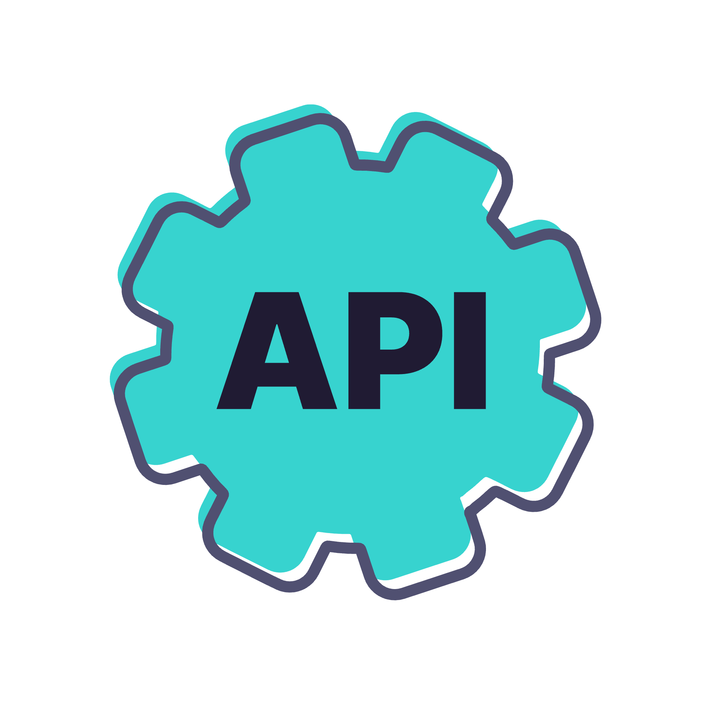

  

    <h1 style="font-size:2.9rem; font-weight:800; line-height:1.1; color:white; margin:0; border:0;">Security with Tyk:</h1>
    <h2 style="font-size:2.1rem; font-weight:800; line-height:1.1; color:white; margin:0.35rem 0 0 0; border:0;">Access Rights</h2>
    
In Tyk, Access rights control what APIs a client can use.

  

  

---
layout: default
---

  <h1 style="font-size:2.35rem; line-height:1.05; font-weight:800; color:#5b10d9; margin:0 0 0.95rem 0; max-width:7.2in; border:0;">What are Access Rights in Tyk?</h1>
  

    
Tyk is an enterprise-grade API Gateway that controls authentication, authorization, and traffic governance.

    
It enforces these rules through:

    <ul style="margin:0 0 0 1.15rem; padding:0; line-height:1.72;">
      <li>Access Rights (per-client permissions)</li>
      <li>Policies (centralized templates for rate limits, quotas, and scopes)</li>
    </ul>
  

  

---
layout: default
---

  <h1 style="font-size:2.18rem; line-height:1.05; font-weight:800; color:#5b10d9; margin:0 0 0.85rem 0; max-width:6.8in; border:0;">What an API Client Is Allowed to Access</h1>
  

    
Every API client (like a user, application, or service) is associated with an API Key or token. That key defines the client’s Access Rights — a list of APIs and API versions it is allowed to call.

    <ul style="margin:0 0 0 1.2rem; padding:0; line-height:1.7;">
      <li>You can explicitly allow specific APIs or versions.</li>
      <li>You do not need to define what is denied — if an API isn’t listed, access is automatically blocked.</li>
    </ul>
    
If the client tries to access an unauthorized API, the Tyk Gateway will reject the request with a 403 Forbidden error.

  

  

<!-- Notes: Encapsulation of rules
Policies give you a way to encapsulate security and other access settings into a pre-defined entity.
Purpose is to make your life easier when managing lots of tokens.
The important thing to understand about policies is that a single policy can apply to many tokens, so having a few policies can let you manage very large numbers of tokens easily.

They allow you to define:
An access control list, which sets which APIs, versions, endpoints and methods the policy can access.
Rate limit
Quota

Dynamically attached
When a policy is saved on the Dashboard, it only takes around 10 seconds for it to take effect on the server.
Policies are attached to request sessions at the start of the Tyk processing pipeline, so updates are take effect immediately.

Partitioning
Once a policy is assigned to a token it will override the settings of that token.
However, with policy partitioning it is possible to override only a particular part of the token – the ACL, rate limit, or quota (or any combination of the three).

No effect on open APIs
Policies have no effect one APIs which have been configured to be open.
This is because the Tyk pipeline skips all authentication so does not process any tokens provided. -->

---
layout: default
---

  <h1 style="font-size:3.15rem; line-height:1.02; font-weight:800; color:#5b10d9; margin:0.05rem 0 0 0.6rem; border:0;">Without Access rights</h1>
  
  

  

  
  

  

    

    

    

    

    

    

    

  

  

<!-- Notes: Without Access Rights
Everyone (all users) can access the API freely.
Green light means there's no restriction, which matches reality when access rights are not enforced.
Implication: This can lead to unauthorized usage, abuse, or security issues. -->

---
layout: default
---

  <h1 style="font-size:3rem; line-height:1.02; font-weight:800; color:#5b10d9; margin:0.1rem 0 0 0.12rem; border:0;">Access Rights with Tyk</h1>
  
  

  

  
  

  

  

    

    

    

    

    

    

  

  

    
•API Key valid?

    
•Does this key have access to the API?

  

  

<!-- Notes: Tyk sits in front of your APIs and enforces access control. For each incoming request, it checks:

For the key validity and whether that key is able to access the API

If both are true, the request is passed through. If not, it is denied. -->

---
layout: default
---

  <h1 style="font-size:2.16rem; line-height:1.05; font-weight:800; color:#5b10d9; margin:0 0 0.95rem 0; border:0;">Define Access Rights</h1>
  

    

      
Access rights are configured in both API Key and Policy objects

      
Defined by the <code style="font-size:0.72rem; background:#f4f4f4; padding:0 0.18rem; border-radius:0.16rem;">access_rights</code> property:

      <ul style="margin:0 0 0 1.05rem; padding:0; line-height:1.65;">
        <li>Contains a list of APIs which are allowed to be accessed</li>
        <li>Each API entry contains a list of versions which are allowed to be accessed</li>
      </ul>
      
Note: When new versions of an API are created, they are not automatically added to access rights

    

    

      
    

  

  

---
layout: default
---

  <h1 style="font-size:1.9rem; line-height:1.02; font-weight:800; color:#5b10d9; margin:0 0 1rem 0; max-width:7.2in; border:0;">Access Rights: Path Based Permissions</h1>
  

    
Path-based permissions provide additional granular control of API access, based on HTTP methods and paths:

    <ul style="margin:0 0 0 1.05rem; padding:0; line-height:1.7;">
      <li>Defined as the HTTP methods allowed for a path e.g. <code style="font-size:0.72rem; background:#f4f4f4; padding:0 0.14rem; border-radius:0.15rem;">GET /hello</code></li>
      <li>Paths and methods act as an allow list</li>
    </ul>
    
APIs must be selected in Access Rights to enable path-based permissions to be defined for them

  

  

<!-- Notes: Encapsulation of rules
Policies give you a way to encapsulate security and other access settings into a pre-defined entity.
Purpose is to make your life easier when managing lots of tokens.
The important thing to understand about policies is that a single policy can apply to many tokens, so having a few policies can let you manage very large numbers of tokens easily.

They allow you to define:
An access control list, which sets which APIs, versions, endpoints and methods the policy can access.
Rate limit
Quota

Dynamically attached
When a policy is saved on the Dashboard, it only takes around 10 seconds for it to take effect on the server.
Policies are attached to request sessions at the start of the Tyk processing pipeline, so updates are take effect immediately.

Partitioning
Once a policy is assigned to a token it will override the settings of that token.
However, with policy partitioning it is possible to override only a particular part of the token – the ACL, rate limit, or quota (or any combination of the three).

No effect on open APIs
Policies have no effect one APIs which have been configured to be open.
This is because the Tyk pipeline skips all authentication so does not process any tokens provided. -->

---
layout: default
---

  <h1 style="font-size:1.82rem; line-height:1.02; font-weight:800; color:#5b10d9; margin:0 0 1.05rem 0; max-width:7.8in; border:0;">Access Rights: Path-Based Permissions Enforcement</h1>
  

    
Enforcement is based on the permissions granted to the API client:

    <ul style="margin:0 0 0 1.05rem; padding:0; line-height:1.65;">
      <li>If the requested API, HTTP method and path combination is not found in the path-based permissions then the request is blocked</li>
      <li>Example:
        <ul style="margin:0.3rem 0 0 0.9rem; line-height:1.55;">
          <li><code style="font-size:0.68rem; background:#f4f4f4; padding:0 0.15rem; border-radius:0.15rem;">/profile</code> allows <code style="font-size:0.68rem; background:#f4f4f4; padding:0 0.15rem; border-radius:0.15rem;">GET</code> requests, any <code style="font-size:0.68rem; background:#f4f4f4; padding:0 0.15rem; border-radius:0.15rem;">POST</code> requests for <code style="font-size:0.68rem; background:#f4f4f4; padding:0 0.15rem; border-radius:0.15rem;">/profile</code> are blocked</li>
        </ul>
      </li>
      <li style="margin-top:0.45rem;">API clients which fail the path-based permissions check will be blocked:
        <ul style="margin:0.3rem 0 0 0.9rem; line-height:1.55;">
          <li>HTTP status code: 403 Forbidden</li>
        </ul>
      </li>
    </ul>
  

  

<!-- Notes: Encapsulation of rules
Policies give you a way to encapsulate security and other access settings into a pre-defined entity.
Purpose is to make your life easier when managing lots of tokens.
The important thing to understand about policies is that a single policy can apply to many tokens, so having a few policies can let you manage very large numbers of tokens easily.

They allow you to define:
An access control list, which sets which APIs, versions, endpoints and methods the policy can access.
Rate limit
Quota

Dynamically attached
When a policy is saved on the Dashboard, it only takes around 10 seconds for it to take effect on the server.
Policies are attached to request sessions at the start of the Tyk processing pipeline, so updates are take effect immediately.

Partitioning
Once a policy is assigned to a token it will override the settings of that token.
However, with policy partitioning it is possible to override only a particular part of the token – the ACL, rate limit, or quota (or any combination of the three).

No effect on open APIs
Policies have no effect one APIs which have been configured to be open.
This is because the Tyk pipeline skips all authentication so does not process any tokens provided. -->

---
layout: default
---

  <h1 style="font-size:2.62rem; line-height:1.02; font-weight:800; color:#5b10d9; margin:0 0 0.85rem 0; max-width:7.5in; border:0;">Policies: Reusable Access Templates</h1>
  

    
Rather than configuring access rights for every single API Key, Tyk lets you define Policies that group:

    <ul style="margin:0 0 0 1.15rem; padding:0; line-height:1.55; font-size:0.82rem;">
      <li>Which APIs (and versions) can be accessed</li>
      <li>Quotas or usage limits</li>
      <li>Rate limiting rules</li>
      <li>Expiry rules or custom metadata</li>
    </ul>
    
You assign policies to API keys, OAuth clients, or JWT tokens — making it easy to manage consistent access rules

  

  

<!-- Notes: Encapsulation of rules
Policies give you a way to encapsulate security and other access settings into a pre-defined entity.
Purpose is to make your life easier when managing lots of tokens.
The important thing to understand about policies is that a single policy can apply to many tokens, so having a few policies can let you manage very large numbers of tokens easily.

They allow you to define:
An access control list, which sets which APIs, versions, endpoints and methods the policy can access.
Rate limit
Quota

Dynamically attached
When a policy is saved on the Dashboard, it only takes around 10 seconds for it to take effect on the server.
Policies are attached to request sessions at the start of the Tyk processing pipeline, so updates are take effect immediately.

Partitioning
Once a policy is assigned to a token it will override the settings of that token.
However, with policy partitioning it is possible to override only a particular part of the token – the ACL, rate limit, or quota (or any combination of the three).

No effect on open APIs
Policies have no effect one APIs which have been configured to be open.
This is because the Tyk pipeline skips all authentication so does not process any tokens provided. -->
