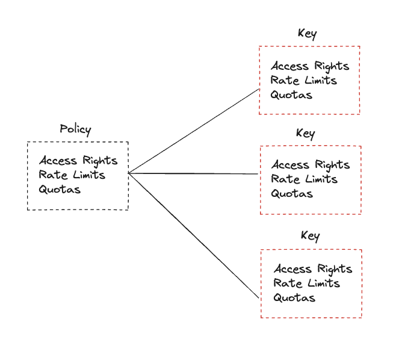
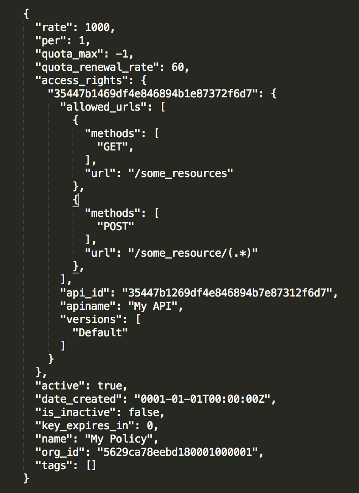
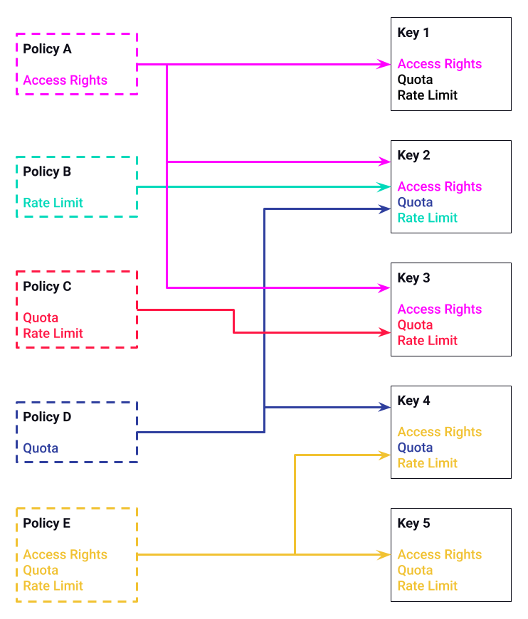
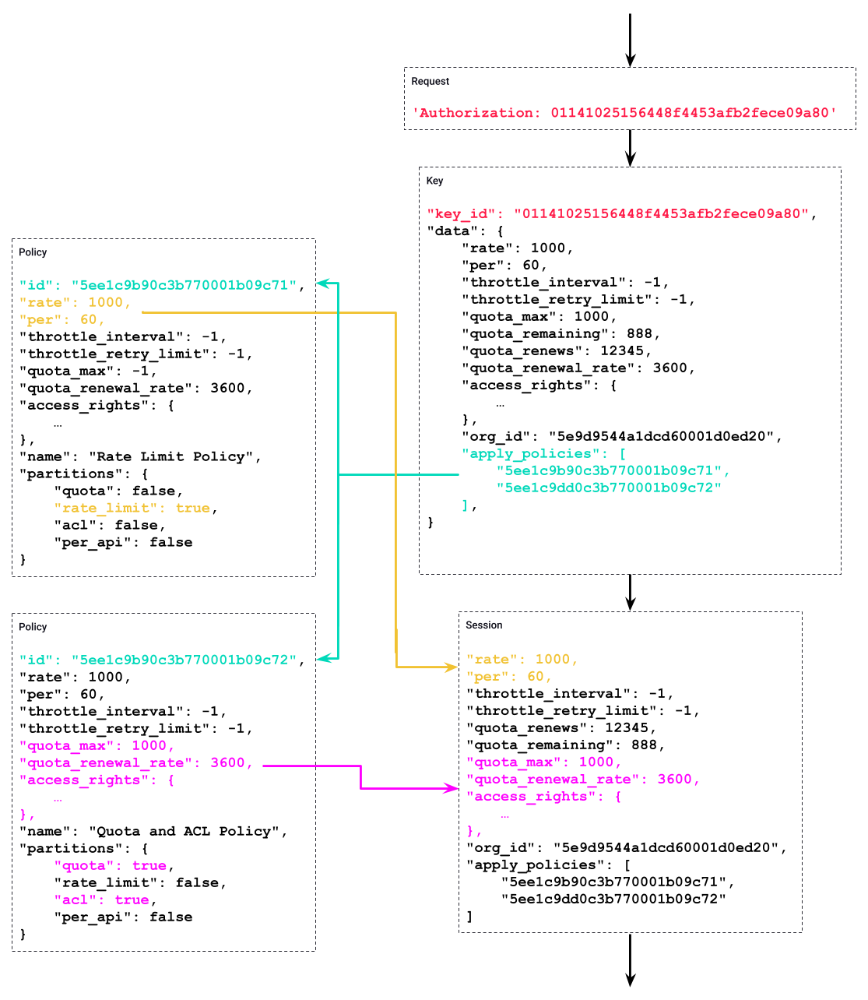

  <h1 style="font-size:2.6rem; font-weight:800; color:white; margin:0; border:0;">API Security with Tyk:</h1>
  <h2 style="font-size:1.45rem; font-weight:600; color:white; margin:0.6rem 0 0 0; border:0;">Policies in Tyk</h2>
  

    Learn how Tyk manages API access, quotas, and rate limits through reusable, scalable templates.
  

  

---
layout: default
---

# Policies

In Tyk, Security Policies act as templates for access control and rate limiting.

Access Keys (tokens) are what clients use to authenticate and access APIs.

By combining them, you can:

- Standardize access control
- Update access rights at scale
- Implement tiered access levels (Basic → Premium → Enterprise)
- Monitor and manage usage centrally

<!-- Notes: Encapsulation of rules
Policies give you a way to encapsulate security and other access settings into a pre-defined entity.
Purpose is to make your life easier when managing lots of tokens.
The important thing to understand about policies is that a single policy can apply to many tokens, so having a few policies can let you manage very large numbers of tokens easily.

They allow you to define:
An access control list, which sets which APIs, versions, endpoints and methods the policy can access.
Rate limit
Quota

Dynamically attached
When a policy is saved on the Dashboard, it only takes around 10 seconds for it to take effect on the server.
Policies are attached to request sessions at the start of the Tyk processing pipeline, so updates are take effect immediately.

Partitioning
Once a policy is assigned to a token it will override the settings of that token.
However, with policy partitioning it is possible to override only a particular part of the token – the ACL, rate limit, or quota (or any combination of the three).

No effect on open APIs
Policies have no effect one APIs which have been configured to be open.
This is because the Tyk pipeline skips all authentication so does not process any tokens provided. -->

---
layout: default
---

# Security Policy Overview

A Security Policy defines reusable rules for:

- API Access lists
- Rate limits
- Quotas
- Tags & metadata

Acts as a template to apply consistent limits or permissions to many keys.

Makes it easy to modify access for thousands of keys at once.

<!-- Notes: Encapsulation of rules
Policies give you a way to encapsulate security and other access settings into a pre-defined entity.
Purpose is to make your life easier when managing lots of tokens.
The important thing to understand about policies is that a single policy can apply to many tokens, so having a few policies can let you manage very large numbers of tokens easily.

They allow you to define:
An access control list, which sets which APIs, versions, endpoints and methods the policy can access.
Rate limit
Quota

Dynamically attached
When a policy is saved on the Dashboard, it only takes around 10 seconds for it to take effect on the server.
Policies are attached to request sessions at the start of the Tyk processing pipeline, so updates are take effect immediately.

Partitioning
Once a policy is assigned to a token it will override the settings of that token.
However, with policy partitioning it is possible to override only a particular part of the token – the ACL, rate limit, or quota (or any combination of the three).

No effect on open APIs
Policies have no effect one APIs which have been configured to be open.
This is because the Tyk pipeline skips all authentication so does not process any tokens provided. -->

---
layout: default
---

# Why Use Policies?

  

    
Without policies:

    
Each API key must be updated manually.

    
With policies:

    
Update once → all associated keys inherit changes.

    
Example: Upgrade 10,000 users' quotas by updating just one policy.

  

  

    
  

<!-- Notes: Encapsulation of rules
Policies give you a way to encapsulate security and other access settings into a pre-defined entity.
Purpose is to make your life easier when managing lots of tokens.
The important thing to understand about policies is that a single policy can apply to many tokens, so having a few policies can let you manage very large numbers of tokens easily.

They allow you to define:
An access control list, which sets which APIs, versions, endpoints and methods the policy can access.
Rate limit
Quota

Dynamically attached
When a policy is saved on the Dashboard, it only takes around 10 seconds for it to take effect on the server.
Policies are attached to request sessions at the start of the Tyk processing pipeline, so updates are take effect immediately.

Partitioning
Once a policy is assigned to a token it will override the settings of that token.
However, with policy partitioning it is possible to override only a particular part of the token – the ACL, rate limit, or quota (or any combination of the three).

No effect on open APIs
Policies have no effect one APIs which have been configured to be open.
This is because the Tyk pipeline skips all authentication so does not process any tokens provided. -->

---
layout: default
---

# Policy Capabilities

A Tyk policy can define:

- APIs and versions accessible
- Allowed methods and paths
- Rate limits
- Quotas
- Tags and metadata

Policies can also be partitioned — e.g.

- Apply global ACLs for all users
- Apply per-user rate limits and quotas

<!-- Notes: Encapsulation of rules
Policies give you a way to encapsulate security and other access settings into a pre-defined entity.
Purpose is to make your life easier when managing lots of tokens.
The important thing to understand about policies is that a single policy can apply to many tokens, so having a few policies can let you manage very large numbers of tokens easily.

They allow you to define:
An access control list, which sets which APIs, versions, endpoints and methods the policy can access.
Rate limit
Quota

Dynamically attached
When a policy is saved on the Dashboard, it only takes around 10 seconds for it to take effect on the server.
Policies are attached to request sessions at the start of the Tyk processing pipeline, so updates are take effect immediately.

Partitioning
Once a policy is assigned to a token it will override the settings of that token.
However, with policy partitioning it is possible to override only a particular part of the token – the ACL, rate limit, or quota (or any combination of the three).

No effect on open APIs
Policies have no effect one APIs which have been configured to be open.
This is because the Tyk pipeline skips all authentication so does not process any tokens provided. -->

---
layout: default
---

# Relationship: Policy vs Access Key

Policies are applied to keys when keys are created.

Policies override any individual settings on the key.

Multiple policies can be combined for flexible control.

<!-- Notes: Encapsulation of rules
Policies give you a way to encapsulate security and other access settings into a pre-defined entity.
Purpose is to make your life easier when managing lots of tokens.
The important thing to understand about policies is that a single policy can apply to many tokens, so having a few policies can let you manage very large numbers of tokens easily.

They allow you to define:
An access control list, which sets which APIs, versions, endpoints and methods the policy can access.
Rate limit
Quota

Dynamically attached
When a policy is saved on the Dashboard, it only takes around 10 seconds for it to take effect on the server.
Policies are attached to request sessions at the start of the Tyk processing pipeline, so updates are take effect immediately.

Partitioning
Once a policy is assigned to a token it will override the settings of that token.
However, with policy partitioning it is possible to override only a particular part of the token – the ACL, rate limit, or quota (or any combination of the three).

No effect on open APIs
Policies have no effect one APIs which have been configured to be open.
This is because the Tyk pipeline skips all authentication so does not process any tokens provided. -->

---
layout: default
---

# Policy Evaluation Flow

When a request comes in:

1. Tyk reads the Access Key
2. Checks which Policies are linked
3. Merges rules → applies rate limit, quota, ACL
4. Grants or denies API access accordingly

Note: This enables centralized management and consistent enforcement.

<!-- Notes: Encapsulation of rules
Policies give you a way to encapsulate security and other access settings into a pre-defined entity.
Purpose is to make your life easier when managing lots of tokens.
The important thing to understand about policies is that a single policy can apply to many tokens, so having a few policies can let you manage very large numbers of tokens easily.

They allow you to define:
An access control list, which sets which APIs, versions, endpoints and methods the policy can access.
Rate limit
Quota

Dynamically attached
When a policy is saved on the Dashboard, it only takes around 10 seconds for it to take effect on the server.
Policies are attached to request sessions at the start of the Tyk processing pipeline, so updates are take effect immediately.

Partitioning
Once a policy is assigned to a token it will override the settings of that token.
However, with policy partitioning it is possible to override only a particular part of the token – the ACL, rate limit, or quota (or any combination of the three).

No effect on open APIs
Policies have no effect one APIs which have been configured to be open.
This is because the Tyk pipeline skips all authentication so does not process any tokens provided. -->

---
layout: default
---

<h2 style="color:#5900CB; font-size:1.8rem; font-weight:bold; margin-bottom:1rem;">Policy Structure</h2>

  

    

      

      
Quota and rate limiting data

    

    

      

      
Access control (API ID / Path Version)

    

    

      

      
Lock out policy holders

    

    

      

      
Meta data and analytics

    

  

  

    
  

<!-- Notes: Encapsulation of rules
Policies give you a way to encapsulate security and other access settings into a pre-defined entity.
Purpose is to make your life easier when managing lots of tokens.
The important thing to understand about policies is that a single policy can apply to many tokens, so having a few policies can let you manage very large numbers of tokens easily.

They allow you to define:
An access control list, which sets which APIs, versions, endpoints and methods the policy can access.
Rate limit
Quota

Dynamically attached
When a policy is saved on the Dashboard, it only takes around 10 seconds for it to take effect on the server.
Policies are attached to request sessions at the start of the Tyk processing pipeline, so updates are take effect immediately.

Partitioning
Once a policy is assigned to a token it will override the settings of that token.
However, with policy partitioning it is possible to override only a particular part of the token – the ACL, rate limit, or quota (or any combination of the three).

No effect on open APIs
Policies have no effect one APIs which have been configured to be open.
This is because the Tyk pipeline skips all authentication so does not process any tokens provided. -->

---
layout: default
---

# Key Policy Fields

<!-- Notes: Encapsulation of rules
Policies give you a way to encapsulate security and other access settings into a pre-defined entity.
Purpose is to make your life easier when managing lots of tokens.
The important thing to understand about policies is that a single policy can apply to many tokens, so having a few policies can let you manage very large numbers of tokens easily.

They allow you to define:
An access control list, which sets which APIs, versions, endpoints and methods the policy can access.
Rate limit
Quota

Dynamically attached
When a policy is saved on the Dashboard, it only takes around 10 seconds for it to take effect on the server.
Policies are attached to request sessions at the start of the Tyk processing pipeline, so updates are take effect immediately.

Partitioning
Once a policy is assigned to a token it will override the settings of that token.
However, with policy partitioning it is possible to override only a particular part of the token – the ACL, rate limit, or quota (or any combination of the three).

No effect on open APIs
Policies have no effect one APIs which have been configured to be open.
This is because the Tyk pipeline skips all authentication so does not process any tokens provided. -->

---
layout: default
---

# Access Key Example

  

    

      <pre style="color:#e0e0e0; font-size:0.65rem; margin:0; font-family:monospace; line-height:1.5; white-space:pre; overflow:hidden;">{
  "org_id": "53ac07777cbb8c2d53000002",
  "apply_policies": [
    "59672779fa4387000129507d",
    "53222349fa4387004324324e"
  ],
  "quota_max": 1000,
  "rate": 3,
  "per": 1
}</pre>
    

  

  

    
The key inherits all limits, ACLs, and quotas from the applied policies.

    
Any changes to the policy → immediately reflected for this key.

  

<!-- Notes: Encapsulation of rules
Policies give you a way to encapsulate security and other access settings into a pre-defined entity.
Purpose is to make your life easier when managing lots of tokens.
The important thing to understand about policies is that a single policy can apply to many tokens, so having a few policies can let you manage very large numbers of tokens easily.

They allow you to define:
An access control list, which sets which APIs, versions, endpoints and methods the policy can access.
Rate limit
Quota

Dynamically attached
When a policy is saved on the Dashboard, it only takes around 10 seconds for it to take effect on the server.
Policies are attached to request sessions at the start of the Tyk processing pipeline, so updates are take effect immediately.

Partitioning
Once a policy is assigned to a token it will override the settings of that token.
However, with policy partitioning it is possible to override only a particular part of the token – the ACL, rate limit, or quota (or any combination of the three).

No effect on open APIs
Policies have no effect one APIs which have been configured to be open.
This is because the Tyk pipeline skips all authentication so does not process any tokens provided. -->

---
layout: default
---

# Policies: General vs Per-API Rules

Rules defined in the policy can be set generally for all APIs, or specifically for individual APIs.

Only some rules can be set per-API:

- Rate limiting
- Throttling
- Quotas
- Path-based permissions

  
Important: This cannot be used at the same time as Policy partitioning

<!-- Notes: Encapsulation of rules
Policies give you a way to encapsulate security and other access settings into a pre-defined entity.
Purpose is to make your life easier when managing lots of tokens.
The important thing to understand about policies is that a single policy can apply to many tokens, so having a few policies can let you manage very large numbers of tokens easily.

They allow you to define:
An access control list, which sets which APIs, versions, endpoints and methods the policy can access.
Rate limit
Quota

Dynamically attached
When a policy is saved on the Dashboard, it only takes around 10 seconds for it to take effect on the server.
Policies are attached to request sessions at the start of the Tyk processing pipeline, so updates are take effect immediately.

Partitioning
Once a policy is assigned to a token it will override the settings of that token.
However, with policy partitioning it is possible to override only a particular part of the token – the ACL, rate limit, or quota (or any combination of the three).

No effect on open APIs
Policies have no effect one APIs which have been configured to be open.
This is because the Tyk pipeline skips all authentication so does not process any tokens provided. -->

---
layout: default
---

# Policies: Policy Partitioning

Policy partitioning allows policies to enforce only specific rules.

Helps reduce the total number of Policies required and provide more flexibility.

Policies must select at least one rule set to enforce:

- Quotas
- Rate limiting
- Access control
- GraphQL query depth

<!-- Notes: Encapsulation of rules
Policies give you a way to encapsulate security and other access settings into a pre-defined entity.
Purpose is to make your life easier when managing lots of tokens.
The important thing to understand about policies is that a single policy can apply to many tokens, so having a few policies can let you manage very large numbers of tokens easily.

They allow you to define:
An access control list, which sets which APIs, versions, endpoints and methods the policy can access.
Rate limit
Quota

Dynamically attached
When a policy is saved on the Dashboard, it only takes around 10 seconds for it to take effect on the server.
Policies are attached to request sessions at the start of the Tyk processing pipeline, so updates are take effect immediately.

Partitioning
Once a policy is assigned to a token it will override the settings of that token.
However, with policy partitioning it is possible to override only a particular part of the token – the ACL, rate limit, or quota (or any combination of the three).

No effect on open APIs
Policies have no effect one APIs which have been configured to be open.
This is because the Tyk pipeline skips all authentication so does not process any tokens provided. -->

---
layout: default
---

# Policies: Multi-Policy Keys

It is possible to assign multiple Policies to a Key:

- Policy rules will be merged to create a combined rule set
- It is possible to select Policies with the same API Access Rights, if their path-based permissions do not conflict
- When using partitioned Policies, their partitions must not overlap

<!-- Notes: Encapsulation of rules
Policies give you a way to encapsulate security and other access settings into a pre-defined entity.
Purpose is to make your life easier when managing lots of tokens.
The important thing to understand about policies is that a single policy can apply to many tokens, so having a few policies can let you manage very large numbers of tokens easily.

They allow you to define:
An access control list, which sets which APIs, versions, endpoints and methods the policy can access.
Rate limit
Quota

Dynamically attached
When a policy is saved on the Dashboard, it only takes around 10 seconds for it to take effect on the server.
Policies are attached to request sessions at the start of the Tyk processing pipeline, so updates are take effect immediately.

Partitioning
Once a policy is assigned to a token it will override the settings of that token.
However, with policy partitioning it is possible to override only a particular part of the token – the ACL, rate limit, or quota (or any combination of the three).

No effect on open APIs
Policies have no effect one APIs which have been configured to be open.
This is because the Tyk pipeline skips all authentication so does not process any tokens provided. -->

---
layout: default
---

  

    Example
  

  

<!-- Notes: This example illustrates how Policies can be combined and the effect this has on the Key.

On the left side of the diagram are 5 Policies. 4 are partitioned Policies; A, B, C and D. And Policy E is a standard Policy. For the sake of simplicity, only three properties are shown; Access Rights, Quotas and Rate Limit.

On the right side of the diagram are 5 keys. The properties shown in the Keys are colour-code to match the Policies they are inherited from.

Starting at the top;
Key 1 is associated with Policy A. Policy A is a partitioned Policy which only defines Access Rights, so Key 1 inherits only that property, leaving the Key's other properties, Quota and Rate Limit, to be defined directly on the Key itself.
Key 2 is associated with three Policies; A, B and D. Each of these Policies is partitioned, and none of the partitions overlap, so this is ok. This means that each of the Key's properties is defined by a different Policy.
Key 3 is associated with two Policies; A and C. This is much like the last example, but in this case, Policy C defines two properties, but they don't overlap with Policy A, so this is ok.
Key 4 is associated with two Policies D and E. This is a mixture of different types of Policy, Policy D is partitioned and Policy E is normal. This results in Policy D's properties overriding Policy E's properties; so although Policy E defines a Quota, the Key uses the Quota from Policy D, as it is a partitioned Policy.
Key 5 is associated with one Policy, E. Policy E is a standard Policy, so all of its properties are inherited. -->

---
layout: default
---

  

    Example
  

  

<!-- Notes: This example shows how Policy data is combined with Key data, resulting in the session data used by the Gateway to process the request.

The left side of the diagram has the Policy objects. The right side of the diagram shows the sequence as the request is processed by the Gateway.

The colour-coding and lines show the relationships between the data.

Starting at the top right with the Request, it provides an Authorization header containing a key.

The Gateway uses that value to retrieve the key data from the database. This is what's shown in the Key box.

The Key defines the Policies it's associated with in the "apply_policies" property. In this case it has 2 Policies, as linked by the teal colour and line.

The Gateway processes these Policies and merges them with the Key to create the session data.

In this case, the Policies are partitioned, with one Policies defining the Rate Limit data, and the other Policy defining the Quota and Access Rights data.

These are merged into the Key data as shown by the Yellow and Pink colours and lines.

This data is then used by the Gateway during the rest of the request lifecycle. -->
