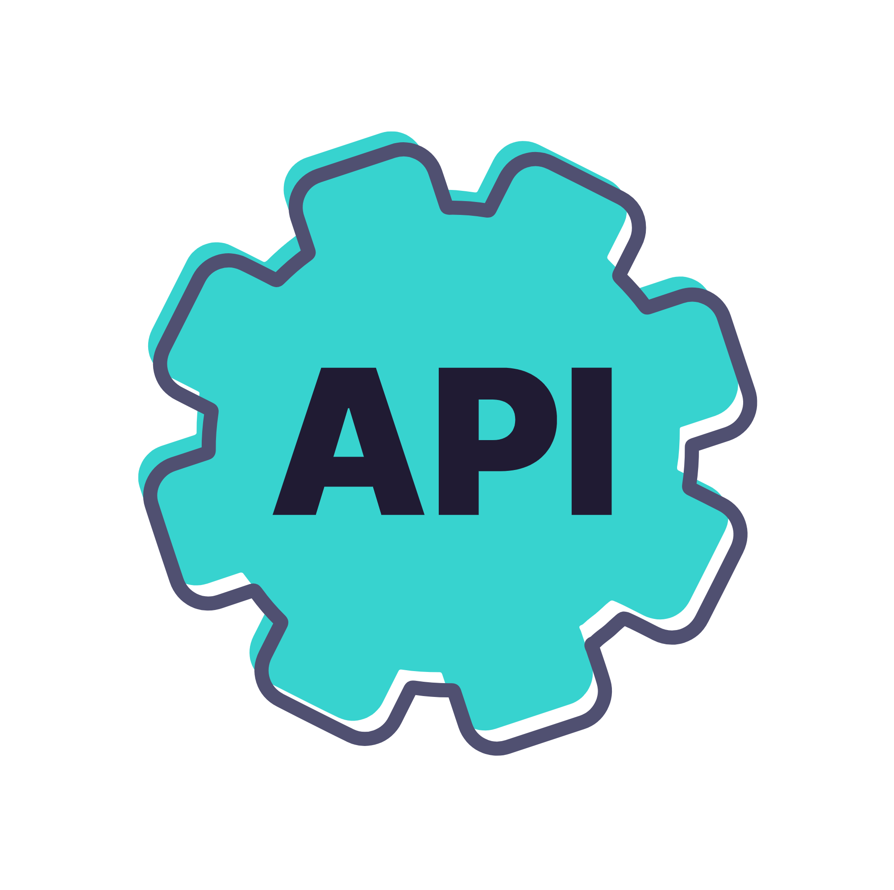
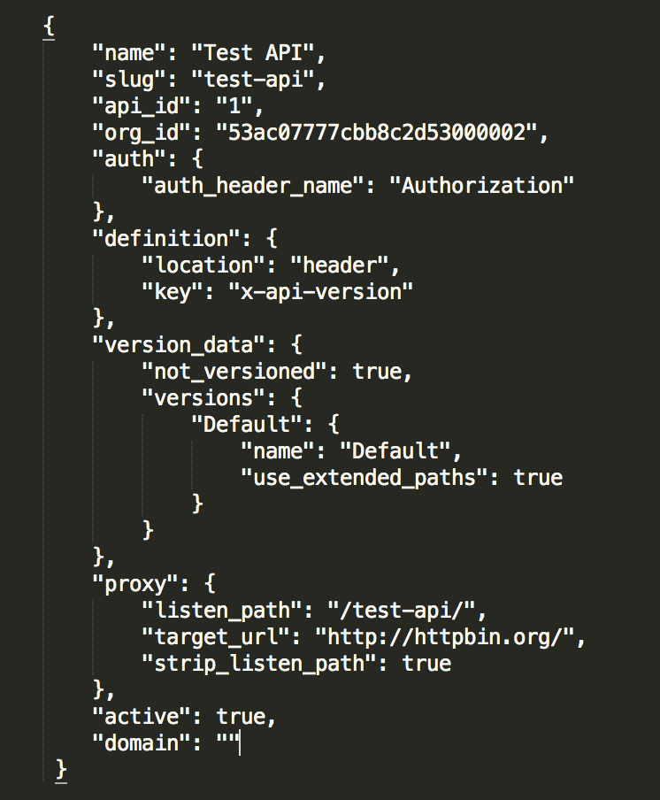

  <h1 style="position:absolute; left:160px; top:220px; font-size:3.28rem; font-weight:800; color:white; margin:0; border:0; line-height:1.06; text-align:left;">Classic API Definitions</h1>
  

    
  

---
layout: default
---

<h1 style="color:#5900CB; font-size:2.35rem; font-weight:800; margin:0 0 1.15rem 0; line-height:1.03;">Tyk-Classic API Definition</h1>

  

    <ul style="margin:0; padding-left:1.25rem;">
      <li style="margin-bottom:0.52rem;">
        Defined using JSON structure
        <ul style="margin-top:0.12rem; padding-left:1.35rem; list-style-type:circle;">
          <li>Fully customizable API config file managed via Dashboard or API</li>
        </ul>
      </li>
      <li style="margin-bottom:0.52rem;">
        Contains all gateway-level logic, such as
        <ul style="margin-top:0.12rem; padding-left:1.35rem; list-style-type:circle;">
          <li>Authentication</li>
          <li>Rate-limiting</li>
          <li>Target URL</li>
          <li>Versions</li>
          <li>Middleware</li>
        </ul>
      </li>
      <li>
        Editable via
        <ul style="margin-top:0.12rem; padding-left:1.35rem; list-style-type:circle;">
          <li>Tyk Dashboard UI (API Designer)</li>
          <li>Tyk Admin API</li>
          <li>Tyk Classic API Definition file (.json)</li>
        </ul>
      </li>
    </ul>
  

  

    
  

  

<!-- Notes: “Let’s talk about how Tyk manages and stores your API configurations."
"At the core of Tyk’s API management is something called an API Definition. This is essentially a JSON object that describes everything Tyk needs to know about your API. Each API you expose through Tyk has its own API Definition, and this is what the Tyk Gateway reads to manage how traffic flows."
"Inside an API Definition, we encapsulate the management rules for that API. It includes the settings and middlewares that define how incoming requests are handled, authenticated, and forwarded."
"For example, you can specify: Authentication, like API Keys or JWTs, to secure your API; Rate-limiting and quotas to protect your backend services from being overwhelmed; The Target URL, where Tyk should forward requests after it processes them; Support for Versions, so you can manage multiple versions of the same API simultaneously; And Middleware, which lets you apply transformations, enforce business logic, or add custom behaviors on requests and responses."
"Now, there are two types of API Definitions available in Tyk: Tyk Classic API Definitions, which are highly flexible and use Tyk’s traditional JSON schema; and Tyk OAS API Definitions, which are based on the OpenAPI Specification, providing a standardized, industry-recognized way of defining and managing APIs."
"Regardless of the type you choose, the API Definition is the single source of truth that governs how Tyk handles your APIs." -->

---
layout: default
---

<h1 style="color:#5900CB; font-size:2.6rem; font-weight:800; margin:0 0 0.85rem 0; line-height:1.02;">Necessary Fields</h1>

  
  

  
Metadata about the API

  
Security method type and location of credentials

  
Version data and middleware configurations for list operations

  
Target and listener setup

  <svg viewBox="0 0 980 424" width="100%" height="424" style="position:absolute; inset:0;">
    <g stroke="#1481d8" stroke-width="3" fill="none">
      <line x1="436" y1="78" x2="500" y2="78" />
      <path d="M500 50 L500 106 L548 106" />
      <path d="M500 50 L500 50 L548 50" />
      <line x1="436" y1="192" x2="500" y2="192" />
      <path d="M500 112 L500 248 L548 248" />
      <path d="M500 112 L500 112 L548 112" />
      <line x1="436" y1="304" x2="500" y2="304" />
      <path d="M500 250 L500 356 L548 356" />
      <path d="M500 250 L500 250 L548 250" />
      <line x1="436" y1="388" x2="500" y2="388" />
      <path d="M500 362 L500 414 L548 414" />
      <path d="M500 362 L500 362 L548 362" />
    </g>
  </svg>

  

