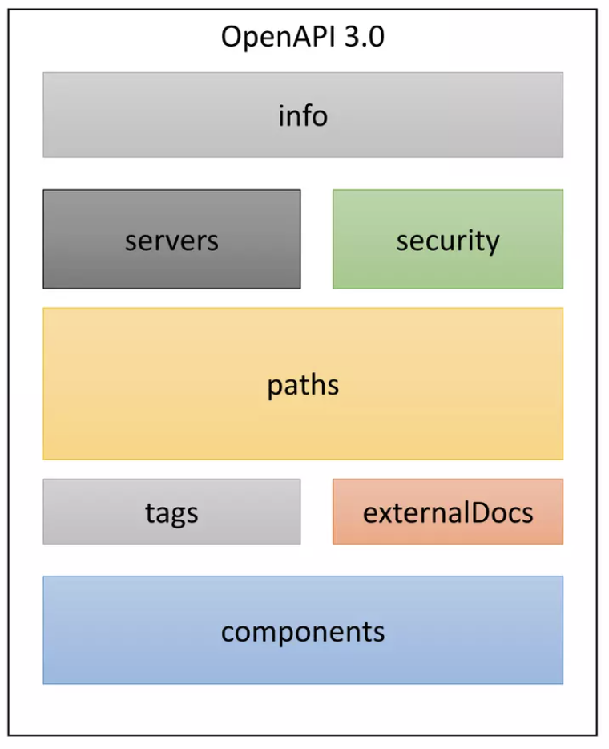
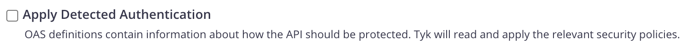
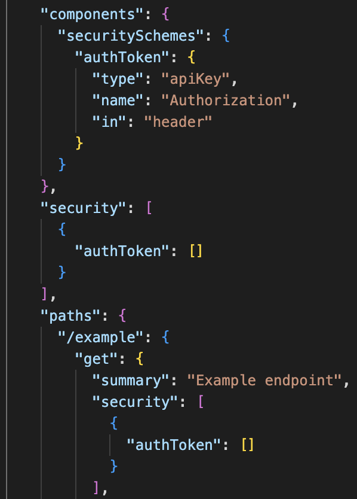
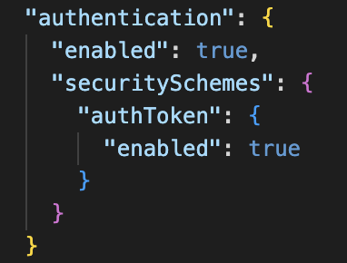
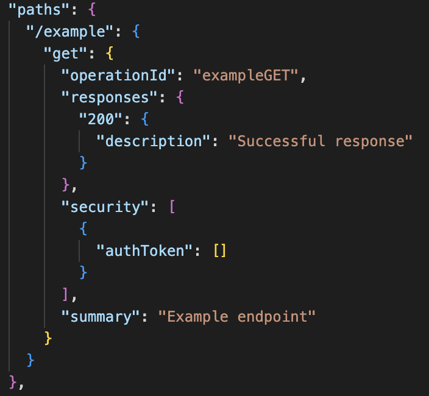
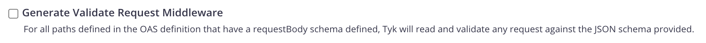
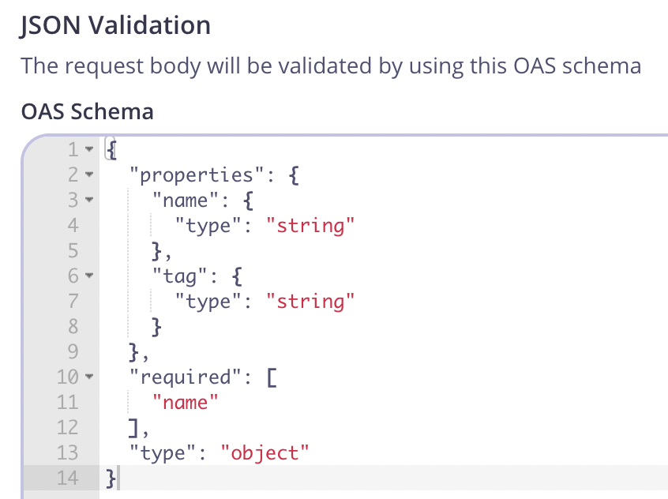

  <h1 style="position:absolute; left:6.2rem; top:13.6rem; margin:0; color:#fff; font-size:3.0rem; font-weight:800; letter-spacing:0.01em; line-height:1.05;">Tyk OAS API Definitions</h1>
  

  

---
layout: default
---

Tyk OAS Definition

•

Standard of defining APIs via OpenAPI Specification

•

Tyk supports the importing and configuration on the OAS

•

Significant time and complexity savings if you are already using it to design and document your APIs

<!-- Notes: Tyk supports the OpenAPI Specification, or OAS, which is the industry standard for defining APIs. If you're already using OAS to design and document your APIs, you can import those definitions directly into Tyk. This offers significant time savings and reduces complexity because you don't need to redefine your APIs from scratch. -->

---
layout: default
---

What is Tyk OAS API definition?

Tyk OAS API Definition

=

OpenAPI description

Tyk extension

From your API design tool or code editor (info, servers, paths, components, ...)

Export from Dashboard or Start from a template (gateway configurations, middleware configurations, listenPath, metadata, ...)

<!-- Notes: Tyk OAS API Definition combines a standard OpenAPI description with a Tyk extension section. The OpenAPI description comes from your design tool or editor, and the Tyk extension comes from dashboard export or a template. -->

---
layout: default
---

Tyk OAS Definition

OpenAPI 3.0

Tyk OAS Definition

x-tyk-api-gateway

<!-- Notes: A deeper look into the different sections. On the left is an OAS 3.0 spec and upon import we can see the sections are preserved with an additional x-tyk-api-gateway added. -->

---
layout: default
---

  <h1 style="margin:0 0 0.15rem 0; color:#5a16d6; font-size:2.28rem; font-weight:800; line-height:1.05;">Tyk Vendor Extension Reference</h1>

  
Custom Tyk API extensions inside the OpenAPI definition.

  
Stored under the key x-tyk-api-gateway.

  
Main Fields

  <ul style="margin:0; padding-left:1.25rem; color:#0f1127; font-size:0.92rem; line-height:1.4; max-width:42rem;">
    <li style="margin-bottom:0.8rem;">info (Info)
      <ul style="margin:0.15rem 0 0 0; padding-left:1.55rem; list-style-type:circle;">
        <li>Main metadata for the API definition</li>
      </ul>
    </li>
    <li style="margin-bottom:0.8rem;">upstream (Upstream)
      <ul style="margin:0.15rem 0 0 0; padding-left:1.55rem; list-style-type:circle;">
        <li>Configurations related to the upstream target</li>
      </ul>
    </li>
    <li style="margin-bottom:0.8rem;">server (Server)
      <ul style="margin:0.15rem 0 0 0; padding-left:1.55rem; list-style-type:circle;">
        <li>Configurations for the API server</li>
      </ul>
    </li>
    <li>middleware (Middleware)
      <ul style="margin:0.15rem 0 0 0; padding-left:1.55rem; list-style-type:circle;">
        <li>Configurations for Tyk middleware</li>
      </ul>
    </li>
  </ul>

  
Use x-tyk-api-gateway to enrich your OpenAPI spec with Tyk-specific runtime and security controls.

<!-- Notes: Slide Intro: "Now let's look at how Tyk extends the OpenAPI Specification with our own vendor extensions." Script Body: "Tyk uses the extension key x-tyk-api-gateway inside your OpenAPI documents." "This allows you to store Tyk-specific configurations directly in the API definition, alongside the standard OpenAPI fields." "In other words, you can design and document your API in OAS as usual, but still capture the Tyk settings needed for deployment and runtime." Walkthrough of Fields: Info – "This contains the main metadata for the API definition. Think of it as the high-level details about your API." Upstream – "Here you configure how Tyk connects to the upstream target — for example, the backend service you're proxying." Server – "This defines the server-side configuration — things like the listen path, host, and protocol." Middleware – "Finally, middleware holds the configuration for all Tyk middleware. This is where you can enrich or protect requests and responses." Closing: "So with x-tyk-api-gateway, you can keep both your OpenAPI spec and your Tyk configuration in a single document. That makes APIs easier to manage, version, and deploy consistently across environments." -->

---
layout: default
---

Tyk OAS Definition

•

Authentication

○ Auth token

○ JWT

○ OAuth 2.0

○ mTLS

○ Basic Auth

○ Multi-Auth

<!-- Notes: OAS securitySchemes describe ways an API may be accessed. When an apiKey securityScheme is configured in a Tyk OAS API definition, the x-tyk-api-gateway authentication mechanism becomes an authentication token, and Tyk only needs enabled set to true. -->

---
layout: default
---

Tyk OAS Definition

•

Validation
○ Automatically creates a request validation middleware in Tyk with schema in OAS

<!-- Notes: Tyk can validate request parameters and payloads against a schema provided in the OAS API definition, including schemas referenced elsewhere in the same definition. -->

---
layout: default
---

Tyk OAS Definition

•

Middleware
○ Uses operationIDs for middleware configured for each path

○ Middleware declared in x-tyk-api-gateway section

<!-- Notes: Middleware for a specific API path is linked through the operationId so the x-tyk-api-gateway configuration can refer back to the endpoint defined in the OAS paths section. -->