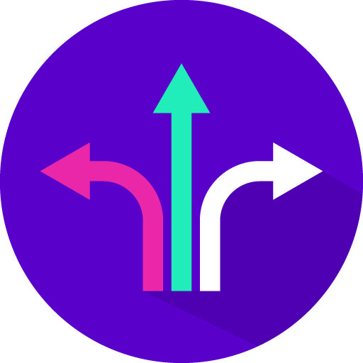
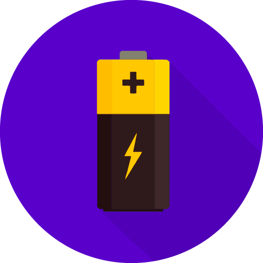

<!-- Notes: -->

---
layout: default
---

  

    About the Foundational Certification
  

  <ul style="position:absolute; left:168px; top:175px; width:650px; color:white; font-size:0.9rem; line-height:1.45;">
    <li>Foundational API management knowledge on Tyk</li>
    <li>Created for general audience - non-technical and technical</li>
    <li>Hands-on lab sessions</li>
    <li>Quizzes for progress checks</li>
    <li>Preparation to progress on specific learning paths</li>
    <li>Access to Customer Solutions Architects for additional support</li>
  </ul>

  

    
  

<!-- Notes: -->

---
layout: default
---

  

    About Tyk
  

  

    Tyk is a modern API Management Platform: an open source gateway, 
    powered by Go, and designed as cloud native from the start, enabling:
  

  <ul style="position:absolute; left:160px; top:235px; width:640px; color:white; font-size:0.78rem; line-height:1.48;">
    <li>Traffic management via the open source gateway</li>
    <li>Lifecycle management, analytics and observability via our intuitive dashboard</li>
    <li>Developer self-service and community engagement through our Enterprise Developer Portal</li>
    <li>Highly flexible deployment models: cloud, cloud/multi-cloud hybrid and on-prem</li>
  </ul>

  

    
  

<!-- Notes: -->

---
layout: default
---

  

    
    
2014

    
Here

    

      Tyk is born! Our CEO was looking for a lightweight yet highly performant API Gateway.
    

  

  

    
    
2016

    
There

    

      Tyk is incorporated and the paid licensing and support model is made generally available.
    

  

  

    
    
Today

    
Everywhere

    

      Tyk has over 151 employees in 31 countries worldwide with hundreds of customers on six continents.
    

  

  

    
  

<!-- Notes: -->

---
layout: cover
background: ./source_renders/slide-5.png
---

<!-- Notes: -->

---
layout: default
---

  
YEAH, BUT WHY TYK?

  
Tyk is not just a unique name!

  

    

      
      
Simplicity

    

    

      
      
Deployment flexibility

    

    

      
      
Batteries included

    

    

      
      
Highly secure

    

    

      
      
GraphQL Universal Data Graph

    

    

      
      
Our own stack

    

  

  

    
  

<!-- Notes: -->

---
layout: cover
background: ./source_renders/slide-7.png
---

<!-- Notes: -->
