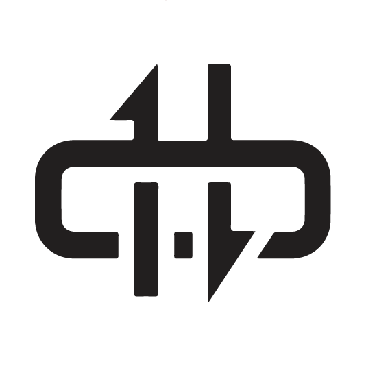
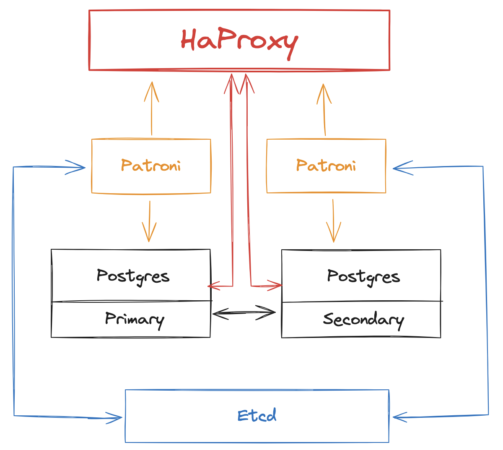
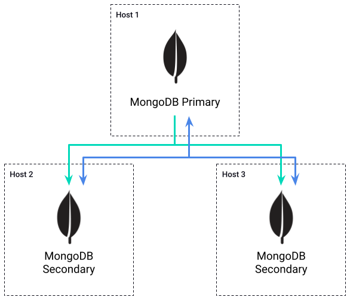

  

    <h1 style="font-size:3.35rem; font-weight:800; line-height:0.98; color:white; margin:0; letter-spacing:-0.02em;">Tyk Database: MongoDB &amp; PostgreSQL</h1>
    
Understanding the role of Tyk's primary databases and how they support performance and high availability

  

  

    
  

---
layout: default
---

  

    

      <h1 style="font-size:2rem; font-weight:700; color:#5900CB; margin:0 0 1rem 0;">Tyk &amp; Databases</h1>
      
Long-Term Data

      
▪ API definitions/Policies

      
▪ Analytics/Usage Statistics

      
▪ Dashboard User and Access Management

      
▪ Audit Logs

      
Supported Databases

      
▪ PostgreSQL

      
▪ MongoDB

    

    

      

        
Redis

        
        
Database

        
        

        

        
        
Gateway

        
        
Dashboard

        

        

      

    

  

  

    
  

<!-- Notes: Tyk Dashboard requires a database to store and manage various types of data that are essential for its operation and the enhanced features it provides. The database stores API configurations, policies, and user settings. The database is used to store detailed analytics data collected from the Gateway. Information about users, roles, and permissions is stored in the database. The database maintains audit logs of changes made through the Dashboard. Dashboard data store. Used by the Dashboard for data storage. For production environments it is recommended to run MongoDB in a highly available manner. API configurations: stores API configurations, analytics, Dashboard configurations, dashboard users, portal developers, portal configuration, policies, organisations. -->

---
layout: default
---

  <h1 style="font-size:2.28rem; font-weight:800; color:#5900CB; margin:0 0 0.85rem 0; letter-spacing:-0.02em;">PostgreSQL</h1>
  

    

      

        
•

        
Combination of streaming replication, Patroni &amp; Etcd for automated failover

      

      

        
•

        
HAProxy for load balancing:

      

      

        

          
○

          
Continuous Synchronization by streaming write-ahead logs (WAL) from primary to standby nodes

        

        

          
○

          
HAProxy

        

        

          

            
■

            
Monitors health of servers via Patroni (Primary &amp; Standby)

          

          

            
■

            
Distributes incoming database connections

          

        

        

          
○

          
Etcd acts as a distributed key-value store for configuration management

        

        

          
○

          
Patroni

        

        

          

            
■

            
Manages failover and PostgreSQL cluster management, monitors health of servers &amp; checking status &amp; connectivity

          

          

            
■

            
Orchestrates standby promotion if there are issues detected on primary server

          

        

      

    

    

      
    

  

  

    
  

<!-- Notes: To ensure high availability in a PostgreSQL setup, we can use a combination of streaming replication, Patroni, Etcd, and HAProxy. Note that you may have a different way of achieving this and this is solely for informational purposes. Streaming replication enables continuous synchronization between the primary and standby PostgreSQL nodes by streaming the write-ahead logs. Patroni manages the PostgreSQL cluster, handling failovers, and monitoring the health and connectivity of both primary and standby nodes. Etcd acts as a distributed key-value store and maintains the cluster state. HAProxy plays the role of a load balancer monitoring server health via Patroni. -->

---
layout: default
---

  <h1 style="font-size:2.28rem; font-weight:800; color:#5900CB; margin:0 0 0.9rem 0; letter-spacing:-0.02em;">MongoDB</h1>
  

    

      
MongoDB uses Replica Sets for high availability:

      

        
•

        
Requires a minimum of three separate hosts for high availability

      

      

        
•

        
All members of Replica Set must be able to communicate with each other

      

      

        
•

        
Election occurs if Primary becomes inaccessible

      

      

        
•

        
Members can have different priorities, to determine the new Primary

      

      

        
•

        
A majority of Replica Set members are required for an election

      

    

    

      
    

  

  

    
  

<!-- Notes: MongoDB uses what it calls Replica Sets to enable high availability deployments. These deployments must consist of at least three hosts in order to be highly available. All members of the Replica Set must be able to communicate with each other to maintain a heartbeat. If the Primary member becomes inaccessible, then a new primary is elected from the remaining members. Members can be given a priority to determine which member is elected the new Primary. A majority of members are required to hold an election. -->