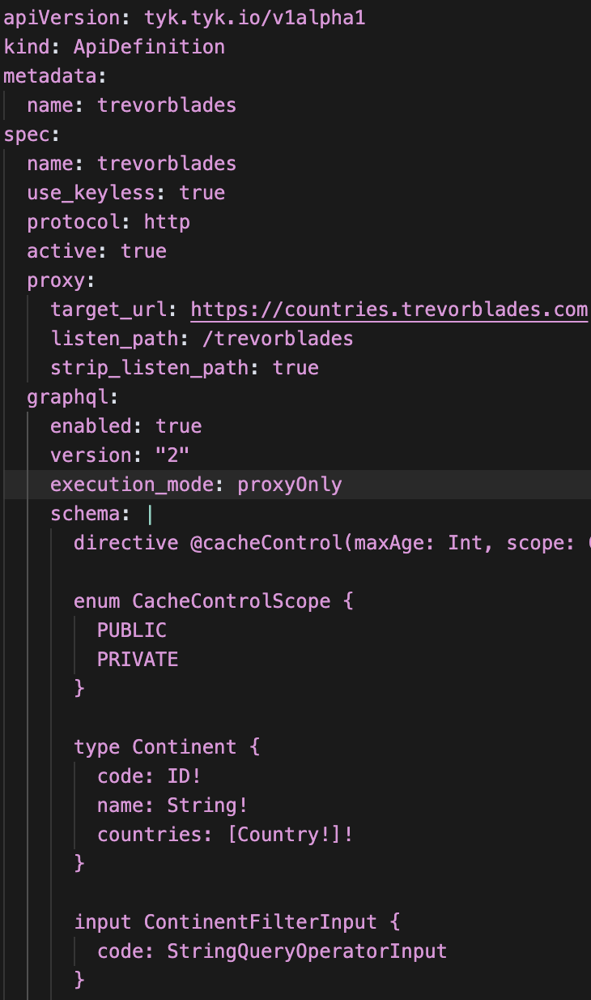
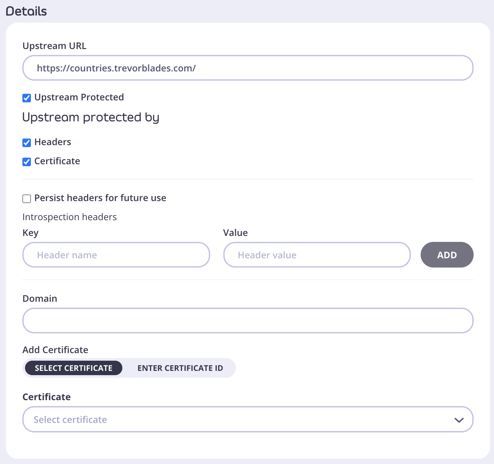
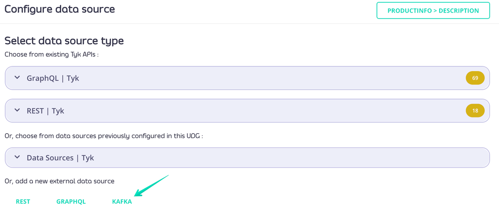
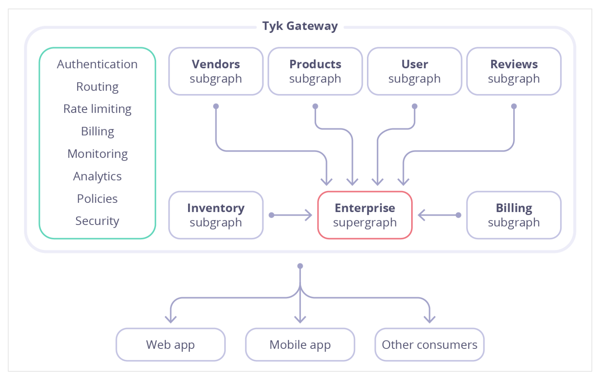
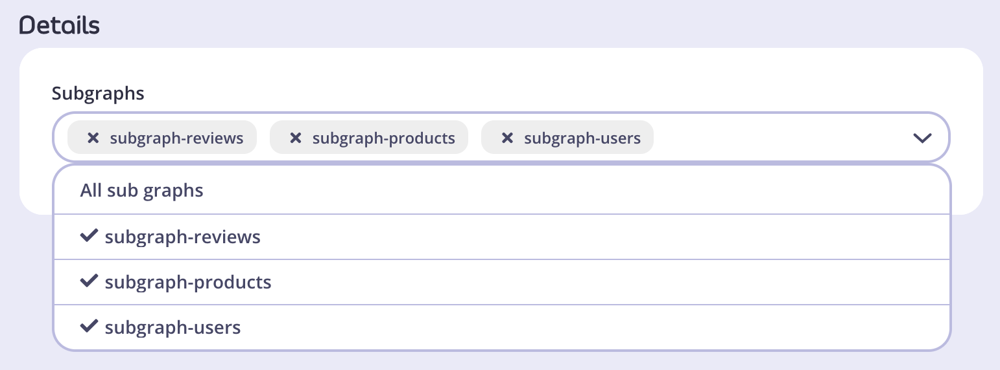

<h1 style="font-size:3.5rem; font-weight:700; color:white; margin:0 0 0.5rem 0;">Tyk Onboarding</h1>

Sr. Customer Solutions Architect

  

  

  

  

  

  

  

---
layout: default
background: 'linear-gradient(135deg, #8438FA 0%, #8438FA 35%, #BB11FF 100%)'
---

  
Module 1

  <h1 style="color:white; font-size:2.5rem; font-weight:bold; margin:0;">GraphQL</h1>

---
layout: default
---

# GraphQL

Definition (GraphQL Foundation):
GraphQL is a query language for APIs and a runtime for fulfilling those queries with your existing data. It describes your data, lets clients request exactly what they need, and evolves safely over time.
Key Benefits:
Reduced network traffic – no over-fetching or under-fetching
Flexible &amp; language-agnostic – works with any backend
Simplified data fetching – one request, structured response
Easy to maintain – schema-based evolution
Strong typing – catch errors early
Great dev experience – ideal for mobile apps, public APIs, and microservices

<!-- Notes: GraphQL is a modern way to work with APIs. It lets clients define exactly what data they need, which means we’re no longer over-fetching or under-fetching like we often do with REST.
One of the biggest advantages is the ability to make a single request for complex, nested data — instead of stitching together multiple REST calls. This leads to cleaner, more efficient frontends, especially in mobile and data-rich applications.
Flexibility is another win — GraphQL is backend-agnostic, and works across languages and data sources.
Strong typing and introspection allow developers to confidently build and explore APIs. Combined with the ability to evolve schemas without breaking clients, GraphQL is not just powerful — it’s sustainable for growing teams and complex systems. -->

---
layout: default
---

<h2 style="color:#5900CB; font-size:1.8rem; font-weight:bold; margin-bottom:1rem;">GraphQL</h2>

  

    <pre style="color:#e0e0e0; font-size:0.55rem; margin:0; font-family:monospace; line-height:1.5; white-space:pre;">The GraphQL Advantage:
Traditional REST API Call
To load user info + their posts:
GET /user/123
GET /user/123/posts
Multiple round-trips
Over-fetching / under-fetching</pre>
  

  

    <pre style="color:#e0e0e0; font-size:0.55rem; margin:0; font-family:monospace; line-height:1.5; white-space:pre;">GraphQL
query {
  user(id: "123") {
    name
    posts {
      title
      publishedAt
    }
  }
}
One request
Only the data needed
Structured JSON response</pre>
  

<!-- Notes: Let’s start by understanding how GraphQL differs from REST. In REST, getting related data often means making multiple requests — one for user info, another for posts, etc. This causes over-fetching, especially for mobile devices with limited bandwidth.
With GraphQL, you can ask for exactly what you need in one request — here, both user details and their posts — and get back only that data.
This eliminates redundant calls and makes the API feel snappier and more efficient.

One of GraphQL’s biggest advantages is its flexibility for different frontends.
A mobile app can request just a user's name, while an admin dashboard might want full details — all using the same endpoint.
This means backend developers don’t need to build different versions of the same endpoint — the frontend drives the shape of the response.
That’s why GraphQL is so popular in mobile and microservices environments. -->

---
layout: default
---

<h2 style="color:#5900CB; font-size:1.8rem; font-weight:bold; margin-bottom:1rem;">GraphQL</h2>

  <pre style="color:#e0e0e0; font-size:0.6rem; margin:0; font-family:monospace; line-height:1.5; white-space:pre;">GraphQL uses a type system to define your API.
type User {
  id: ID!
  name: String!
  email: String!
  posts: [Post!]!
}
type Post {
  title: String!
  publishedAt: String!
}
String! means it's required
Relationships (e.g. posts) are embedded
Tools can auto-generate documentation
Clients get predictable responses
Catches errors at development time</pre>

<!-- Notes: GraphQL APIs are built around a schema — it’s like a contract between the backend and frontend.
This schema is typed, meaning we define the structure of data: what a User is, what fields are required, and how it links to Post.
With this, you get things like auto-generated documentation, type-safe clients, and clear errors when queries go wrong.
It’s especially helpful in larger teams where backend and frontend are developed in parallel. -->

---
layout: default
---

<h2 style="color:#5900CB; font-size:1.8rem; font-weight:bold; margin-bottom:1rem;">GraphQL</h2>

  <pre style="color:#e0e0e0; font-size:0.6rem; margin:0; font-family:monospace; line-height:1.5; white-space:pre;">GraphQL is schema-based, so you can:
Add new fields:
type User {
  age: Int   # Added later
}
Deprecate old fields:
email: String @deprecated(reason: "Use contactEmail")
No breaking changes
Versionless API evolution
Better long-term maintainability</pre>

<!-- Notes: GraphQL supports non-breaking evolution of your API.
If you need to add a field, you just add it to the schema — clients won’t break because they only query what they need.
If you want to deprecate something, you can mark it in the schema — tools will even warn developers not to use it.
This reduces the need for strict versioning like in REST — making long-term maintenance much easier and safer. -->

---
layout: default
---

# GraphQL with Tyk

Native GraphQL Support
No middleware required
Fully compliant with latest GraphQL specs:
Queries – Fetching data
Mutations – Modifying data
Subscriptions – Real-time updates
What You Can Do with Tyk GraphQL:
Securely expose existing GraphQL APIs
Use Tyk’s integrated engine to create a Universal Data Graph – combine multiple services into one unified GraphQL endpoint

<!-- Notes: Tyk has native support for GraphQL — meaning there’s no need for extra middleware or third-party integrations.
Tyk is fully compliant with the official GraphQL specification, including support for queries, mutations, and subscriptions — so you can build real-time and transactional APIs seamlessly.
If you already have GraphQL APIs, you can expose and secure them using Tyk.
And if you’re working with a mix of REST, gRPC, or other services, you can use Tyk’s Universal Data Graph to stitch those together into one unified GraphQL API — a powerful way to modernize and simplify your API layer.
We also have a short intro video available if you want to see this in action. -->

---
layout: default
background: '#8438FA'
---

  <svg width="56" height="42" viewBox="0 0 56 42" fill="none" style="margin-bottom:1.2rem;">
    <rect x="2" y="8" width="32" height="28" rx="8" fill="#21E9BA" opacity="0.6"/>
    <rect x="18" y="2" width="32" height="28" rx="8" fill="#21E9BA" opacity="0.4"/>
  </svg>
  <h1 style="font-size:2.2rem; font-weight:bold; color:white; margin:0;">Hands-On Workshop</h1>
  
Onboarding a GraphQL API

---
layout: default
---

<h2 style="color:#5900CB; font-size:1.8rem; font-weight:bold; margin-bottom:1rem;">Onboarding a GraphQL API</h2>

  

    <pre style="color:#e0e0e0; font-size:0.55rem; margin:0; font-family:monospace; line-height:1.5; white-space:pre;">Like a REST API, you can onboard via the Dashboard UI, Dashboard API or Gateway API for OSS
Steps:
Go to System Management → APIs
Click Add New API
Fill out Base Configuration:
Name, Type = GraphQL
Target URL (e.g. https://countries.trevorblades.com/)
Click Configure API
Choose Authentication Mode (e.g. Auth Token)
Click SAVE – Your GraphQL API is now active and secured.
Go to ‘Playgrounds’
Send the following query:</pre>
  

  

    <pre style="color:#e0e0e0; font-size:0.55rem; margin:0; font-family:monospace; line-height:1.5; white-space:pre;">query {
  countries {
    code
    name
    emoji
  }
}</pre>
  

<!-- Notes: query {
  countries {
    code
    name
    emoji
  }
} -->

---
layout: default
---

<h2 style="color:#5900CB; font-size:1.8rem; font-weight:bold; margin-bottom:1rem;">Onboarding a GraphQL API via Operator</h2>

  

    <pre style="color:#e0e0e0; font-size:0.55rem; margin:0; font-family:monospace; line-height:1.5; white-space:pre;">Onboarding a GraphQL API via Operator is similar to a Classic API Definition:
Run git clone  https://github.com/example-org/graphql-operator-tutorial
Run cd graphql-operator-tutorial 
Run kubectl apply -f graphql-example.yaml -n tyk-cp 
Verify with kubectl get tykapis -n tyk-cp 
Go to ‘Playgrounds’ in the Tyk Dashboard
Send the following query:</pre>
  

  

    <pre style="color:#e0e0e0; font-size:0.55rem; margin:0; font-family:monospace; line-height:1.5; white-space:pre;">query {
  countries {
    code
    name
    emoji
  }
}</pre>
  

<!-- Notes: query {
  countries {
    code
    name
    emoji
  }
} -->

---
layout: default
---

  

    
  

  

    <ul style="margin:0; padding-left:1.3rem; list-style-type:'- ';">
      <li>apiVersion</li>
      <li>kind</li>
      <li>metadata
        <ul style="margin:0.2rem 0 0.2rem 1rem; padding-left:1rem; list-style-type:'- ';">
          <li>name</li>
        </ul>
      </li>
      <li>spec
        <ul style="margin:0.2rem 0 0.2rem 1rem; padding-left:1rem; list-style-type:'- ';">
          <li>name</li>
          <li>use_keyless</li>
          <li>protocol</li>
          <li>active</li>
          <li>proxy
            <ul style="margin:0.2rem 0 0.2rem 1rem; padding-left:1rem; list-style-type:'- ';">
              <li>target_url</li>
              <li>listen_path</li>
              <li>strip_listen_path</li>
            </ul>
          </li>
          <li>graphql
            <ul style="margin:0.2rem 0 0.2rem 1rem; padding-left:1rem; list-style-type:'- ';">
              <li>enabled</li>
              <li>version</li>
              <li>execution_mode</li>
              <li>schema</li>
              <li>playground
                <ul style="margin:0.2rem 0 0.2rem 1rem; padding-left:1rem; list-style-type:'- ';">
                  <li>enabled</li>
                  <li>path</li>
                </ul>
              </li>
            </ul>
          </li>
        </ul>
      </li>
    </ul>
  

  

<!-- Notes: query {
  countries {
    code
    name
    emoji
  }
} -->

---
layout: default
---

<h2 style="color:#5900CB; font-size:1.8rem; font-weight:bold; margin-bottom:1rem;">Securing a GraphQL API via Operator</h2>

  

    Use the example auth-sections.txt
Add section into graphql-example.yaml
Bonus: Run the command to apply the manifest
  

  

    <pre style="color:#e0e0e0; font-size:0.6rem; margin:0; font-family:monospace; line-height:1.5; white-space:pre;">query {
  countries {
    code
    name
    emoji
  }
}</pre>
  

<!-- Notes: query {
  countries {
    code
    name
    emoji
  }
} -->

---
layout: default
---

<h2 style="color:#5900CB; font-size:1.8rem; font-weight:bold; margin-bottom:1rem;">GraphQL Proxy Only</h2>

  <pre style="color:#e0e0e0; font-size:0.6rem; margin:0; font-family:monospace; line-height:1.5; white-space:pre;">Definition: GraphQL Proxy Only is a type of GraphQL API in Tyk that:
Uses a single data source
Has a read-only schema
Automatically loads schema from the upstream using introspection queries
Key Characteristics:
Upstream must support introspection
Useful for exposing existing GraphQL services securely
Supports all Tyk features like policies and rate limiting
Minimal configuration — no schema stitching or data merging</pre>

<!-- Notes: Let's talk about GraphQL Proxy Only, one of the modes available for managing GraphQL APIs in Tyk.
Definition GraphQL Proxy Only is a simplified way of exposing an existing GraphQL service through Tyk. In this mode:
Tyk acts as a pass-through — it proxies a single data source.
It’s read-only from a schema perspective — meaning we don’t define or modify the schema in Tyk.
Instead, Tyk automatically pulls the schema from the upstream using introspection queries.
Key Characteristics
Because Tyk relies on introspection, the upstream GraphQL service must support introspection.
This is especially useful when you want to securely expose an existing GraphQL service without making changes to its implementation.
You still get the full benefits of Tyk’s API management features — like rate limiting, authentication, policies, analytics, and more.
Configuration is minimal. There’s no need to stitch multiple schemas or do complex data merging — making it ideal for quick exposure and governance.
This is a great option for teams looking to add governance and control to a GraphQL API that’s already up and running. -->

---
layout: default
---

# Creating a GraphQL Proxy Only API

Steps to Create:
Log in to the Tyk Dashboard
Go to APIs → Add New API → GraphQL
Provide a name and the upstream URL
If the upstream is protected:
Select Upstream Protected
Add Authorization header or Certificate
Optionally tick Persist headers for future use to avoid re-entering them
Final Steps:
Click Configure API
Make any additional configuration changes
Click Save
Your GraphQL Proxy Only API is now set up and ready to use.

<!-- Notes: Now, let’s go through the steps to create a GraphQL Proxy Only API in Tyk. This is a straightforward process using the Tyk Dashboard.
Step-by-Step:
Log in to the Tyk Dashboard Start by accessing your Tyk Dashboard.
Navigate to: APIs → Add New API → GraphQL You’ll see multiple API types — choose GraphQL.
Provide Basic Info
Enter a name for your API.
Set the upstream URL — this is the URL of your existing GraphQL service.
If the upstream is protected
Tick “Upstream Protected”.
Then either:
Add the Authorization header (e.g., Bearer token), or
Upload a Client Certificate, depending on the upstream’s security method.
Optionally, tick “Persist headers” so you don’t need to re-enter them when updating the schema later.
Final Steps:
Click “Configure API” This will validate and load the schema from the upstream using introspection.
Make any additional changes
You can apply rate limiting, set access policies, or configure OpenTelemetry if needed.
Click “Save”
And that’s it! Your GraphQL Proxy Only API is now live and managed by Tyk.
This setup allows you to quickly expose and govern an existing GraphQL service with minimal configuration. -->

---
layout: default
---

# Managing Schema

Keeping Your Schema in Sync:
Schema updates may be needed when your upstream GraphQL service changes.
The Tyk Dashboard displays the last sync timestamp for your API schema.
Syncing the Schema:
Click "Get latest version" to fetch the schema via introspection query.
Then, click "Update" (top right) to apply the new schema.
Upstream Authentication (if protected):
Navigate to: API &gt; Advanced Options &gt; Upstream Auth Headers
Add your Authorization Header (e.g., bearer token or basic auth).

<!-- Notes: Once your GraphQL Proxy Only API is set up, it’s important to keep the schema in sync with your upstream service.
Over time, your upstream GraphQL service may evolve — maybe new queries are added, fields are removed, or types are renamed. Tyk doesn’t automatically update the schema on your behalf — you’ll need to manually re-sync it to reflect those changes.
To help with this, the Tyk Dashboard displays the last sync timestamp for the schema. This makes it easy to tell if it’s been a while since the last update.
Go to your API in the Tyk Dashboard.
Click “Get latest version” — this will run a fresh introspection query against your upstream.
Once the schema loads, click “Update” in the top-right corner to apply the new schema to your Tyk API.
And just like that, your API is now working with the latest schema from your backend.
Now, if your upstream service is protected — for example, it requires an authorization token — you need to make sure Tyk can authenticate before fetching the schema.
To do this:
Navigate to your API in the Dashboard.
Go to Advanced Options &gt; Upstream Auth Headers.
Add your Authorization header — for example, a Bearer token or Basic Auth credentials.
Tyk will then include this header whenever it runs an introspection query or forwards requests to the upstream — ensuring everything continues to work securely. -->

---
layout: default
---

<h2 style="color:#5900CB; font-size:1.8rem; font-weight:bold; margin-bottom:1rem;">Field Based Permissions</h2>

  

    Query: The entry point of your API
accounts returns a list of Account objects
Account Type:
owner: Name of account holder
number: Unique account number
balance: Sensitive field showing current balance 
  

  

    <pre style="color:#e0e0e0; font-size:0.6rem; margin:0; font-family:monospace; line-height:1.5; white-space:pre;">Understanding the GraphQL Schema
type Query {
  accounts: [Account!]
}
type Account {
  owner: String!
  number: ID!
  balance: Float!
}</pre>
  

<!-- Notes: Let’s take a look at a basic GraphQL query structure for our API.
The entry point for this API is a query called accounts.
When this query is executed, it returns a list of Account objects.
Now, what does an Account object look like?
Here are its key fields:
owner: This is the name of the account holder — a simple string field.
number: This is the unique account number, which identifies the account.
balance: This is a sensitive field — it shows the current balance in the account.
Depending on your use case, you may want to apply fine-grained access control to fields like balance, especially if different users or roles should see different levels of information.
This is where Tyk’s GraphQL security features — like field-level permissions and policies — can really shine. -->

---
layout: default
---

<h2 style="color:#5900CB; font-size:1.8rem; font-weight:bold; margin-bottom:1rem;">Field Based Permissions</h2>

  

    External user tries to access balance and gets:
{
  "errors": [
    {
      "message": "field: balance is restricted on type: Account"
    }
  ]
}
  

  

    <pre style="color:#e0e0e0; font-size:0.6rem; margin:0; font-family:monospace; line-height:1.5; white-space:pre;">Why Use Field-Based Permissions?
Not every API consumer should see everything.
Internal user can query:
query {
  accounts {
    owner
    number
    balance
  }
}</pre>
  

<!-- Notes: In GraphQL, it's easy to request only the data you need — which is a powerful feature.
But with that power comes a risk: Not every API consumer should be able to see everything.
For example:
An internal user — like a back-office system — might be allowed to query all fields of the Account type, including sensitive data like the account balance.
query {
  accounts {
    owner
    number
    balance
  }
}

This is perfectly fine for trusted internal users.

However, when an external user — say, a third-party developer — tries to run the same query, they may not be authorized to see sensitive fields like balance.
Instead of getting the data, they get a clear error message:
json
CopyEdit
{
  "errors": [
    {
      "message": "field: balance is restricted on type: Account"
    }
  ]
}

This is the result of field-based permissions configured in Tyk.

Why This Matters:
It enforces least privilege access — consumers only see what they’re allowed to.
It reduces the risk of data leakage.
And it helps you comply with data protection and regulatory requirements, especially when exposing APIs to third parties.
So, field-based permissions are an essential part of a secure and well-governed GraphQL API strategy. -->

---
layout: default
---

# Setting Up Field Based Permissions

Restricted and allowed types and fields can also be set up via Tyk Dashboard.
Optional: Configure a Policy from System Management &gt; Policies &gt; Add Policy.
From System Management &gt; Keys &gt; Add Key select a policy or configure directly for the key.
Select your GraphQL API (marked as GraphQL).
Enable either Block list or Allow list. By default, both are disabled. It’s not possible to have both enabled at the same time - enabling one switch automatically disables the other.

<!-- Notes: Tyk makes it easy to manage field-level permissions for your GraphQL APIs — right from the Dashboard.
You can restrict or allow access to specific types and fields using either a block list or an allow list.
Here’s how you can set it up:

Step 1: Define Access via a Policy (Optional)
Navigate to: System Management &gt; Policies &gt; Add Policy
In the policy, select your GraphQL API — it’ll be marked clearly as a GraphQL type.
You’ll see two switches: Block list and Allow list.
Important note: You can enable either the block list or the allow list — not both. Turning on one will automatically disable the other.
Use the UI to select which fields or types to block or allow.

Step 2: Apply the Policy to a Key
Go to: System Management &gt; Keys &gt; Add Key
You can either:
Attach the policy you just created, or
Directly define GraphQL permissions for this key in the interface.
This allows you to customize access per client, ensuring internal and external users only see what they’re allowed to.

Why This Matters
This approach gives you fine-grained control without changing your upstream service — all access logic is handled by Tyk at the gateway level.
It’s a great way to enforce privacy, protect sensitive data, and customize access based on user roles or API clients. -->

---
layout: default
---

# Setting Up Field Based Permissions - Blocklist

By default all Types and Fields will be unchecked. By checking a Type or Field you will disallow to use it for any GraphQL operation associated with the key.
For example, the settings illustrated below would block the following:
code and countries fields in Continent type.
latt and longt fields in Coordinates type.

<!-- Notes: By default, all Types and Fields are unchecked in the permissions settings.
This means everything is allowed unless you explicitly block something.
When you check a Type or Field, you’re telling Tyk to disallow access to that part of the schema for any GraphQL operations made using the associated API key.
For example, in the settings shown here:
The fields code and countries on the Continent type are blocked.
The fields latt and longt on the Coordinates type are blocked as well.
So if a client tries to query these blocked fields, they will get an error — access will be denied.
This allows you to precisely control which parts of your GraphQL API clients can access, helping secure sensitive or irrelevant data without modifying your backend. -->

---
layout: default
---

# Setting Up Field Based Permissions - Allowlist

By default all Types and Fields will be unchecked. By checking a Type or Field you will allow it to be used for any GraphQL operation associated with the key.
For example, the settings illustrated below would only allow the following:
code field in Continent type.
code and name fields in Language type.

<!-- Notes: By default, all Types and Fields are unchecked in the permissions settings.
In this case, that means nothing is allowed until you explicitly allow access.
When you check a Type or Field, you are granting permission for that part of the schema to be used in any GraphQL operation associated with the API key.
For example, in the settings shown here:
Only the code field on the Continent type is allowed.
And for the Language type, only the code and name fields are allowed.
Any attempt by the client to query fields outside of these allowed ones will be blocked.
This approach is useful when you want a strict allow-list policy to tightly control what data clients can access, ensuring maximum security and compliance. -->

---
layout: default
background: '#8438FA'
---

  <svg width="56" height="42" viewBox="0 0 56 42" fill="none" style="margin-bottom:1.2rem;">
    <rect x="2" y="8" width="32" height="28" rx="8" fill="#21E9BA" opacity="0.6"/>
    <rect x="18" y="2" width="32" height="28" rx="8" fill="#21E9BA" opacity="0.4"/>
  </svg>
  <h1 style="font-size:2.2rem; font-weight:bold; color:white; margin:0;">Hands-On Workshop</h1>
  
Setting Up Field Based Permissions

---
layout: default
---

<h2 style="color:#5900CB; font-size:1.8rem; font-weight:bold; margin-bottom:1rem;">Setting Up Field Based Permissions</h2>

  

    Create a policy
Create an API Key with policy
Set up blocklist on the Country Type field
Use the Playground and add the header as a json:
{
  “Authorization”: “API-KEY”
}
Make the query:
  

  

    <pre style="color:#e0e0e0; font-size:0.6rem; margin:0; font-family:monospace; line-height:1.5; white-space:pre;">query {
  countries {
    code
    name
    emoji
  }
}</pre>
  

<!-- Notes: query {
  countries {
    code
    name
    emoji
  }
} -->

---
layout: default
---

<h2 style="color:#5900CB; font-size:1.8rem; font-weight:bold; margin-bottom:1rem;">Complexity Limiting</h2>

  

    GraphQL Complexity Limiting
Even with a simple schema, deeply nested or resource-heavy operations can overload your upstream services.
  

  

    <pre style="color:#e0e0e0; font-size:0.6rem; margin:0; font-family:monospace; line-height:1.5; white-space:pre;">type Query {
  continents: [Continent!]!
}
type Continent {
  name: String!
  countries: [Country!]!
}
type Country {
  name: String!
  continent: Continent!
}</pre>
  

<!-- Notes: "GraphQL is incredibly powerful and flexible, allowing clients to request exactly the data they need. However, this flexibility comes with a risk — even with a simple schema, clients can craft deeply nested queries or request large amounts of data in a single operation.
Such complex or resource-heavy queries can put significant strain on your upstream services, leading to slow response times, increased server load, and potentially downtime.
To prevent this, GraphQL complexity limiting is a vital safeguard. It helps us define thresholds for query depth and resource usage, effectively protecting our backend from expensive or malicious queries.
By enforcing complexity limits, we ensure our API remains responsive and stable for all users, while still giving clients the flexibility they need.
In the next section, we’ll explore how Tyk Universal Data Graph lets you set and enforce these complexity limits easily." -->

---
layout: default
---

# Complexity Limiting

Deeply Nested Query Example
This query is valid, but heavily recursive and can stress your backend.

---
layout: default
---

# Complexity Limiting

Query Depth = 2
{
  continents {
    name
  }
}
Query Depth = 3
{
  continents {
    countries {
      name
    }
  }
}
When Depth Limit is Exceeded:
Tyk will block the query and respond with:
{
  "error": "depth limit exceeded"
}
Limit query depth by setting a max depth in:
A Policy
An Individual Key

<!-- Notes: To protect your GraphQL API from overly complex or expensive queries, you can limit the query depth.
This helps prevent performance issues and potential abuse.
You can set a maximum query depth in two places:
At the Policy level, which applies to all keys associated with that policy.
Or at the individual API Key level, for more granular control.
Setting these limits ensures your API stays performant and secure by restricting how deeply clients can nest their queries. -->

---
layout: default
---

# Introspection

GraphQL introspection allows clients to query a server for its schema.
Useful for tools like GraphQL Playground and Tyk Dashboard to understand available types and operations.
Tyk uses introspection to fetch the upstream schema and render it in the UI when setting up a GraphQL proxy.
🔍 Important: Introspection reflects the upstream schema only, not Tyk's schema transformations.

<!-- Notes: Introspection is a built-in feature of any GraphQL server. It enables clients to query the server about its schema — which types exist, what fields they have, and what kind of operations are allowed.
When we create a GraphQL API using Tyk Dashboard, Tyk sends an introspection query to the upstream GraphQL service. This is what populates the Schema tab in the UI.
One important caveat: introspection always reflects the upstream source. So if you modify the schema in Tyk — say, by limiting fields or renaming types — those changes won’t appear in the introspection results. That’s why it's important to keep your upstream and Tyk-side schemas in sync to avoid confusion during debugging or client integration.
If you want to learn more about how introspection works at a protocol level, the GraphQL Foundation’s official spec is a great resource. -->

---
layout: default
---

<h2 style="color:#5900CB; font-size:1.8rem; font-weight:bold; margin-bottom:0.5rem;">Introspection</h2>

  

<!-- Notes: Introspection is a built-in feature of any GraphQL server. It enables clients to query the server about its schema — which types exist, what fields they have, and what kind of operations are allowed.
When we create a GraphQL API using Tyk Dashboard, Tyk sends an introspection query to the upstream GraphQL service. This is what populates the Schema tab in the UI.
One important caveat: introspection always reflects the upstream source. So if you modify the schema in Tyk — say, by limiting fields or renaming types — those changes won’t appear in the introspection results. That’s why it's important to keep your upstream and Tyk-side schemas in sync to avoid confusion during debugging or client integration.
If you want to learn more about how introspection works at a protocol level, the GraphQL Foundation’s official spec is a great resource. -->

---
layout: default
---

# Introspection

GraphQL Introspection in Production
Introspection is useful for development and debugging.
In production, introspection can:
Reveal sensitive schema and implementation details.
Allow attackers to discover and map out your API.
If Authentication Mode is Open (Keyless):
Introspection is always enabled and cannot be disabled.
You can disable introspection per key or via security policy using:
Tyk Dashboard
Tyk Gateway API

<!-- Notes: GraphQL introspection is designed as a discovery and diagnostic feature to help developers during the development process. It allows tools and developers to query the API for its schema, including types, fields, and relationships.
However, enabling introspection in production can expose your API’s structure, making it easier for attackers to understand and exploit potential vulnerabilities. For example, they could discover hidden mutations or sensitive fields that were not meant to be public.
A critical consideration is that if your API is configured with Open (Keyless) authentication, Tyk enables introspection by default, and this setting cannot be changed. This presents a security risk, especially for publicly accessible APIs.
Tyk allows you to control introspection more securely by disabling it on a per-key or per-policy basis. This configuration can be done through the Tyk Dashboard or programmatically through the Tyk Gateway API.
The recommendation is to disable introspection in production environments, and only enable it in development or controlled internal settings. -->

---
layout: default
---

<h2 style="color:#5900CB; font-size:1.8rem; font-weight:bold; margin-bottom:1rem;">Introspection Queries</h2>

  

    Any GraphQL API can be explored using introspection queries.
Introspection queries reveal detailed schema information.
Example: Introspecting all types in the schema.
  

  

    <pre style="color:#e0e0e0; font-size:0.6rem; margin:0; font-family:monospace; line-height:1.5; white-space:pre;">query {
  __schema {
    types {
      name
      description
      kind
    }
    queryType {
      fields {
        name
        description
      }
    }
  }
}</pre>
  

<!-- Notes: Any GraphQL API can be explored using introspection queries.
These special queries allow clients to discover detailed information about the schema — including types, fields, and relationships — without prior knowledge.
For example, you can run an introspection query that lists all types in the schema.
This capability is powerful for tools like API explorers or clients that need to dynamically understand the API structure. -->

---
layout: default
---

# Introspection Queries

Schema Overview Query
Retrieves a summary of all types, queries, and mutations in the schema, including their names, kinds, and descriptions.
Single Type Details Query
Fetches detailed information about a specific type, such as its fields, arguments, interfaces, enum values, and descriptions.
Field Arguments Query
Focuses on the arguments of a specific field, detailing their names, types, and default values.
Enum Values Query
Retrieves the possible values for an enum type, including descriptions and deprecation status.
Interface and Union Types Query
Provides information on the possible types that implement an interface or belong to a union.

<!-- Notes: GraphQL introspection allows you to explore the schema dynamically by sending different types of queries.
The Schema Overview Query gives a broad picture of everything the API offers, useful for initial exploration.
Single Type Details Query zooms into one type to understand its structure and relationships, essential for detailed API consumption.
Field Arguments Query helps when you want to know what inputs a particular field accepts, aiding in precise query construction.
Enum Values Query is handy when working with fields that have a fixed set of possible values, ensuring you use valid inputs.
Finally, Interface and Union Types Query helps understand polymorphic types, clarifying what concrete types to expect.
Knowing these query types helps you debug, document, and build better GraphQL clients and tools. -->

---
layout: default
---

# Validation - Query Validation

Tyk supports validation of GraphQL queries and schemas to prevent errors during request processing.
Query Validation:
Tyk’s native GraphQL engine validates queries against the GraphQL Specification.
Both the Gateway in front of your existing GraphQL API and any Universal Data Graph have validation middleware.
Invalid requests are caught by the Gateway and not forwarded upstream, returning errors to the client.

<!-- Notes: Tyk provides robust validation of GraphQL queries and schemas to help prevent errors during request processing.
Using Tyk’s native GraphQL engine, all incoming queries are validated against the official GraphQL Specification.
This validation happens both at the Gateway, which sits in front of your existing GraphQL API, and in any Universal Data Graph you might be using.
As a result, invalid requests are caught early by Tyk — they are blocked at the Gateway and never forwarded upstream.
Instead, the client receives clear error messages, which helps maintain API reliability and protects your backend services from malformed queries. -->

---
layout: default
---

<h2 style="color:#5900CB; font-size:1.8rem; font-weight:bold; margin-bottom:1rem;">Validation - Schema Validation</h2>

  <pre style="color:#e0e0e0; font-size:0.6rem; margin:0; font-family:monospace; line-height:1.5; white-space:pre;">Schema Validation:
Prevents broken or invalid schemas from being saved or updated in Tyk.
Available only via Tyk Dashboard or Dashboard API.
Ensures schemas do not contain:
Duplicated operation types (Query, Mutation, Subscription)
Duplicated type names, field names, or enum values
Usage of unknown types
If schema validation fails via the API, a 400 Bad Request is returned with detailed errors.</pre>

<!-- Notes: "Schema validation is a crucial feature in Tyk’s Universal Data Graph that helps maintain the integrity and reliability of your GraphQL APIs.
When you create or update a schema—whether through the Tyk Dashboard or the Dashboard API—Tyk automatically validates it to prevent broken or invalid schemas from being saved.
This validation checks for common errors such as:
Duplicate operation types like multiple Queries or Mutations defined,
Duplicate type names, field names, or enum values,
And the usage of unknown or undefined types.
If any of these issues are found, the system will reject the schema update and return a 400 Bad Request response with detailed error messages.
This safeguard ensures that your API schemas remain consistent and error-free, preventing runtime failures and unexpected behaviors downstream.
Overall, schema validation acts as an early warning system, catching issues before they impact your users." -->

---
layout: default
---

# Introspection Headers

Purpose: Used when Tyk Dashboard sends an introspection query to fetch the upstream GraphQL schema.
Usage scenario: Required when upstream GraphQL APIs are protected and require authorization for schema discovery.
Key Points:
Headers are only used during schema introspection from the Dashboard.
These headers are not forwarded during runtime API requests from consumers.
Configurable in the Advanced Options tab or via raw API definition:

<!-- Notes: This feature is used when the Tyk Dashboard sends an introspection query to fetch the upstream GraphQL schema.
It’s especially important in scenarios where your upstream GraphQL APIs are protected and require authorization for schema discovery.
A key point to note is that these authorization headers are only used during the schema introspection process from the Dashboard.
They are not forwarded during runtime API requests made by your API consumers, so your API security remains intact.
You can configure these headers easily in the Advanced Options tab of your API settings or by editing the raw API definition. -->

---
layout: default
---

<h2 style="color:#5900CB; font-size:1.8rem; font-weight:bold; margin-bottom:1rem;">Introspection Headers</h2>

  <pre style="color:#e0e0e0; font-size:0.6rem; margin:0; font-family:monospace; line-height:1.5; white-space:pre;">"graphql": {
  "execution_mode": "proxyOnly",
  "proxy": {
    "auth_headers": {
      "admin-auth": "token-value"
    }
  }
}</pre>

---
layout: default
---

# Request Headers

Purpose: Used to inject additional headers into runtime requests proxied through Tyk Gateway.
Usage scenario: Add metadata, tokens, or dynamic values to upstream requests.
Key Points:
Only active during actual API requests, not during introspection.
Supports static values or dynamic context variables like $tyk_context.*.
Configurable in the Advanced Options tab or raw API definition:

<!-- Notes: This feature is used to inject additional headers into runtime requests that are proxied through the Tyk Gateway.
It’s useful when you want to add metadata, tokens, or other dynamic values to requests sent to your upstream GraphQL API.
Importantly, these headers are only active during actual API requests from clients — they are not applied during schema introspection.
You can configure headers with static values or use dynamic context variables, such as $tyk_context.*, to customize them per request.
These settings can be found in the Advanced Options tab or by editing the raw API definition. -->

---
layout: default
---

<h2 style="color:#5900CB; font-size:1.8rem; font-weight:bold; margin-bottom:1rem;">Request Headers</h2>

  <pre style="color:#e0e0e0; font-size:0.6rem; margin:0; font-family:monospace; line-height:1.5; white-space:pre;">"graphql": {
  "execution_mode": "proxyOnly",
  "proxy": {
    "request_headers": {
      "context-vars-metadata": "$tyk_context.path",
      "static-metadata": "static-value"
    }
  }
}</pre>

<!-- Notes: While introspection headers are used during setup, Request headers are used during live API traffic.
They allow you to pass additional information to the upstream, like static metadata or dynamic values extracted from the request — for example, the path or user identity.
This can be particularly useful for multi-tenant APIs or APIs that expect custom authorization headers.
Just like introspection headers, request headers can be configured either through the Tyk Dashboard UI or directly in the raw API definition — giving you flexibility and automation options. -->

---
layout: default
---

<h2 style="color:#5900CB; font-size:1.8rem; font-weight:bold; margin-bottom:1rem;">Persisting GraphQL queries</h2>

  <pre style="color:#e0e0e0; font-size:0.6rem; margin:0; font-family:monospace; line-height:1.5; white-space:pre;">Tyk allows exposing a GraphQL query as a REST endpoint.
Achieved using persist_graphql inside extended_paths.
Configured on an HTTP-type API definition.
Useful for:
Creating simple, cacheable REST endpoints
Predefined access to known GraphQL operations
Requirements:
The target_url must point to a GraphQL upstream.
enable_context_vars must be set to true.</pre>

<!-- Notes: Tyk allows you to expose a GraphQL query as a REST endpoint using the persist_graphql feature inside extended_paths.
This is configured on an HTTP-type API definition, not a GraphQL type.
It’s especially useful for:
Creating simple, cacheable REST endpoints from complex GraphQL queries.
Providing predefined access to specific GraphQL operations without exposing the full schema.
To use this feature, two requirements must be met:
The target_url must point to a valid GraphQL upstream.
enable_context_vars must be set to true.
This approach lets you combine the flexibility of GraphQL with the simplicity and caching benefits of REST. -->

---
layout: default
---

<h2 style="color:#5900CB; font-size:1.8rem; font-weight:bold; margin-bottom:1rem;">Persisting GraphQL queries</h2>

  <pre style="color:#e0e0e0; font-size:0.6rem; margin:0; font-family:monospace; line-height:1.5; white-space:pre;">API Definition &amp; Versioning Setup
Basic API definition:
"proxy": {
  "listen_path": "/trevorblades/",
  "target_url": "https://countries.trevorblades.com",
  "strip_listen_path": true
}
Enable versioning with:
use_extended_paths: true
not_versioned: true
GraphQL to REST middleware lives inside extended_paths.persist_graphql.</pre>

<!-- Notes: Here’s a basic example of an API definition for a GraphQL proxy in Tyk:
The listen_path is set to /trevorblades/.
The target_url points to the upstream GraphQL service at https://countries.trevorblades.com.
We enable strip_listen_path to remove the prefix before forwarding requests upstream.
To enable versioning with this setup:
Set use_extended_paths to true — this allows more granular path handling.
Set not_versioned to true if you want to disable automatic versioning behavior.
The important piece for GraphQL-to-REST conversion is that the middleware handling this logic lives inside the extended_paths.persist_graphql section.
This modular approach gives you flexibility to manage your API versions and expose GraphQL queries as REST endpoints with fine control -->

---
layout: default
---

<h2 style="color:#5900CB; font-size:1.8rem; font-weight:bold; margin-bottom:1rem;">Persisting GraphQL queries</h2>

  <pre style="color:#e0e0e0; font-size:0.6rem; margin:0; font-family:monospace; line-height:1.5; white-space:pre;">The vital part of this is the extended_paths.persist_graphql field
Sample persist_graphql configuration:
"persist_graphql": [
  {
    "method": "GET",
    "path": "/getContinentByCode",
    "operation": "query ($continentCode: ID!) { continent(code: $continentCode) { code name countries { name } } }",
    "variables": {
      "continentCode": "EU"
    }
  }
]</pre>

<!-- Notes: Once the API definition is in place, versioning plays an important role — even if you're not managing multiple versions.
By setting not_versioned: true and providing a "Default" version, you activate the GraphQL-to-REST middleware. This is where the persist_graphql configuration lives. -->

---
layout: default
---

# Persisting GraphQL queries

Each entry includes:
method – e.g., GET
path – e.g., /getContinentByCode
operation – the GraphQL query
variables – parameters passed to the query
{
    "data": {
        "continent": {
            "code": "EU",
            "name": "Europe",
            "countries": [
                {
                    "name": "Andorra"
                },
                ...
            ]
        }
    }
}

<!-- Notes: In this final step, we configure the actual persisted query.
The path /getContinentByCode becomes a usable REST endpoint.
When Tyk receives a GET request to that path, it will construct and send the defined GraphQL operation to the upstream — in this case, fetching the continent by code.
The query and variables are hardcoded, so it's predictable and easy to cache or control. -->

---
layout: default
---

# Dynamic Variables

You can pass dynamic variables to your persisted GraphQL queries.
Supported sources:
Request headers
URL path parameters
Use Tyk context variables to reference them.
Ideal for flexible query inputs without hardcoding values.

<!-- Notes: Tyk’s persisted query middleware isn’t limited to static variable values.
You can dynamically extract variables from the request—either from headers or from the URL path—using Tyk’s request context variables.
This adds flexibility and enables more personalized or user-specific GraphQL queries using simple REST calls. -->

---
layout: default
---

<h2 style="color:#5900CB; font-size:1.8rem; font-weight:bold; margin-bottom:1rem;">Dynamic Variables</h2>

  

    Request Header:
code: UK
  

  

    <pre style="color:#e0e0e0; font-size:0.6rem; margin:0; font-family:monospace; line-height:1.5; white-space:pre;">Example: Extract countryCode from request header code
{
  "method": "GET",
  "path": "/getCountryByCode",
  "operation": "query ($countryCode: ID!) {\n   country(code: $countryCode) {\n        code\n        name\n   }\n}",
  "variables": {
    "countryCode": "$tyk_context.headers_Code"
  }
}</pre>
  

<!-- Notes: Here, we’re using a header called code as the value for the GraphQL variable countryCode.
This way, your consumers can send different values in the header, and Tyk will inject them into the query.
It’s especially useful when your consumers can’t modify the URL but can control headers. -->

---
layout: default
---

# Dynamic Variables

Response:
{
  "data": {
    "country": {
      "code": "UK",
      "name": "United Kingdom"
    }
  }
}

<!-- Notes: Tyk’s persisted query middleware isn’t limited to static variable values.
You can dynamically extract variables from the request—either from headers or from the URL path—using Tyk’s request context variables.
This adds flexibility and enables more personalized or user-specific GraphQL queries using simple REST calls. -->

---
layout: default
---

<h2 style="color:#5900CB; font-size:1.8rem; font-weight:bold; margin-bottom:1rem;">Dynamic Variables</h2>

  

    Request URL:
/getCountryByCode/NG
  

  

    <pre style="color:#e0e0e0; font-size:0.6rem; margin:0; font-family:monospace; line-height:1.5; white-space:pre;">Example: Extract countryCode from the URL
{
  "method": "GET",
  "path": "/getCountryByCode/{countryCode}",
  "operation": "query ($countryCode: ID!) {\n   country(code: $countryCode) {\n        code\n        name\n   }\n}",
  "variables": {
    "countryCode": "$path.countryCode"
  }
}</pre>
  

<!-- Notes: In this case, we’re using a path parameter from the URL itself to extract the variable value.
Tyk will automatically parse the value after /getCountryByCode/ and inject it into the GraphQL query.
This is great for clean, REST-style API paths while still harnessing GraphQL behind the scenes. -->

---
layout: default
---

# Dynamic Variables

Response:
{
  "data": {
    "country": {
      "code": "NG",
      "name": "Nigeria"
    }
  }
}

<!-- Notes: Tyk’s persisted query middleware isn’t limited to static variable values.
You can dynamically extract variables from the request—either from headers or from the URL path—using Tyk’s request context variables.
This adds flexibility and enables more personalized or user-specific GraphQL queries using simple REST calls. -->

---
layout: default
background: 'linear-gradient(135deg, #8438FA 0%, #8438FA 35%, #BB11FF 100%)'
---

  
Module 3

  <h1 style="color:white; font-size:2.5rem; font-weight:bold; margin:0;">Universal Data Graph</h1>

---
layout: default
---

# What is the Universal Data Graph (UDG)?

Universal Data Graph (UDG) is Tyk's powerful GraphQL execution engine that allows you to create a unified GraphQL API by stitching together multiple data sources into a single, cohesive schema.
Core Concept:
Define a single GraphQL schema that represents your ideal API
Map schema fields to different backend data sources
Tyk's execution engine automatically resolves queries across all data sources
No need to modify existing backend services
Execution Mode:
UDG uses the executionEngine execution mode
Operates as a GraphQL gateway that orchestrates data fetching
Supports multiple data source types simultaneously

<!-- Notes: The Universal Data Graph, or UDG, is a powerful feature in Tyk that allows you to consolidate multiple APIs—whether REST or GraphQL—into a single GraphQL interface.

What’s unique here is that you don’t need to spin up or maintain a GraphQL server of your own. Instead, UDG lets you map and configure your existing REST APIs directly through Tyk.

This means that Tyk becomes the hub for all your API integration needs—both internal microservices and external APIs—under one query layer.

Even better, because this is built on Tyk, your Graph inherits all the benefits: authentication, rate limiting, monitoring, and extensible middleware, making it not only powerful but also secure and scalable by design. -->

---
layout: default
---

# Currently supported DataSources:
REST
GraphQL
SOAP (through the REST datasource)
Kafka

<!-- Notes: An extension orphan is an unresolved extension causing federation failure.
This happens if you extend a type that isn’t defined in exactly one subgraph.
Make sure every type extension has a clear base type in only one subgraph to avoid errors.
For example, the type named Person does not need to be defined in Subgraph 1, but it must be defined in exactly one subgraph (see Shared Types: extension of shared types is not possible, so extending a type that is defined in multiple subgraphs will produce an error). -->

---
layout: default
---

# Key Concepts - DataSources

Resolvers vs. DataSources
Resolvers: Functions that return data for a field (typical in GraphQL)
DataSources: Config-driven way to fetch data for fields
No code required — just configuration
🔗 Types of DataSources in Tyk
Internal:
REST/SOAP APIs already managed in Tyk
➜ Use middleware to validate and transform data
External:
APIs not (yet) managed in Tyk
➜ Easily included in your data graph
➜ Can transition to internal when needed

<!-- Notes: In traditional GraphQL, you often write resolvers — small functions that handle fetching data for each field in your schema. These need to be implemented manually and tied to specific types and fields.
Tyk’s Universal Data Graph replaces resolvers with a more streamlined approach: DataSources. These are config-based, meaning you don’t have to write code — you just tell the engine where and how to get the data.
There are two kinds of DataSources:
Internal: These are your existing Tyk-managed APIs, like REST or SOAP. You can apply Tyk’s built-in middleware — for example, for auth, transformation, or rate limiting.
External: These are APIs you haven’t added to Tyk yet. UDG allows you to include them in your graph right away. Later, if you want to bring them into Tyk to use middleware or analytics, that transition is easy.
This flexibility gives you a low-code way to build powerful, secure, and scalable GraphQL endpoints. -->

---
layout: default
---

<h2 style="color:#5900CB; font-size:1.8rem; font-weight:bold; margin-bottom:1rem;">Key Concepts - Arguments</h2>

  <pre style="color:#e0e0e0; font-size:0.6rem; margin:0; font-family:monospace; line-height:1.5; white-space:pre;">GraphQL Arguments → REST Calls
Schema example:
type Query {
    user(id: Int!): User
}
type User {
    id: Int!
    name: String
}
Goal: Map the id argument in a GraphQL query to the correct REST API path</pre>

<!-- Notes: Let’s revisit a common use case: querying a user by ID.
In GraphQL, we define a field like user(id: Int!) that returns a User object.
The question is — how do we take that id argument and pass it into our REST API URL?
This is where Tyk’s Universal Data Graph (UDG) becomes powerful. It allows you to inject GraphQL arguments directly into the REST call using simple templating. -->

---
layout: default
---

<h2 style="color:#5900CB; font-size:1.8rem; font-weight:bold; margin-bottom:1rem;">Key Concepts - Arguments</h2>

  <pre v-pre style="color:#e0e0e0; font-size:0.6rem; margin:0; font-family:monospace; line-height:1.5; white-space:pre;">Injecting Arguments into REST Paths
Templating REST URLs
In the “Configure Data Source” tab:
Use this template in the path field:
https://example.com/user/{{ .arguments.id }}
Type { to access a dropdown of available fields and arguments.
Tip: You can dynamically inject any GraphQL argument or field this way.</pre>

<!-- Notes: When configuring your DataSource, Tyk provides a flexible way to map GraphQL arguments into your REST call.
In this case, to hit an endpoint like /user/123, you use templating like this: https://example.com/user/{{ .arguments.id }}
As you type the curly brace {, Tyk shows a dropdown with all the arguments and fields you can use — it’s very intuitive.
This setup allows your UDG to resolve data dynamically and efficiently, making it easier to integrate with your existing APIs without writing extra code. -->

---
layout: default
---

<h2 style="color:#5900CB; font-size:1.8rem; font-weight:bold; margin-bottom:0.5rem;">Key Concepts - Arguments</h2>

  

---
layout: default
---

<h2 style="color:#5900CB; font-size:1.8rem; font-weight:bold; margin-bottom:1rem;">Key Concepts - Field Mappings</h2>

  

    Field Mappings – When Are They Needed
Automatic Field Mapping
When the GraphQL schema mirrors the REST API response, no manual field mapping is required.
Example REST response:
{
  "id": 1,
  "name": "Martin Buhr"
}
  

  

    <pre style="color:#e0e0e0; font-size:0.6rem; margin:0; font-family:monospace; line-height:1.5; white-space:pre;">Matching GraphQL schema:
type Query {
    user(id: Int!): User
}
type User {
    id: Int!
    name: String
}</pre>
  

<!-- Notes: In Universal Data Graph, field mappings are automatic if your GraphQL schema matches the structure of your REST API’s JSON response.
This is the ideal scenario. As shown here, if the API returns id and name, and those fields are present in your GraphQL schema, no extra configuration is required — UDG will resolve them automatically. -->

---
layout: default
---

# Key Concepts - Field Mappings

Field Mappings – Handling Different Field Names
If the REST response uses a different field name, field mapping is required.
Example REST response:
{
  "id": 1,
  "user_name": "Martin Buhr"
}
In this case, manual mapping is needed:
Uncheck "Disable field mapping"
Set name field path to user_name
Nested fields can use dot notation: user.full_name
GraphQL schema:
{
  "id": 1,
  "user_name": "Martin Buhr"
}

<!-- Notes: When the field names don’t match, UDG cannot automatically resolve the response. In this example, the API returns user_name, but your schema defines the field as name. To fix this, enable field mapping manually and point the name field to user_name. For nested JSON fields, use dot notation like user.full_name. -->

---
layout: default
---

<h2 style="color:#5900CB; font-size:1.8rem; font-weight:bold; margin-bottom:1rem;">Key Concepts - Reusing response fields</h2>

  <pre style="color:#e0e0e0; font-size:0.6rem; margin:0; font-family:monospace; line-height:1.5; white-space:pre;">Chaining Data Across APIs
You can use data from one API response to call another API.
Example APIs:
People List: https://people-api.dev/people
Person Details: https://people-api.dev/people/{person_id}
Driver Licenses: https://driver-license-api.dev/driver-licenses/{driver_license_id}</pre>

<!-- Notes: With Universal Data Graph, you can chain API responses using fields from one API to query another.
In this example, we start with the People API, which gives us a driverLicenseID.
That field becomes the key to fetch full driver license details from a separate API. -->

---
layout: default
---

<h2 style="color:#5900CB; font-size:1.8rem; font-weight:bold; margin-bottom:1rem;">Key Concepts - Defining Data Source URLs</h2>

  

    Reminder:
Use .object to reference fields from the parent object.
Use .arguments to reference query arguments.
  

  

    <pre v-pre style="color:#e0e0e0; font-size:0.6rem; margin:0; font-family:monospace; line-height:1.5; white-space:pre;">Static and Dynamic URL Templates
Query.people
Static URL for retrieving the list of people:
https://people-api.dev/people
Query.person
Uses the id argument dynamically in the URL:
https://people-api.dev/people/{{.arguments.id}}
Person.driverLicense
Uses data from the parent object via .object placeholder:
https://driver-license-api.dev/driver-licenses/{{.object.driverLicenseID}}</pre>
  

<!-- Notes: Now that we’ve defined our schema, the next step is to connect each field to the appropriate data source using URLs.
For simple fields like people, you can use a static URL. But when arguments are involved — like the id in person(id: Int!) — you use the .arguments placeholder to inject the argument into the URL.
For nested objects like driverLicense, we want to use a field (driverLicenseID) from the parent object (Person). This is where .object.driverLicenseID comes in — it tells Tyk to use a property from the parent object when forming the request URL. -->

---
layout: default
---

# Key Concepts - Defining Data Source URLs

GraphQL Query:
{
  people {
    id
    name
    age
    driverLicense {
      id
      issuedBy
      validUntil
    }
  }
}

<!-- Notes: Now that we’ve defined our schema, the next step is to connect each field to the appropriate data source using URLs.
For simple fields like people, you can use a static URL. But when arguments are involved — like the id in person(id: Int!) — you use the .arguments placeholder to inject the argument into the URL.
For nested objects like driverLicense, we want to use a field (driverLicenseID) from the parent object (Person). This is where .object.driverLicenseID comes in — it tells Tyk to use a property from the parent object when forming the request URL. -->

---
layout: default
---

# Response Example:
{
  "data": {
    "people": [
      {
        "id": 1,
        "name": "User 1",
        "age": 40,
        "driverLicense": {
          "id": "DL1234",
          "issuedBy": "United Kingdom",
          "validUntil": "2040-01-01"
        }
      },
      {
        "id": 2,
        "name": "User 2",
        "age": 30,
        "driverLicense": {
          "id": "DL5555",
          "issuedBy": "United Kingdom",
          "validUntil": "2035-01-01"
        }
      }
    ]
  }
}

<!-- Notes: This is the final result of our setup.
Using only a single GraphQL query, Tyk's Universal Data Graph engine makes multiple backend calls — first to the People API, then to the Driver License API — and stitches the data together automatically.
The end user sees a clean, unified response, while the complexity of backend integrations is abstracted away. This is the core power of UDG: connecting distributed APIs into a single queryable graph. -->

---
layout: default
---

# UDG Header Management

Two levels of header control:
Global Headers
Defined in graphql.engine.global_headers
Sent to all data sources
Can include request context variables
Data Source Headers
Defined in graphql.engine.data_sources[].config.headers
Specific to individual data sources
Also supports context variables like JWT claims
{
  "global_headers": [
    { "key": "global-header", "value": "example-value" },
    { "key": "request-id", "value": "$tyk_context.request_id" }
  ]
}

<!-- Notes: With Tyk v5.2, you now have fine-grained control over HTTP headers for both the overall UDG and specific data sources.
Global headers are useful when you want to apply something like a request ID or an org-wide auth token across all upstream APIs.
These headers can include request context variables — for example, $tyk_context.request_id — so you can inject runtime values into the request.
We define these inside the global_headers section of the API definition. -->

---
layout: default
---

# UDG Header Management

Data Source Headers and Context Variables
Example - Data Source Header Config:
{
  "headers": {
    "data-source-header": "data-source-header-value",
    "datasource1-jwt-claim": "$tyk_context.jwt_claims_datasource1"
  }
}
Key Notes:
Defined per data source
Ideal for individual API authentication needs
Can also access JWT claims and request context values

<!-- Notes: Data source headers work similarly but are scoped more narrowly — they apply only to the specific data source you define them under.
This is especially useful when you're dealing with multiple APIs that require different credentials, JWT claims, or custom headers.
Just like global headers, these can use context variables like JWT claims — so you can pass identity or tenant info dynamically. -->

---
layout: default
---

# UDG Header Management

Header Precedence Rules
When header keys overlap, Tyk applies priority:
Data Source header overrides Global header if both define the same key.

<!-- Notes: Now, if you define the same header at both the global and data source levels, the data source version takes precedence.
This gives you flexibility — you can set broad headers by default, but override them where needed for specific upstream APIs.
In this example, example-header is defined at both levels, but the data source’s value wins.
This rule helps prevent conflicts and gives you precise control over how each API call is formed. -->

---
layout: default
background: 'linear-gradient(135deg, #8438FA 0%, #8438FA 35%, #BB11FF 100%)'
---

  
Module 4

  <h1 style="color:white; font-size:2.5rem; font-weight:bold; margin:0;">DataSources</h1>

---
layout: default
---

# Connect Data Sources

Unified Data Graph (UDG) – Datasource Overview
Datasources power your UDG and its schema
Can be attached to any field in the UDG schema
Support nested configuration
Quick Start vs Full Control
You can add datasources directly to UDG without registering them as APIs in Tyk
For advanced features (rate limits, quotas, transformations), import the API into Tyk first
Supported Datasource Types:
REST
GraphQL
SOAP (via REST Datasource)
Kafka

<!-- Notes: Unified Data Graph in Tyk relies on datasources — these are your backend systems that provide the actual data.
You can attach a datasource to any field in the UDG schema, and even nest them, enabling complex data compositions.
While you can add datasources quickly for testing or prototyping without creating a full Tyk API, this limits your access to key API management features.
For things like quotas, rate limiting, and transformations, we strongly recommend importing the backend API into Tyk first.
Tyk supports REST and GraphQL directly, SOAP via REST wrappers, and even Kafka for event-driven data access. -->

---
layout: default
---

<h2 style="color:#5900CB; font-size:1.8rem; font-weight:bold; margin-bottom:1rem;">GraphQL Datasource Overview</h2>

  

    Makes GraphQL queries to upstream GraphQL services
Configured similarly to REST Datasource
Handles query and response specifics automatically 
Example Query:
query TykCEO {
    employee(id: 1) {
        id
        name
    }
}
  

  

    <pre style="color:#e0e0e0; font-size:0.6rem; margin:0; font-family:monospace; line-height:1.5; white-space:pre;">Schema Example:
type Query {
    employee(id: Int!): Employee
}
type Employee {
    id: Int!
    name: String!
}</pre>
  

<!-- Notes: Tyk supports GraphQL Datasources which allow querying upstream GraphQL services. While the configuration is nearly identical to REST Datasources, there's a subtle but key difference in how GraphQL responses are handled, which we’ll explore next.
Let’s walk through a typical example. This schema and query target an employee by ID. The query asks for id and name fields. -->

---
layout: default
---

# GraphQL Datasource Overview

GraphQL Response Parsing
Actual Response:
{
  "data": {
    "employee": {
        "id": 1,
        "name": "Martin Buhr"
    }
  }
}
Tyk Extracts:
{
  "employee": {
    "id": 1,
    "name": "Martin Buhr"
  }
}

<!-- Notes: Unlike REST, GraphQL wraps responses inside a data object. Tyk automatically unwraps this for you, simplifying field mapping. -->

---
layout: default
---

# GraphQL Datasource Overview

REST vs GraphQL
REST APIs do not wrap responses
GraphQL APIs wrap responses in root fields (like data, employee)
GraphQL field mapping is enabled by default
Why Use GraphQL Datasource?
Specification-compliant GraphQL requests
Supports nested REST &amp; GraphQL APIs in a single schema
Query planner sends correct queries to upstreams
How the Query Planner Works
Checks if a field has a datasource
That datasource resolves the field and its children
If a nested field has its own datasource, ownership shifts

<!-- Notes: One key takeaway: GraphQL responses include a wrapping field, while REST typically does not. Because of this, GraphQL field mapping is turned on by default.
Tyk’s GraphQL engine sends standard-compliant queries. You can mix multiple REST and GraphQL datasources—even nested—and Tyk will handle query composition and resolution automatically.
The query planner follows field ownership: when it hits a field with a datasource, it uses that datasource. If a nested field has its own, ownership shifts until it exits that field. -->

---
layout: default
---

# GraphQL Datasource Overview

Summary
Tyk supports full GraphQL Datasource configuration
Automatic unwrapping of data field
Query planner handles mixed datasources

<!-- Notes: In summary, Tyk makes it simple to use GraphQL APIs as datasources, with support for automatic parsing, field-level attachments, and flexible query planning across services. -->

---
layout: default
---

# Kafka Datasource Overview

Enables subscribing to Kafka topics and querying events with GraphQL.
Integrates Kafka's powerful pub/sub model into your Universal Data Graph.
Operates based on Kafka’s consumer group mechanism.
Kafka Consumer Groups
A group of cooperating consumers that share processing load.
Kafka automatically manages membership and rebalances partitions.
Allows for horizontal scaling and fault tolerance.

<!-- Notes: Kafka is a distributed messaging system used for building real-time data pipelines and streaming applications. In Tyk, we can treat Kafka as a data source in our Universal Data Graph. This means developers can subscribe to topics and access streamed data using GraphQL queries. This is incredibly powerful for use cases involving live data such as product updates, financial tickers, IoT data, or live metrics.
The Tyk Kafka DataSource is built on top of Kafka consumer groups. This is key, because it means it supports all Kafka features such as load balancing, fault tolerance, and scalability. When integrated into your schema, fields using Kafka can continuously stream updated data to any client that subscribes.

In Kafka, a consumer group consists of multiple consumers that coordinate to consume messages from a topic. Each partition in a topic is consumed by only one consumer in a group, ensuring messages are processed exactly once per group.

If we add more consumers than partitions, the extra consumers will remain idle. This model allows for dynamic scaling — consumers can be added or removed at runtime, and Kafka will rebalance automatically. Tyk leverages this model so multiple APIs or instances can share the workload for high-volume streams. -->

---
layout: default
---

<h2 style="color:#5900CB; font-size:1.8rem; font-weight:bold; margin-bottom:1rem;">Kafka Datasource Overview</h2>

  <pre style="color:#e0e0e0; font-size:0.6rem; margin:0; font-family:monospace; line-height:1.5; white-space:pre;">Basic Kafka Configuration
broker_addresses: Kafka broker hosts
topics: Kafka topics to subscribe to
group_id: Consumer group identifier
client_id: Optional identifier for logging and debugging</pre>

<!-- Notes: To configure a Kafka DataSource in Tyk, the following fields are required:

broker_addresses: This is where your Kafka brokers live. It’s enough to supply just one broker; Kafka will discover the rest.
topics: These are the Kafka topics you want to subscribe to. All events must match the GraphQL schema.
group_id: This defines your consumer group. Multiple APIs can share this ID, which lets them cooperate on event processing.
client_id: This is a unique identifier for the client, used in Kafka logs and metrics to trace requests.

This configuration is part of the Tyk API Definition object, allowing this setup to be version-controlled and automated. -->

---
layout: default
---

# Kafka Datasource Overview

Configuring via Tyk Dashboard
Click the field to attach Kafka DataSource.
In Configure Data Source, choose KAFKA.
Provide:
Data source name
Broker addresses
Topics
Group ID
Client ID
(Optional) Kafka version, balance strategy, field mappings
Click Save.

<!-- Notes: Tyk provides an intuitive UI to configure Kafka DataSources. Simply select a field in your schema and choose the Kafka data source type. You’ll be asked to input essential information like broker address and topic names.
Optional fields let you further customize how the consumer behaves. These settings allow for advanced balancing and mapping if your data structure is more complex. Once saved, you’ll see the data source type and name directly on the field, making schema maintenance easy. -->

---
layout: default
---

<h2 style="color:#5900CB; font-size:1.8rem; font-weight:bold; margin-bottom:0.5rem;">Kafka Datasource Overview</h2>

  

<!-- Notes: Tyk provides an intuitive UI to configure Kafka DataSources. Simply select a field in your schema and choose the Kafka data source type. You’ll be asked to input essential information like broker address and topic names.
Optional fields let you further customize how the consumer behaves. These settings allow for advanced balancing and mapping if your data structure is more complex. Once saved, you’ll see the data source type and name directly on the field, making schema maintenance easy. -->

---
layout: default
---

<h2 style="color:#5900CB; font-size:1.8rem; font-weight:bold; margin-bottom:1rem;">Kafka Datasource Overview</h2>

  <pre style="color:#e0e0e0; font-size:0.6rem; margin:0; font-family:monospace; line-height:1.5; white-space:pre;">Once done the field you just configured will show information about data source type and name:</pre>

<!-- Notes: Tyk provides an intuitive UI to configure Kafka DataSources. Simply select a field in your schema and choose the Kafka data source type. You’ll be asked to input essential information like broker address and topic names.
Optional fields let you further customize how the consumer behaves. These settings allow for advanced balancing and mapping if your data structure is more complex. Once saved, you’ll see the data source type and name directly on the field, making schema maintenance easy. -->

---
layout: default
---

<h2 style="color:#5900CB; font-size:1.8rem; font-weight:bold; margin-bottom:1rem;">Kafka Datasource Overview</h2>

  

    Example Subscription Query
subscription Products {
    productUpdated {
        name
        price
        inStock
    }
}
Automatically receives new product data when Kafka publishes an event.
Compatible with most GraphQL clients.
  

  

    <pre style="color:#e0e0e0; font-size:0.6rem; margin:0; font-family:monospace; line-height:1.5; white-space:pre;">GraphQL Subscriptions with Kafka
Real-Time Subscriptions
Use GraphQL subscription queries to listen to Kafka events.
Define Subscription type in your schema:
type Product {
 name: String
 price: Int
 inStock: Int
}
type Subscription {
 productUpdated: Product
}
Subscribers will get real-time updates on every event.</pre>
  

<!-- Notes: GraphQL subscriptions are a powerful way to deliver real-time updates to clients. In Tyk, we can map Kafka topics to GraphQL subscription fields.
When an event is published to the topic, all subscribed clients will receive the update instantly. This is done using the standard GraphQL subscription query type. Clients can use any compliant GraphQL client or library to consume these updates — no need for custom protocols or vendor-specific solutions.
This allows real-time data streams to be cleanly integrated into your unified API architecture.

This is how simple it is to subscribe to Kafka-powered fields in Tyk. This GraphQL query on the right subscribes to the productUpdated field, which will be populated with data from the Kafka topic.
Whenever a new message comes through with product details, the client receives it immediately. This is ideal for use cases like e-commerce dashboards, live inventory trackers, or monitoring tools.
Developers can integrate this into frontend apps using tools like Apollo Client or urql. -->

---
layout: default
---

# Kafka Datasource Overview

Publishing Test Events
Simulating Kafka Events
Publish event to product-updates topic:
{
    "productUpdated": {
        "name": "product1",
        "price": 1624,
        "inStock": 219
    }
}
Use any Kafka producer or GUI tool.
Useful for testing subscriptions and schema mappings.

<!-- Notes: To test your setup, you can publish events manually to Kafka using tools like Kafka CLI, Postman + Kafka REST Proxy, or a Kafka GUI.
Here we’re sending a JSON message to the product-updates topic. When this happens, all GraphQL clients subscribed to productUpdated will receive the new product info instantly. This is a great way to validate your data mappings, consumer group configuration, and client subscriptions.
This enables full-cycle testing without needing a complete application stack. -->

---
layout: default
---

# Kafka Datasource Overview

Summary
Kafka DataSource in Tyk
Seamlessly integrates Kafka with GraphQL APIs.
Allows real-time streaming via GraphQL subscriptions.
Scalable via Kafka consumer groups.
Easy setup via Tyk Dashboard or API Definition.

<!-- Notes: To wrap up: Tyk’s Kafka DataSource is a powerful way to bring live streaming data into your Universal Data Graph. It leverages Kafka’s proven scalability and fault-tolerance while giving developers a modern, flexible API layer using GraphQL.
It’s ideal for dynamic use cases — from IoT and supply chain systems to product catalogs and user behavior tracking. You can manage everything in one place — Tyk Gateway — and still keep your architecture loosely coupled and event-driven.
If you’re building anything real-time, Kafka with Tyk UDG is a compelling option. -->

---
layout: default
---

# REST Datasource Overview

REST DataSources connect REST APIs to your GraphQL schema
Enables field-level resolution via REST endpoints
Supported for both external APIs and Tyk-managed APIs

<!-- Notes: REST DataSources act as connectors between your GraphQL schema and existing REST endpoints. Instead of rewriting your APIs, you attach a REST DataSource to a GraphQL field, allowing that field to be resolved via a REST call. These can be external APIs or APIs already managed in your Tyk Gateway.
If we add more consumers than partitions, the extra consumers will remain idle. This model allows for dynamic scaling — consumers can be added or removed at runtime, and Kafka will rebalance automatically. Tyk leverages this model so multiple APIs or instances can share the workload for high-volume streams. -->

---
layout: default
---

# REST Datasource Overview

Select the field in your schema
Configure as External REST DataSource
Name
URL
Method (GET, POST, etc.)
Optional: Headers, Field Mapping

<!-- Notes: To attach an external REST API to a GraphQL field, start by selecting the field in the schema editor. Use the right-side configuration panel to define your DataSource details. This includes naming it, entering the REST URL, HTTP method, and optionally setting request headers and field mapping to align the response with your schema. -->

---
layout: default
---

# REST Datasource Overview

Attaching Tyk REST API
Select the field
Choose REST | Tyk from the dropdown
Pick from existing Tyk APIs
Provide endpoint and method
Optional headers and mapping
Save and Generate Resolver
Click "Save &amp; Update API"
Resolver is auto-generated
GraphQL runtime will call the REST endpoint when the field is queried

<!-- Notes: If your REST API is already managed by Tyk, the integration is even easier. Choose from the list of available Tyk APIs in the dropdown, then configure which endpoint and method to use. This method promotes reuse of existing API definitions and policies.

Once the DataSource configuration is complete, saving it will generate a resolver function under the hood. This resolver ensures that when your GraphQL field is queried, the corresponding REST call is made to retrieve the data dynamically. -->

---
layout: default
---

<h2 style="color:#5900CB; font-size:1.8rem; font-weight:bold; margin-bottom:1rem;">REST Datasource Overview</h2>

  <pre style="color:#e0e0e0; font-size:0.6rem; margin:0; font-family:monospace; line-height:1.5; white-space:pre;">Auto-generate REST DataSource via OAS
Use Tyk Dashboard API
Endpoint: POST /api/data-graphs/data-sources/import
Request Body:
{
    "type": "string",
    "data": "string"
}
type is an enum with the following possible values:
openapi
Asyncapi
To import an OAS specification you need to choose openapi</pre>

<!-- Notes: To save time, Tyk allows you to auto-generate DataSource configurations from an OpenAPI (OAS) document. Just call the Dashboard API with the OAS content, and Tyk will generate and publish the corresponding GraphQL configuration. This is particularly useful for onboarding large REST APIs quickly. -->

---
layout: default
---

# REST Datasource Overview

Summary
REST DataSources make it easy to integrate legacy REST APIs
Both external and internal APIs are supported
Automatic configuration possible with OAS

<!-- Notes: To wrap up, REST DataSources provide a powerful way to integrate legacy REST APIs into your modern GraphQL layer. You can attach them to any field, choose external or internal APIs, and even use OpenAPI specs to automate the setup. This enhances development agility while leveraging existing infrastructure. -->

---
layout: default
background: '#8438FA'
---

  <svg width="56" height="42" viewBox="0 0 56 42" fill="none" style="margin-bottom:1.2rem;">
    <rect x="2" y="8" width="32" height="28" rx="8" fill="#21E9BA" opacity="0.6"/>
    <rect x="18" y="2" width="32" height="28" rx="8" fill="#21E9BA" opacity="0.4"/>
  </svg>
  <h1 style="font-size:2.2rem; font-weight:bold; color:white; margin:0;">Hands-On Workshop</h1>
  
Setting Up UDG

---
layout: default
---

# Prerequisites

Ensure the following are ready:
Tyk Dashboard access
Node.js v13+
Docker Desktop or a local dev environment
Git

<!-- Notes: To wrap up, REST DataSources provide a powerful way to integrate legacy REST APIs into your modern GraphQL layer. You can attach them to any field, choose external or internal APIs, and even use OpenAPI specs to automate the setup. This enhances development agility while leveraging existing infrastructure. -->

---
layout: default
---

<h2 style="color:#5900CB; font-size:1.8rem; font-weight:bold; margin-bottom:1rem;">Clone and Run Example REST APIs</h2>

  <pre style="color:#e0e0e0; font-size:0.6rem; margin:0; font-family:monospace; line-height:1.5; white-space:pre;">We’ll first set up the example services locally.
git clone https://github.com/example-org/example-rest-api-for-udg.git
cd example-rest-api-for-udg
npm install
npm run build
npm start
You should see:
Users Service Running on http://localhost:4000
Review service running on http://localhost:4001</pre>

---
layout: default
---

# Create a UDG API in Tyk Dashboard

Go to Tyk Dashboard → APIs
Click "Add New API"
Select UDG (Universal Data Graph) as the API type
Name it something like user-reviews-demo
Set Authentication to "Keyless" for testing

---
layout: default
---

<h2 style="color:#5900CB; font-size:1.8rem; font-weight:bold; margin-bottom:1rem;">Define Your GraphQL Schema</h2>

  <pre style="color:#e0e0e0; font-size:0.6rem; margin:0; font-family:monospace; line-height:1.5; white-space:pre;">In the Schema tab, replace the default schema with:
type Mutation {
  default: String
}
type Query {
  user(id: String): User
}
type Review {
  id: String
  text: String
  userId: String
  user: User
}
type User {
  id: String
  username: String
  reviews: [Review]
}</pre>

---
layout: default
---

<h2 style="color:#5900CB; font-size:1.8rem; font-weight:bold; margin-bottom:1rem;">Connect the user Query to the Users REST API</h2>

  <pre v-pre style="color:#e0e0e0; font-size:0.6rem; margin:0; font-family:monospace; line-height:1.5; white-space:pre;">In the Schema tab, select the field user under Query
Choose Data Source Type → REST
Choose Use External Data Source
Fill in:
Datasource Name: getUserById
HTTP Method: GET
URL: http://host.docker.internal:4000/users/{{.arguments.id}}
(This uses GraphQL args as a dynamic path param)
(Optional) Add headers if needed
Save &amp; Update API</pre>

---
layout: default
---

# Test the API in GraphQL Playground

Navigate to the Playground tab in Tyk Dashboard and run:
query getUser {
  user(id: "1") {
    username
    id
    reviews {
      text
    }
  }
}
Expected Response:
{
  "data": {
    "user": {
      "username": "User 1",
      "id": "1",
      "reviews": null
    }
  }
}
At this point, reviews is null because it's not yet connected. You’ll need to attach another REST data source for the reviews field next.

---
layout: default
---

<h2 style="color:#5900CB; font-size:1.8rem; font-weight:bold; margin-bottom:1rem;">Challenge</h2>

  <pre style="color:#e0e0e0; font-size:0.6rem; margin:0; font-family:monospace; line-height:1.5; white-space:pre;">Try to resolve reviews field on type Users
Try to resolve users field on type Reviews</pre>

---
layout: default
background: '#8438FA'
---

  <svg width="56" height="42" viewBox="0 0 56 42" fill="none" style="margin-bottom:1.2rem;">
    <rect x="2" y="8" width="32" height="28" rx="8" fill="#21E9BA" opacity="0.6"/>
    <rect x="18" y="2" width="32" height="28" rx="8" fill="#21E9BA" opacity="0.4"/>
  </svg>
  <h1 style="font-size:2.2rem; font-weight:bold; color:white; margin:0;">Demo</h1>
  
Stitching 2 Data Sources into a single UDG

---
layout: default
---

# UDG Countries Enriched — Overview

The "UDG Countries Enriched" API is a Universal Data Graph (UDG) example that combines data from two sources into a single GraphQL endpoint.
It exposes a unified GraphQL API that merges:
GraphQL Countries API (internal Tyk API) — provides code and name
REST Countries API (external service) — provides population

<!-- Notes: "Let me introduce you to the UDG Countries Enriched API. This is a practical example of Tyk's Universal Data Graph, or UDG, in action.
What makes this interesting is that it demonstrates how you can take data from multiple, completely different sources and expose them as a single, unified GraphQL endpoint.
In this case, we're combining two data sources: first, an internal GraphQL Countries API that's already running in Tyk, which provides us with country codes and names. And second, an external REST API service that provides population data.
The magic happens when Tyk's UDG engine automatically orchestrates calls to both of these services, merges the responses, and presents everything to the client as if it came from a single API. This is the power of data federation - you get a unified interface without having to modify your existing services." -->

---
layout: default
---

<h2 style="color:#5900CB; font-size:1.8rem; font-weight:bold; margin-bottom:1rem;">UDG Countries Enriched — Overview</h2>

  <pre style="color:#e0e0e0; font-size:0.6rem; margin:0; font-family:monospace; line-height:1.5; white-space:pre;">GraphQL schema
type Country {
  code: ID!
  name: String!
  pop: Int!    # This comes from the REST API
}
type Query {
  country(code: ID!): Country
}
How it works
When you make a query like:
query {
  country(code: "GB") {
    code
    name
    pop
  }
}</pre>

<!-- Notes: Let's look at the GraphQL schema that defines this unified API.
We have a simple Country type with three fields: code, which is an ID; name, which is a string; and pop, which is an integer representing population. Notice that pop comes from the REST API, while code and name come from the GraphQL API.
The Query type has a single field called country that takes a country code as an argument and returns a Country object.
When a client makes a query like this - asking for the country with code 'GB', requesting the code, name, and pop fields - they're making what looks like a simple, single GraphQL query. But behind the scenes, Tyk is going to do something much more sophisticated. -->

---
layout: default
---

<h2 style="color:#5900CB; font-size:1.8rem; font-weight:bold; margin-bottom:1rem;">UDG Countries Enriched — How it works</h2>

  <pre v-pre style="color:#e0e0e0; font-size:0.6rem; margin:0; font-family:monospace; line-height:1.5; white-space:pre;">The UDG engine:
Calls the GraphQL Countries API (internal):
Uses tyk://8ba9f26729e041a95f84f01dd0ce6d9b/
Passes code: "GB" as an argument
Gets back: { code: "GB", name: "United Kingdom" }
Calls the REST Countries API (external):
URL: http://countries-rest-api:4100/cca2/{{.object.code}}
Uses {{.object.code}} from the GraphQL response (dynamic templating)
Gets back: { population: 67081000 }
Merges the results:
Maps population → pop (field mapping)
Returns: { code: "GB", name: "United Kingdom", pop: 67081000 }</pre>

<!-- Notes: Here's where it gets interesting. When that query comes in, Tyk's UDG engine performs a three-step orchestration process.
First, it calls the GraphQL Countries API. Notice it uses the tyk:// protocol - that's Tyk's internal protocol for calling other APIs that are already defined in the Tyk ecosystem. It passes the country code 'GB' as an argument and gets back the basic country information: code and name, which in this case is 'United Kingdom'.
Next, the engine makes a second call, this time to an external REST API. But here's the clever part - look at that URL template. It uses {{.object.code}} - that's dynamic templating. The engine takes the code value it just received from the first API call and uses it to construct the REST API URL. So it calls the REST endpoint with 'GB' and gets back the population data: 67 million, 81 thousand.
Finally, the engine merges these results. It maps the 'population' field from the REST response to the 'pop' field in our schema - that's field mapping in action. And it returns a single, unified response that combines data from both sources.
All of this happens automatically - the client just sees one clean response. -->

---
layout: default
---

<h2 style="color:#5900CB; font-size:1.8rem; font-weight:bold; margin-bottom:1rem;">Data sources configuration</h2>

  <pre v-pre style="color:#e0e0e0; font-size:0.6rem; margin:0; font-family:monospace; line-height:1.5; white-space:pre;">Data Source 1: GraphQL Countries (Internal)
Kind: GraphQL
Internal: true (uses tyk:// protocol to call another Tyk API)
Provides: code, name
Root fields: Query.country
Data Source 2: REST Countries (External)
Kind: REST
Internal: false
URL: http://countries-rest-api:4100/cca2/{{.object.code}}
Provides: population (mapped to pop)
Root fields: Country.pop</pre>

<!-- Notes: Let's break down how these data sources are configured.
The first data source is the GraphQL Countries API. It's marked as internal, which means it's another API that's already managed by Tyk. When you set internal to true, Tyk uses its special tyk:// protocol to route the request efficiently within the Tyk ecosystem. This data source provides the code and name fields, and it handles the root Query.country field.
The second data source is the REST Countries API. This one is marked as external - it's not a Tyk-managed API, just a regular REST service. The URL uses that dynamic templating we saw earlier, where {{.object.code}} gets replaced with the actual country code from the previous data source. This REST API provides the population data, which gets mapped to our schema's pop field. It's configured to handle the Country.pop field specifically.
This configuration shows the flexibility of UDG - you can mix and match internal Tyk APIs with external services, GraphQL with REST, and Tyk handles all the complexity of orchestrating these calls. -->

---
layout: default
---

<h2 style="color:#5900CB; font-size:1.8rem; font-weight:bold; margin-bottom:1rem;">Data sources configuration</h2>

  <pre v-pre style="color:#e0e0e0; font-size:0.6rem; margin:0; font-family:monospace; line-height:1.5; white-space:pre;">Features
Dynamic templating: {{.object.code}} uses data from the first data source
Field mapping: population → pop
Internal API calls: uses tyk:// to call another Tyk API
External API calls: can call any REST endpoint
Single request: client makes one query, UDG handles multiple upstream calls
Example query
curl -X POST http://tyk-gateway.localhost:8080/universal-data-graph-composed/ \
 -H "Content-Type: application/json" \
 -d '{
   "query": "query { country(code: \"GB\") { code name pop } }"
 }'</pre>

<!-- Notes: Let me highlight the key features that make UDG powerful.
First, dynamic templating - that {{.object.code}} syntax allows you to use data from one data source to construct requests to another. This enables sophisticated data composition patterns.
Second, field mapping - you can transform field names to match your desired schema. Here, the REST API returns 'population', but we map it to 'pop' in our GraphQL schema.
Third, internal API calls using the tyk:// protocol - this allows efficient communication between Tyk-managed APIs without going through external network calls.
Fourth, external API calls - UDG can call any REST endpoint, giving you the flexibility to federate data from services you don't control.
And finally, the single request pattern - from the client's perspective, they make one GraphQL query, and Tyk handles all the complexity of calling multiple upstream services, waiting for responses, and merging the data.
Here's a practical example of how you'd use this API. It's a simple curl command that posts a GraphQL query to the endpoint. The client just specifies what they want - code, name, and pop for country 'GB' - and Tyk does all the heavy lifting behind the scenes.
This is the power of Universal Data Graph - it lets you build sophisticated, federated APIs while keeping the client experience simple and clean. -->

---
layout: default
background: 'linear-gradient(135deg, #8438FA 0%, #8438FA 35%, #BB11FF 100%)'
---

  
Module 2

  <h1 style="color:white; font-size:2.5rem; font-weight:bold; margin:0;">GraphQL Federation</h1>

---
layout: default
---

# What is GraphQL Federation

GraphQL Federation solves the complexity of scaling GraphQL in large enterprises.
Allows you to break down monolithic GraphQL services into multiple backend services.
Tyk (v4.0+) supports federation to expose multiple services as a single, unified graph.
Simplifies maintenance and encourages service ownership.

<!-- Notes: When enterprises adopt GraphQL, they quickly realize that centralizing everything into a single GraphQL service doesn’t scale well—it becomes hard to manage, and teams step on each other’s toes.
GraphQL Federation addresses this by enabling multiple services to define parts of the graph independently.
With Tyk’s federation support, you can stitch these services into a unified API surface—making it easier for teams to work independently while offering a seamless experience to API consumers. -->

---
layout: default
---

<h2 style="color:#5900CB; font-size:1.8rem; font-weight:bold; margin-bottom:0.5rem;"></h2>

  

<!-- Notes: What you're looking at is the architecture enabled by GraphQL Federation in Tyk.
In the center, we have the Supergraph, which represents the unified GraphQL schema exposed to consumers. It acts as a single endpoint but is actually composed of several Subgraphs—each one backed by a different backend service or domain team.
All these subgraphs are stitched together within the Tyk Gateway. This is key: Tyk is not just routing requests. It acts as the control layer that applies essential API management features like:
Authentication – to ensure only valid clients can query the graph
Authorization – to control access to specific parts of the graph
Rate Limiting – to protect backend services from overload
Monitoring &amp; Tracing – to give insight into how each subgraph performs
At the bottom, you see arrows going to mobile apps, web clients, and other consumers. From their perspective, it’s just one GraphQL API. But behind the scenes, it’s a cleanly separated and scalable architecture.
This setup empowers teams to own and deploy their own subgraphs independently, while Tyk stitches everything together securely and reliably. -->

---
layout: default
---

# Subgraphs and Supergraphs

Subgraph is a representation of a back-end service and defines a distinct GraphQL schema. It can be queried directly as a separate service or it can be federated into a larger schema of a supergraph.
Supergraph is a composition of several subgraphs that allows the execution of a query across multiple services in the backend.

---
layout: default
---

<h2 style="color:#5900CB; font-size:1.8rem; font-weight:bold; margin-bottom:1rem;">Subgraph Examples</h2>

  <pre style="color:#e0e0e0; font-size:0.6rem; margin:0; font-family:monospace; line-height:1.5; white-space:pre;">Users
extend type Query {
  me: User
}
type User @key(fields: "id") {
  id: ID!
  username: String!
}
Products
extend type Query {
  topProducts(first: Int = 5): [Product]
}
extend type Subscription {
  updatedPrice: Product!
  updateProductPrice(upc: String!): Product!
  stock: [Product!]
}
type Product @key(fields: "upc") {
  upc: String!
  name: String!
  price: Int!
  inStock: Int!
}</pre>

<!-- Notes: Let’s walk through a couple of subgraph examples that demonstrate how teams can independently define parts of a federated schema.

First, the Users subgraph:

We’re extending the Query type with a new field called me, which returns a User.

The User type is marked with @key(fields: "id"). This tells the federation system that id is the unique identifier for this entity, and other subgraphs can reference or resolve this user using the id field.

This subgraph might be owned by the Identity or Auth team, focused solely on user data.

Now the Products subgraph:

Here, the Query type is extended again, this time with a topProducts field that returns a list of products.

This subgraph also extends Subscription with live updates like updatedPrice and stock—so you can enable real-time features in the same graph.

The Product type is defined with a @key(fields: "upc"), meaning the unique product code (UPC) identifies each product entity across the supergraph.

This subgraph is likely owned by the eCommerce or Inventory team.

By breaking these definitions out into subgraphs and federating them, we maintain team autonomy, deployment flexibility, and a unified API interface for consumers—this is the real power of GraphQL Federation with Tyk. -->

---
layout: default
---

<h2 style="color:#5900CB; font-size:1.8rem; font-weight:bold; margin-bottom:1rem;">Subgraph Examples</h2>

  <pre style="color:#e0e0e0; font-size:0.6rem; margin:0; font-family:monospace; line-height:1.5; white-space:pre;">Reviews
type Review {
  body: String!
  author: User! @provides(fields: "username")
  product: Product!
}
extend type User @key(fields: "id") {
  id: ID! @external
  username: String! @external
  reviews: [Review]
}
extend type Product @key(fields: "upc") {
  upc: String! @external
  reviews: [Review]
}</pre>

<!-- Notes: Now let’s look at an example that highlights how subgraphs interact with each other—using the Review subgraph.

We start with the Review type, which defines fields for the review body, its author, and the related product. Notice the use of @provides(fields: "username") on the author field—this tells the supergraph that the Review subgraph can provide the username field from the User entity, even though it doesn't own the User type.

Below that, we see how the User type is extended from another subgraph:
It’s marked with @key(fields: "id"), meaning id is used to uniquely identify a User across subgraphs.
Both id and username are marked @external, because they are owned by the original User subgraph.
The reviews field is added by this subgraph to enrich the User entity with related reviews.

Similarly, the Product type is also extended:
It uses the same pattern with @key and @external to integrate fields like upc, which is owned by the Products subgraph.
Then, it adds a new reviews field to the Product entity.

These patterns follow subgraph conventions in GraphQL Federation:
Subgraphs can reference types defined in other subgraphs.
Subgraphs can extend those types with additional fields.
To make this work, any entity being shared across subgraphs must use the @key directive—this makes it an entity that others can build on.
This modular, team-owned design allows you to scale your GraphQL architecture without building one giant monolithic schema. -->

---
layout: default
---

# After federating all subgraphs in Tyk, the unified supergraph schema looks like:
type Query {
  topProducts(first: Int = 5): [Product]
  me: User
}
type Subscription {
  updatedPrice: Product!
  updateProductPrice(upc: String!): Product!
  stock: [Product!]
}
type Review {
  body: String!
  author: User!
  product: Product!
}
type Product {
  upc: String!
  name: String!
  price: Int!
  inStock: Int!
  reviews: [Review]
}
type User {
  id: ID!
  username: String!
  reviews: [Review]
}

<!-- Notes: Once we’ve defined and registered all our subgraphs—like Users, Products, and Reviews—we federate them into a single supergraph within the Tyk Gateway.
Here, you can see the complete schema that gets exposed to the client. It merges the capabilities of each subgraph:
topProducts and subscriptions come from the Products subgraph
me and user details from the Users subgraph
Review ties it all together—pulling user and product data from other subgraphs
All this is made possible through federation. And the best part? The client doesn’t know or care which subgraph the data came from—they query one unified schema. Tyk manages all the complexity behind the scenes. -->

---
layout: default
---

<h2 style="color:#5900CB; font-size:1.8rem; font-weight:bold; margin-bottom:1rem;">Subgraph and Supergraphs</h2>

  <pre style="color:#e0e0e0; font-size:0.6rem; margin:0; font-family:monospace; line-height:1.5; white-space:pre;">Split your schema across multiple subgraphs for modularity
Use @key, @external, and @provides to link types across services
All subgraphs unified and governed via Tyk Gateway
Benefits: Faster development, clear service ownership, centralized security
One supergraph = One entry point for all consumers</pre>

<!-- Notes: Let’s summarize what we’ve learned:
Federation allows us to break up our GraphQL schema into multiple subgraphs, each maintained by different teams or services. This enables faster development and clearer ownership.
We use directives like @key, @external, and @provides to establish relationships across these subgraphs. This makes the overall schema composable and flexible.
All these subgraphs are unified at the Tyk Gateway level, which handles cross-cutting concerns like authentication, authorization, rate limiting, and more—ensuring governance and performance.
The end result is a single supergraph exposed to clients—whether they’re web apps, mobile apps, or other consumers—offering one consistent API entry point.
Tyk’s federation support gives you the flexibility of a distributed architecture with the simplicity of a unified GraphQL interface. -->

---
layout: default
---

# Creating a Subgraph via the Dashboard UI

Log in to Dashboard → APIs &gt; Add New API &gt; Federation &gt; Subgraph
Choose a name and provide an upstream URL
If upstream is protected, select "Upstream Protected" and provide auth details (Header or Certificate)

<!-- Notes: To start creating a subgraph in Tyk, log into the Dashboard and navigate to APIs, then add a new API. Select Federation, then Subgraph.
Give your subgraph a name and specify the upstream URL where your backend service is hosted.
If the upstream URL requires authentication, make sure to enable protection and add either header-based or certificate credentials. -->

---
layout: default
---

<h2 style="color:#5900CB; font-size:1.8rem; font-weight:bold; margin-bottom:0.65rem;">Creating a Supergraph via the Dashboard UI</h2>

  
Go to APIs &gt; Add New API &gt; Federation &gt; Supergraph

  
In Details, select subgraphs to include

  
Configure supergraph settings like any other API

  
Save → supergraph is available in the API list

  
  

<!-- Notes: To combine subgraphs, create a supergraph in the Dashboard under Federation.
Select which subgraphs you want to federate into the supergraph.
Configure it with policies, throttling, and any other gateway features.
When saved, your supergraph acts as a single unified API for your consumers. -->

---
layout: default
---

<h2 style="color:#5900CB; font-size:1.8rem; font-weight:bold; margin-bottom:0.65rem;">Defining Global Headers for Supergraphs</h2>

  
Open supergraph API in Dashboard

  
Go to Subgraphs tab → Global Headers

  
Add header name and value

  
Click Update, then Update API to save changes

  
Headers are forwarded to all relevant subgraphs

  

<!-- Notes: Global headers can be added on the supergraph level to pass consistent information like auth tokens to all subgraphs.
This is useful for authentication or tracing headers that must be included in every subgraph request.
Headers can be added, updated, or deleted anytime via the Dashboard. -->

---
layout: default
---

<h2 style="color:#5900CB; font-size:1.8rem; font-weight:bold; margin-bottom:0.65rem;">Defining Global Headers for Supergraphs</h2>

  
Open supergraph API in Dashboard

  
Go to Subgraphs tab → Global Headers

  
Add header name and value

  
Click Update, then Update API to save changes

  
Headers are forwarded to all relevant subgraphs

  

<!-- Notes: Global headers can be added on the supergraph level to pass consistent information like auth tokens to all subgraphs.
This is useful for authentication or tracing headers that must be included in every subgraph request.
Headers can be added, updated, or deleted anytime via the Dashboard. -->

---
layout: default
---

<h2 style="color:#5900CB; font-size:1.8rem; font-weight:bold; margin-bottom:1rem;">Entities – Defining the Base Entity</h2>

  <pre style="color:#e0e0e0; font-size:0.6rem; margin:0; font-family:monospace; line-height:1.5; white-space:pre;">Base entity must have @key directive with fields that uniquely identify it
Multiple primary keys allowed
Example:
type MyEntity @key(fields: "id") @key(fields: "name") {
  id: ID!
  name: String!
}</pre>

<!-- Notes: In federation, entities represent core objects shared across subgraphs.
A base entity is defined in one subgraph with the @key directive to specify unique identifiers.
You can define multiple keys for flexibility in referencing entities. -->

---
layout: default
---

<h2 style="color:#5900CB; font-size:1.8rem; font-weight:bold; margin-bottom:1rem;">Entities – Extending Entities</h2>

  <pre style="color:#e0e0e0; font-size:0.6rem; margin:0; font-family:monospace; line-height:1.5; white-space:pre;">Extensions add fields to base entities in other subgraphs
Must use @key with the same primary key fields
Primary keys referenced with @external directive
Example:
extend type MyEntity @key(fields: "id") {
  id: ID! @external
  newField: String!
}</pre>

<!-- Notes: Other subgraphs can extend base entities to add new fields.
They must declare the primary key with @external to indicate it’s defined elsewhere.
This allows subgraphs to share and build on common entities without duplication. -->

---
layout: default
---

<h2 style="color:#5900CB; font-size:1.8rem; font-weight:bold; margin-bottom:1rem;">Entities – Entity Stubs</h2>

  <pre style="color:#e0e0e0; font-size:0.6rem; margin:0; font-family:monospace; line-height:1.5; white-space:pre;">Stubs reference an entity without adding fields
Minimal info needed to identify the entity
Example:
extend type MyEntity @key(fields: "id") {
  id: ID! @external
}</pre>

<!-- Notes: Sometimes a subgraph only needs to reference an entity without adding new fields; this is called a stub.
It ensures the subgraph can refer to the entity while maintaining schema integrity in the supergraph. -->

---
layout: default
---

<h2 style="color:#5900CB; font-size:1.8rem; font-weight:bold; margin-bottom:1rem;">Shared Types &amp; Extending Shared Types</h2>

  <pre style="color:#e0e0e0; font-size:0.6rem; margin:0; font-family:monospace; line-height:1.5; white-space:pre;">Shared types have the same name and structure in multiple subgraphs
Extensions allowed only if normalized resolutions are identical
Example enums with extensions:
Subgraph 1
enum Example { A, B }
extend enum Example { C }
Subgraph 2:
enum Example { A, B, C }</pre>

<!-- Notes: Shared types must be consistent across subgraphs for federation to work.
You can extend shared types, like enums, only if all subgraphs resolve identically after normalization.
Any inconsistency will cause federation to fail. -->

---
layout: default
---

<h2 style="color:#5900CB; font-size:1.8rem; font-weight:bold; margin-bottom:1rem;">Extension Orphans</h2>

  <pre style="color:#e0e0e0; font-size:0.6rem; margin:0; font-family:monospace; line-height:1.5; white-space:pre;">Orphans occur when extensions are unresolved in federation
Happens if base type is missing or defined in multiple subgraphs
Example error: extending a type defined in zero or multiple subgraphs
extend type Person {
  name: String!
}
Federation fails with an error</pre>

<!-- Notes: An extension orphan is an unresolved extension causing federation failure.
This happens if you extend a type that isn’t defined in exactly one subgraph.
Make sure every type extension has a clear base type in only one subgraph to avoid errors.
For example, the type named Person does not need to be defined in Subgraph 1, but it must be defined in exactly one subgraph (see Shared Types: extension of shared types is not possible, so extending a type that is defined in multiple subgraphs will produce an error). -->
