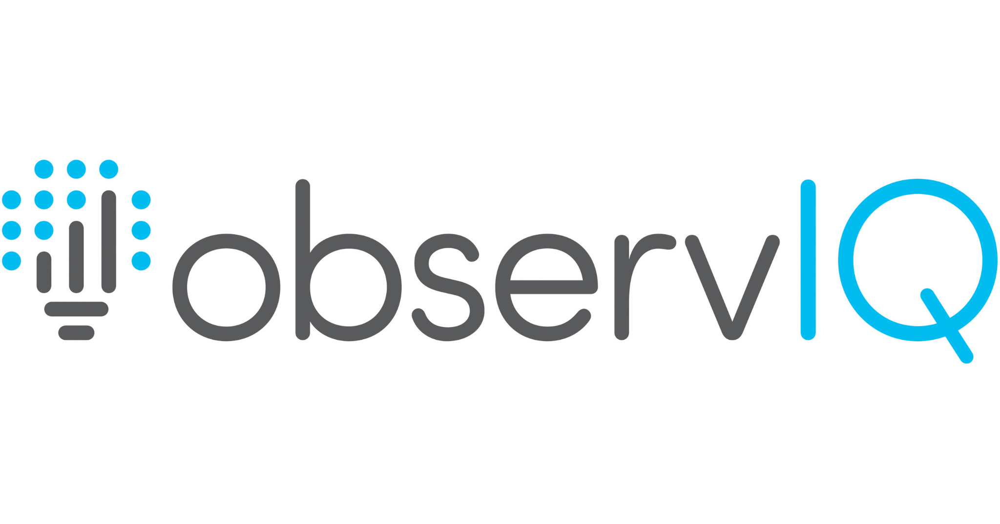
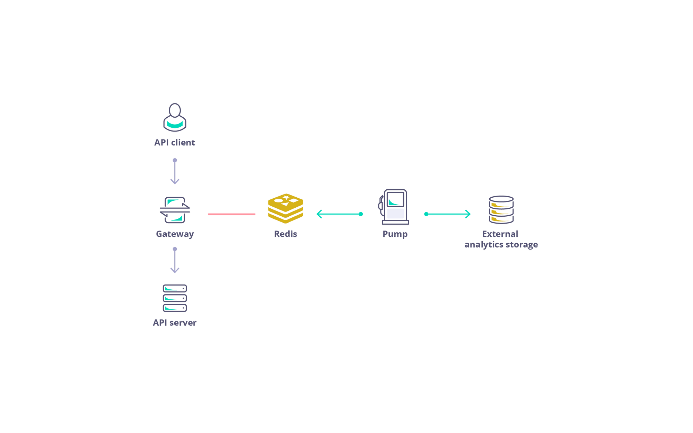
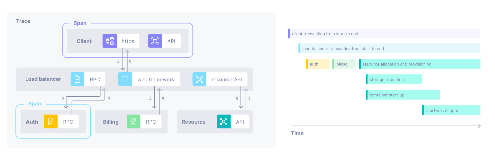
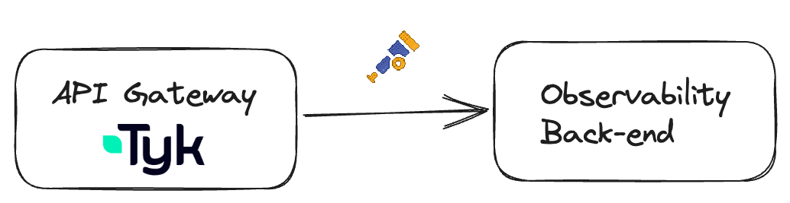
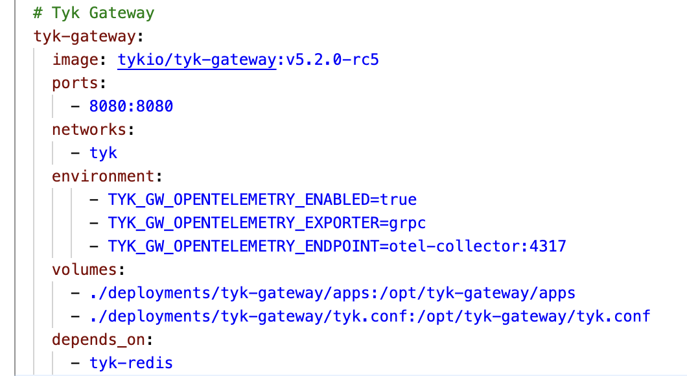
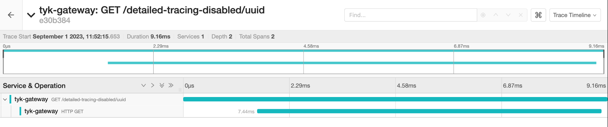
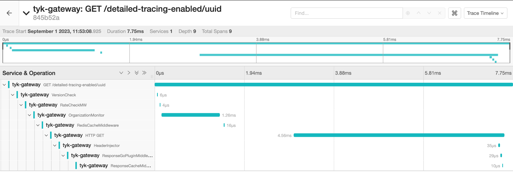

  

  <h1 style="font-size:2.8rem; font-weight:800; color:white; margin:0; line-height:1.2;">Tyk Onboarding</h1>

  
Rahmat - Sr. Customer Solutions Architect

---
layout: default
background: 'linear-gradient(135deg, #8438FA 0%, #8438FA 35%, #BB11FF 100%)'
---

  <h1 style="color:white; font-size:2.5rem; font-weight:bold; margin:0;">Introduction to Open Telemetry</h1>

---
layout: default
---

  

    
    

      Collection of tools to generate and export telemetry data (metrics, logs, and traces)
    

    

      Supported by all major observability vendors and open source tools.
    

    

      Second most popular open source project in the CNCF after Kubernetes with a very active community.
    

  

  

    
    
    
    
    
    
    
    
    
    
    
    
    
    
    
    
    
    
    
    
    
    
    
    
    
    
    
  

<!-- Notes: What is OpenTelemetry?
OpenTelemetry is an open-source collection of tools, APIs, and SDKs that enables developers and organizations to generate, collect, and export telemetry data such as metrics, logs, and traces.
Why OpenTelemetry?
Standardized Observability - provides a unified standard for telemetry data across platforms.
Comprehensive Telemetry - supports Metrics, Logs, and Traces.
Second Most Popular CNCF Project after Kubernetes with a very active community. -->

---
layout: default
---

<h2 style="color:#5900CB; font-size:1.8rem; font-weight:bold; margin-bottom:0.5rem;">OpenTracing</h2>

  

    
  

  

    
    
Metrics and logs

  

  

    
    
    
Distributed tracing

  

<!-- Notes: This diagram demonstrates how the Tyk API Gateway integrates with external analytics and observability tools to provide metrics, logs, and traces.
API Client sends requests to the Tyk Gateway.
Gateway stores analytics in Redis.
Pump collects data from Redis and exports to external systems.
Distributed Tracing via OpenTracing and New Relic.
Metrics and Logs via Prometheus, Datadog, ElasticSearch, Splunk. -->

---
layout: default
---

<h2 style="color:#5900CB; font-size:1.8rem; font-weight:bold; margin-bottom:0.5rem;">OpenTelemetry</h2>

  

    
  

  

    
  

  

Your observability back-end

<!-- Notes: Flow of Data - API Client makes a request to Tyk Gateway.
Telemetry data generated: metrics, logs, and traces collected at this stage.
OpenTelemetry standardizes the export of telemetry data.
Redis: Temporary storage for analytics data.
Pump extracts data and sends to external analytics storage.
OpenTelemetry Collector sends data to observability backends like Prometheus, Elasticsearch, or Jaeger. -->

---
layout: default
---

<h2 style="color:#5900CB; font-size:1.8rem; font-weight:bold; margin-bottom:1.5rem;">OpenTracing &amp; OpenTelemetry</h2>

  

    

      
OpenTracing

      <ul style="font-size:0.9rem; line-height:1.7; padding-left:1rem; margin:0; color:#333;">
        <li>Vendor-neutral API</li>
        <li>Abstracts tracing implementations</li>
        <li>Jaeger, Zipkin or New Relic</li>
        <li>Focuses only on tracing</li>
        <li>Requires manual instrumentation</li>
      </ul>
    

  

  

    

      
OpenTelemetry

      <ul style="font-size:0.9rem; line-height:1.7; padding-left:1rem; margin:0; color:#333;">
        <li>Successor to OpenTracing</li>
        <li>Data exported to backends like Datadog, Dynatrace or Elasticsearch</li>
        <li>Comprehensive Framework for collecting traces, metrics and logs</li>
        <li>Supported by CNCF</li>
        <li>Extends capability by collecting metrics and logs</li>
      </ul>
    

  

<!-- Notes: OpenTracing provides a vendor-neutral API for distributed tracing. It allows developers to abstract tracing implementations like Jaeger, Zipkin, or New Relic. Focuses solely on tracing. Its deprecated.
OpenTelemetry is the successor to OpenTracing. Provides a comprehensive framework for collecting traces, metrics, and logs. Backed by the Cloud Native Computing Foundation (CNCF). -->

---
layout: default
---

<h2 style="color:#5900CB; font-size:1.8rem; font-weight:bold; margin-bottom:1rem;">Traces and Spans</h2>

  

<!-- Notes: A trace represents the complete journey of a request as it flows through the system. It connects the end-to-end path from the moment the request enters the system to its final destination.
A span is the smallest unit of a trace. It represents a single operation. Each span captures: a specific operation, start and end times (latency), and metadata such as tags and attributes.
Example: A user makes an API request that travels through Load Balancer, Auth Service, Billing Service, Resource Service. Each service is represented as a span. -->

---
layout: default
---

<h2 style="color:#5900CB; font-size:1.8rem; font-weight:bold; margin-bottom:1.5rem;">Open Telemetry support in Tyk Gateway</h2>

<table style="width:100%; border-collapse:collapse; font-size:0.95rem;">
  <thead>
    <tr style="border-bottom:2px solid #8438FA;">
      <th style="padding:10px 16px; text-align:left; color:#8438FA; font-weight:bold; width:20%;">Property</th>
      <th style="padding:10px 16px; text-align:left; color:#8438FA; font-weight:bold;">Details</th>
    </tr>
  </thead>
  <tbody>
    <tr style="border-bottom:1px solid #ddd;">
      <td style="padding:12px 16px; font-weight:600; color:#03031C;">Version</td>
      <td style="padding:12px 16px; color:#333;">Tyk Gateway 5.2</td>
    </tr>
    <tr style="border-bottom:1px solid #ddd;">
      <td style="padding:12px 16px; font-weight:600; color:#03031C;">License</td>
      <td style="padding:12px 16px; color:#333;">No additional license needed, available for all OSS and commercial users</td>
    </tr>
    <tr style="border-bottom:1px solid #ddd;">
      <td style="padding:12px 16px; font-weight:600; color:#03031C;">Tyk Cloud</td>
      <td style="padding:12px 16px; color:#333;">Only available for self-hosted gateways (self-managed and hybrid gateways). Support for gateways hosted in Tyk Cloud comes with additional license.</td>
    </tr>
    <tr>
      <td style="padding:12px 16px; font-weight:600; color:#03031C;">Deprecation</td>
      <td style="padding:12px 16px; color:#333;">OpenTracing (older version of OTel) is deprecated</td>
    </tr>
  </tbody>
</table>

<!-- Notes: OpenTelemetry is now natively supported in the Tyk Gateway.
Version: Available starting from Tyk Gateway 5.2 onward.
License: No extra cost - available for all OSS and commercial users.
Tyk Cloud: Self-hosted gateways (self-managed and hybrid). Hosted gateways on Tyk Cloud come with additional license.
Deprecation: OpenTracing is deprecated. Teams should transition to OpenTelemetry. -->

---
layout: default
---

<h2 style="color:#5900CB; font-size:1.8rem; font-weight:bold; margin-bottom:1rem;">Set up</h2>

  

    
  

  

    
  

<!-- Notes: To Enable OpenTelemetry in Tyk Gateway, enable it in the gateway configuration file.
OpenTelemetry is disabled by default. Set TYK_GW_OPENTELEMETRY_ENABLED to true.
Export spans using gRPC protocol to the OpenTelemetry Collector endpoint at localhost:4317.
TYK_GW_OPENTELEMETRY_EXPORTER specifies grpc by default.
TYK_GW_OPENTELEMETRY_ENDPOINT points to the OpenTelemetry Collector.
Enable detailed_tracing to true at API level for specific APIs. -->

---
layout: default
---

<h2 style="color:#5900CB; font-size:1.8rem; font-weight:bold; margin-bottom:0.3rem;">Per default: 1 span per API call</h2>

detailed_tracing to <code style="background:#f0f0f0; padding:2px 6px; border-radius:4px;">false</code>

  

<!-- Notes: By default, when detailed tracing is set to false, Tyk Gateway generates one parent span per API call.
With detailed_tracing disabled, Tyk generates 2 spans: 1 Parent Span capturing the total lifecycle, and 1 Child Span for upstream service response time.
Attributes include: API Name, API Path, API ID, Organization ID.
This configuration is ideal for lightweight observability where basic insights are sufficient. -->

---
layout: default
---

<h2 style="color:#5900CB; font-size:1.8rem; font-weight:bold; margin-bottom:0.3rem;">Detailed tracing for troubleshooting</h2>

detailed_tracing to <code style="background:#f0f0f0; padding:2px 6px; border-radius:4px;">true</code>

  

<!-- Notes: With detailed tracing enabled, multiple spans are created - each corresponding to a specific middleware or stage in the request lifecycle.
Middleware spans include: Authentication Middleware, Rate Limiting Middleware, Transformation Middleware, Upstream Communication.
Each span shows duration, sequence of execution, and the exact middleware that may introduce latency.
This provides granular visibility into Tyk's request handling for troubleshooting latency issues. -->
