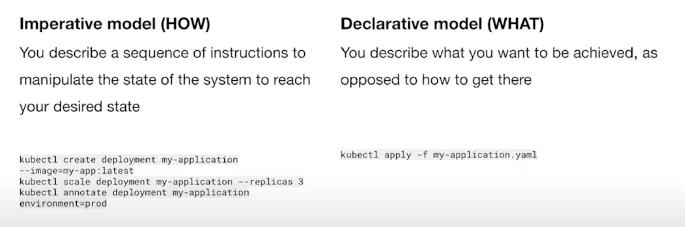
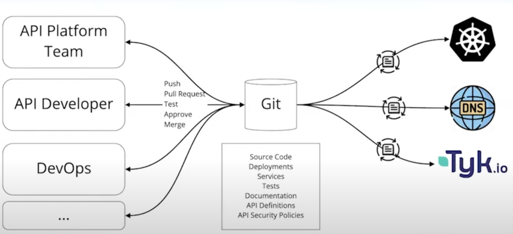
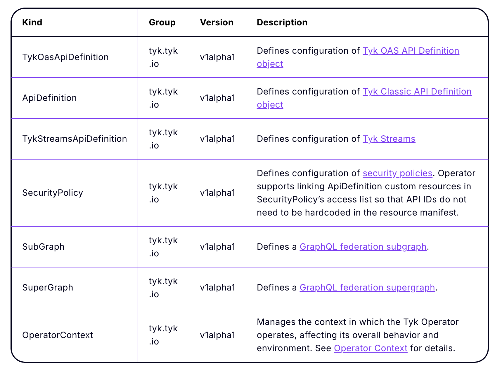
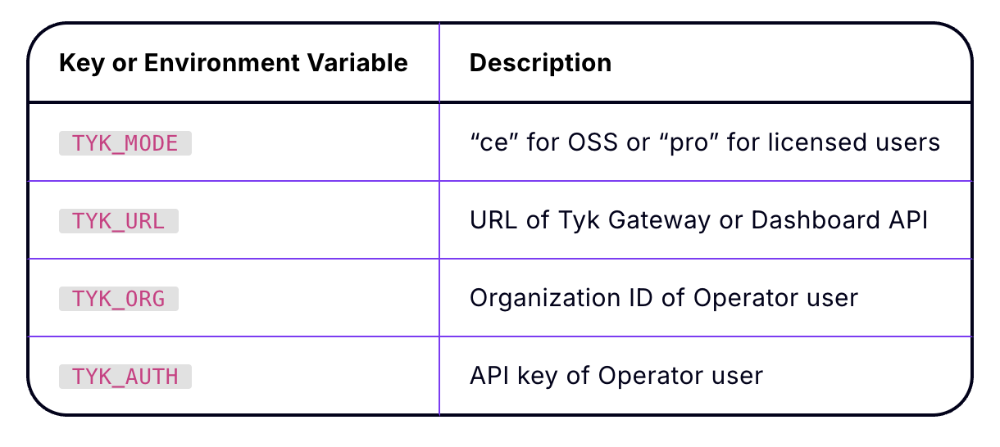
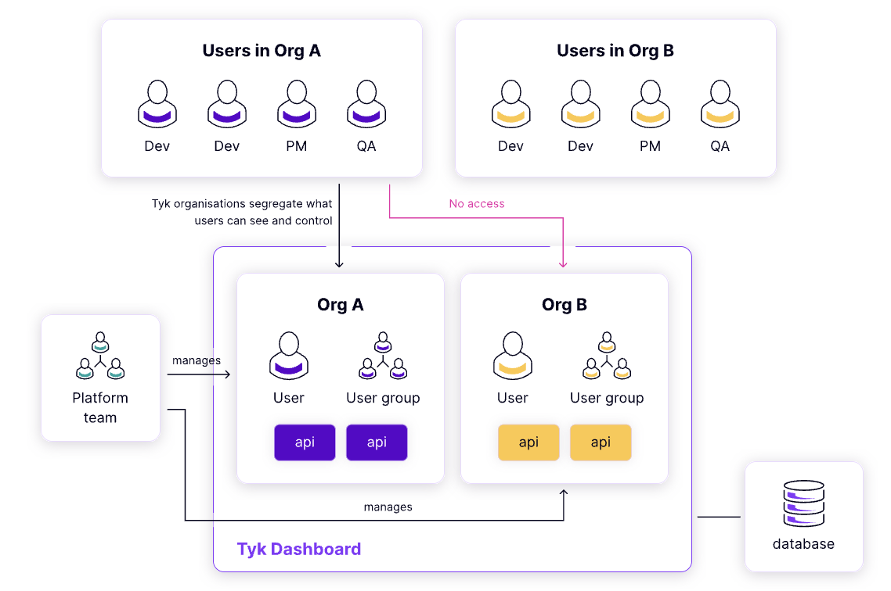
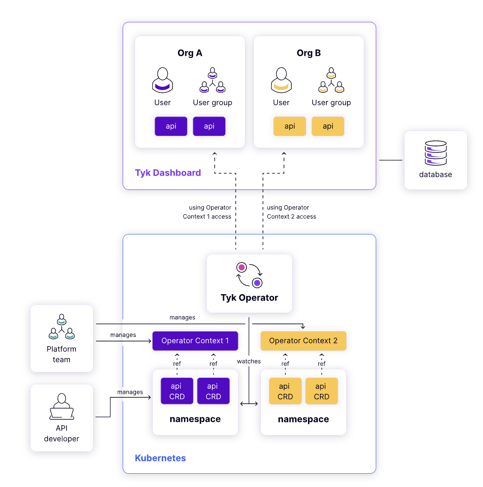
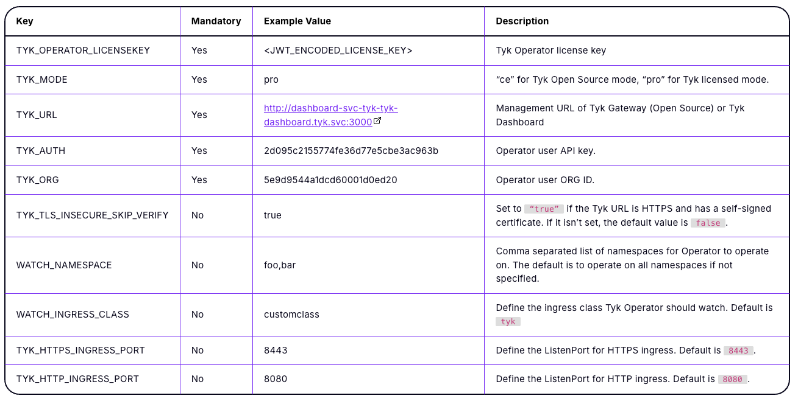
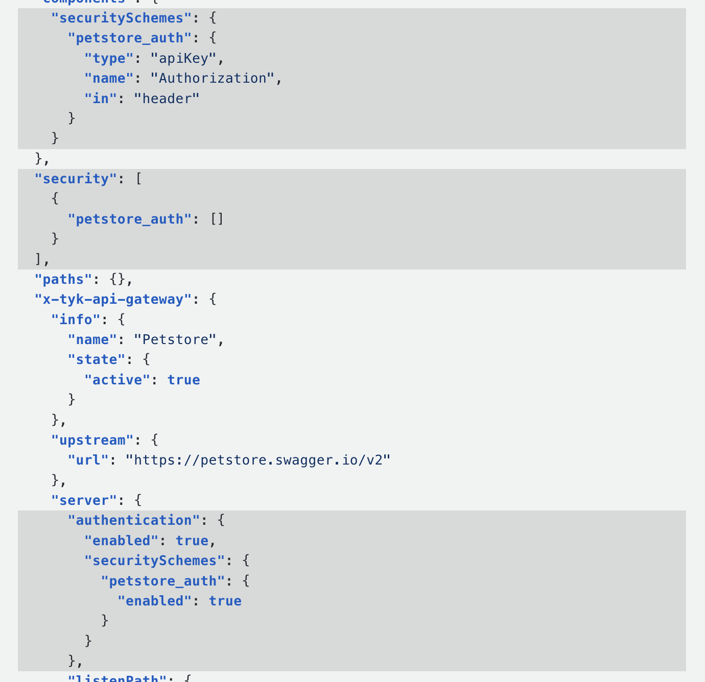
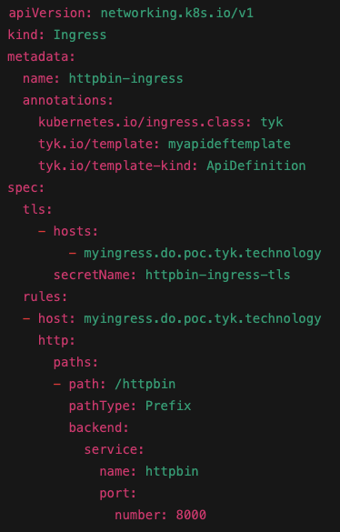
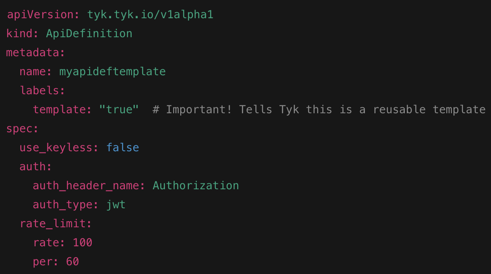

---
layout: cover
background: './images/icons/slide-001-gs-67-p16.png'
---

<div style="position:relative; display:flex; flex-direction:column; justify-content:center; align-items:center; height:100%; text-align:center; color:white;">
  <h1 style="font-size:2.6rem; font-weight:800; color:white; margin:0; border:0;">Tyk Onboarding</h1>
  <p style="opacity:0.85; margin-top:1.5em; max-width:700px; color:white;">Sr. Customer Solutions Architect</p>
</div>

---
layout: default
background: 'linear-gradient(135deg, #8438FA 0%, #8438FA 35%, #BB11FF 100%)'
---

<div style="display:flex; flex-direction:column; justify-content:center; align-items:center; height:100%; text-align:center; color:white;">
  <p style="color:#21E9BA; font-size:0.85rem; letter-spacing:2px; text-transform:uppercase; margin-bottom:0.3rem;">Module 1</p>
  <h1 style="color:white; font-size:2.5rem; font-weight:bold; margin:0;">Tyk Operator</h1>
  <p style="color:rgba(255,255,255,0.8); font-size:1.1rem; margin-top:0.8rem;">Understanding API Management in Kubernetes with Tyk Operator</p>
</div>

---
layout: default
---

# Imperative vs Declarative

<div style="display:flex; justify-content:center; margin-top:1rem;">
  
</div>

<!-- Notes: "Before we dive into the Tyk Operator and how it works, it’s important to take a step back and understand a fundamental concept in Kubernetes: imperative vs declarative approaches. This concept will help us appreciate why Operators, including the Tyk Operator, are powerful tools for managing APIs."
Imperative:
"Imperative is like giving direct instructions. You tell Kubernetes exactly what to do, step-by-step. For example, you might run a kubectl create or kubectl apply command from your terminal to create a resource. You’re in control, but it also means you have to manage and track every change yourself. It’s great for quick tasks or experimentation, but doesn’t scale well for managing complex or long-lived configurations."
Declarative:
"Declarative, on the other hand, is about describing what the desired state of the system should be. You write a YAML file that defines your configuration, and Kubernetes—or in our case, an Operator—makes sure the actual state of the system matches what you described. If something drifts from that state, it’s reconciled automatically. This model is ideal for GitOps, CI/CD, and repeatable deployments."
Transition to Tyk Operator:
"The Tyk Operator follows the declarative model. Instead of manually creating APIs or applying policies via the dashboard or CLI, we define them as Kubernetes custom resources. The Operator watches these resources and ensures Tyk’s configuration aligns with them. This brings all the benefits of GitOps—like version control, auditability, and repeatability—to API management." -->

---
layout: default
---

# Kubernetes Orchestration

<div style="display:flex; justify-content:center; margin-top:1rem;">
  
</div>

<!-- Notes: "Now that we understand the declarative approach, let’s look at the bigger picture of what actually happens when we deploy an API in a modern, cloud-native environment."
"In the middle of this diagram is Git—our single source of truth. It’s where everything starts. Whether you're an API developer, part of the platform team, or in DevOps, you're all interacting with Git to define the desired state of your system."
"On the left, we have different personas contributing to the process:
API developers define the API spec, policies, and access controls.

The platform team might handle things like ingress, service mesh rules, and DNS.

DevOps engineers define the Kubernetes resources, secrets, and CI/CD pipelines."

"And then on the right, you can see the systems that need to be configured:
Tyk, which is our API gateway—needs to be aware of the API, the rate limits, the authentication rules, etc.

DNS, which needs to point to the right service so consumers can actually reach the API.

Kubernetes, which hosts the service itself, including deployments, services, and config maps."

"The challenge is that all of these systems need to stay in sync. If one part is updated but the others aren't, your API might be unreachable, insecure, or just broken."
"This is why using a GitOps approach and tools like the Tyk Operator is so powerful—it helps bridge these moving parts by driving configuration through Git and ensuring everything stays in sync and consistent." -->

---
layout: default
---

# Tyk Operator

Tyk Operator within Kubernetes allows you to manage API lifecycles declaratively
Native Kubernetes operator
Define and manage APIs as code
Deploy, update, and secure APIs using the same declarative configuration approach

<!-- Notes: "Now that we've talked about the value of the declarative model and how complex the API deployment landscape can be, let’s bring it back to how the Tyk Operator fits in."
"The Tyk Operator is a native Kubernetes Operator—which means it works seamlessly inside your Kubernetes cluster, watching for custom resources and taking actions to ensure the API gateway stays in sync with your desired configuration."
"With the Tyk Operator, you can manage the entire API lifecycle declaratively—just like how you manage deployments, services, and ingress in Kubernetes."
"You define your APIs as code—things like the API definition, authentication, rate limiting, routing, and more—using YAML manifests. These are stored in Git, versioned, and part of your CI/CD pipeline."
"When you apply these manifests, the Operator takes care of provisioning, updating, and securing the APIs in Tyk automatically. There's no need to manually click through a dashboard or run CLI commands for every change."
"So you're treating your APIs as first-class citizens in your infrastructure—just like everything else in Kubernetes—benefiting from automation, consistency, and traceability." -->

---
layout: default
---

# Custom Resources

Custom Resources (CRs) extend the Kubernetes API.
They allow you to define and manage application-specific configurations.
CRDs make Kubernetes highly extensible by enabling domain-specific objects.
Defined using Custom Resource Definitions (CRDs), which specify the schema and structure of the resource

<!-- Notes: "To understand how the Tyk Operator works, we need to first understand the concept of Custom Resources, or CRs, in Kubernetes."
"Custom Resources extend the Kubernetes API. They allow us to introduce new types of objects that Kubernetes doesn't support out of the box."
"For example, Kubernetes natively understands objects like Deployments, Services, and ConfigMaps. But with Custom Resources, we can define our own objects—like an API object for Tyk, or maybe a DatabaseBackup or a CertificateRequest—and manage them just like any other Kubernetes resource."
"CRDs, or Custom Resource Definitions, are what make this possible. They define the schema and structure of these new resource types—what fields they have, how they're validated, and how Kubernetes should treat them."
"This makes Kubernetes highly extensible. You can model domain-specific configurations and lifecycles in a way that’s native to the platform, and tools like the Tyk Operator can then watch for these CRs and act on them."
"In our case, we define Tyk-specific CRs—such as APIs, Policies, or Security settings—and the Tyk Operator continuously reconciles the actual state of Tyk with what’s described in those resources." -->

---
layout: default
---

# Tyk Operator

Tyk Operator uses CRDs to manage API configurations declaratively.
These custom resources align with different API types and security policies.
Benefits:
GitOps-ready
Version-controlled API configurations
Integrated with Kubernetes CI/CD workflows

<!-- Notes: "Let’s connect what we’ve seen so far with how the Tyk Operator works under the hood."
"The Tyk Operator uses Custom Resource Definitions, or CRDs, to extend the Kubernetes API so it can understand Tyk-specific resources like APIs, security policies, and more."
"Each CRD represents a specific type of API configuration—for example, one CRD might be used for OpenAPI-based APIs, another for GraphQL, and another for managing authentication and rate limiting policies."
"By defining these configurations as custom Kubernetes resources, we unlock a lot of benefits:"
"First, they are GitOps-ready—we can manage all API configurations as code in Git."

"Second, they’re version-controlled, so any change to an API definition or policy can be tracked, reviewed, and rolled back if needed."

"And third, they integrate seamlessly with existing Kubernetes CI/CD workflows—we can deploy or update APIs using the same pipelines we use for the rest of our applications."

"This approach brings consistency, automation, and control to API management—treating APIs as first-class citizens in your platform engineering practices." -->

---
layout: default
---

# Custom Resources

```yaml
apiVersion: tyk.tyk.io/v1alpha1
kind: TykOasApiDefinition
metadata:
 name: petstore
spec:
 tykOAS:
   configmapRef:
     name: tyk-oas-api-config   # Metadata name of the ConfigMap resource that stores the Tyk OAS API Definition
     namespace: default           # Metadata namespace of the ConfigMap resource
     keyName: oas-api-definition.json # Key for retrieving Tyk OAS API Definition from the ConfigMap
```

<!-- Notes: "Here’s an example of a Custom Resource used with the Tyk Operator—specifically a TykOasApiDefinition."
"This CR is used to declaratively deploy an API using an OpenAPI Specification (OAS) that is stored in a Kubernetes ConfigMap."
"You can see this resource is defined under the tyk.tyk.io API group, and the kind is TykOasApiDefinition."
"The metadata.name is how Kubernetes will track this specific API resource—in this case, it’s called petstore."
"In the spec, we reference a ConfigMap where the actual OAS JSON is stored. This lets us keep large or complex API definitions separate from the CR, following a clean separation of concerns."
"This structure is powerful because it aligns with GitOps best practices: we can store and version the API spec in Git, sync it into a ConfigMap, and then let the Operator do the rest."
"Once this CR is applied, the Tyk Operator watches it, reads the referenced OAS file from the ConfigMap, and ensures that the API is deployed in the Tyk Gateway accordingly." -->

---
layout: default
---

# Tyk Operator CRDs

<div style="display:flex; justify-content:center; margin-top:1rem;">
  
</div>

---
layout: default
---

# Kubernetes Controllers

Definition: A controller is a control loop that watches the state of your cluster and makes changes to move the current state toward the desired state.
Part of Kubernetes Core: Many controllers are built into Kubernetes by default (e.g., Deployment controller, ReplicaSet controller, Job controller).
Function: It continuously reconciles resources by reading their spec and taking action to match the desired state.
Example: If you create a Deployment with 3 replicas, the ReplicaSet controller ensures that 3 pods are always running.

<!-- Notes: "To understand how the Tyk Operator works, we need to first understand controllers, which are a fundamental part of Kubernetes."
"A controller is essentially a control loop—it watches the actual state of the cluster, compares it to the desired state defined in your manifests, and takes actions to bring the two into alignment."
"Kubernetes comes with many built-in controllers—for example, the Deployment controller, the ReplicaSet controller, and the Job controller. Each one is responsible for reconciling a specific type of resource."
"Here’s a simple example: if you create a Deployment and specify 3 replicas, the ReplicaSet controller will make sure there are always 3 pods running. If one crashes, it spins up a new one to maintain the desired state."
"The key idea is reconciliation—controllers don't run once and stop. They run continuously in the background, checking if what you want matches what exists, and correcting any drift."
"This same principle is used by the Tyk Operator. It’s a custom controller that watches for Tyk-specific resources—like API definitions—and ensures that the Tyk Gateway reflects exactly what you’ve declared in your CRs." -->

---
layout: default
---

# Kubernetes Operator

Definition: An operator is a custom controller that manages complex, domain-specific applications or workloads.
Built on Controllers: Operators use controllers to manage Custom Resources (CRDs).
Extends Kubernetes: Operators understand the application lifecycle — including installation, upgrades, backups, configuration changes, etc.
Human Expertise in Code: Acts as a Kubernetes user
Example: The Tyk Operator manages API definitions and security policies by watching custom resources like TykOasApiDefinition.

<!-- Notes: "Now that we’ve covered controllers, let’s talk about Operators—which are essentially custom controllers designed to manage more complex, domain-specific applications."
"An Operator is a specialized controller that goes beyond just keeping pods running—it encodes human operational knowledge into software. It understands how to install, configure, upgrade, and even recover a specific type of application."
"Operators are built on top of the controller pattern. They use Custom Resource Definitions (CRDs) to introduce new Kubernetes-native objects that represent parts of your application."
"In that way, Operators extend Kubernetes itself—they make complex systems feel like native Kubernetes resources."
"Think of an Operator as a robotic system administrator. It behaves like a Kubernetes user that constantly watches for changes, and takes actions to ensure everything is configured correctly."
"A great example of this is the Tyk Operator. It watches for custom resources like TykOasApiDefinition, and ensures that APIs, policies, and other configurations are properly deployed and kept in sync with what’s declared."
"This allows you to manage the full lifecycle of APIs declaratively—just like how Kubernetes manages the lifecycle of your applications." -->

---
layout: default
---

# Reconciliation

Reconciliation is a key design pattern in Kubernetes controllers.
It ensures the actual state of the system matches the desired state.
Tyk Operator uses this pattern to keep Kubernetes objects in sync with Tyk.
Reconciliation is event-driven — it happens when something changes in your cluster.

**Triggers:**
A Kubernetes object is created, updated, or deleted
The Tyk Operator pod is restarted
The Operator’s cache expires (typically ~10 hours)

**⚠️ Important:**
Reconciliation does not react to changes made directly in Tyk!

<!-- Notes: "Reconciliation is a fundamental design pattern used by Kubernetes controllers to keep your cluster in the desired state."
"It works by continuously comparing the actual state of resources in the cluster against the desired state declared in your manifests or Custom Resources."
"The Tyk Operator uses this reconciliation loop to ensure that the Kubernetes objects it manages—like your API definitions—stay perfectly in sync with what’s deployed in the Tyk Gateway."
"This process is event-driven — reconciliation is triggered whenever there’s a change or an event, such as:"
"When a Kubernetes object is created, updated, or deleted."

"If the Tyk Operator pod restarts."

"Or if the Operator’s internal cache expires, which typically happens around every 10 hours."

"One important point to note: reconciliation only tracks changes made through Kubernetes. It does not react to changes made directly inside Tyk outside of Kubernetes."
"So to keep your system consistent and manageable, it’s best practice to make all changes via Kubernetes manifests and CRs, letting the Operator handle the rest." -->

---
layout: default
---

# Reconciliation

What Happens During Reconciliation?
Tyk Operator compares:
Desired State (from Kubernetes object)
Actual State (fetched from Tyk)
If there’s a drift, it performs one of three actions:
CREATE → Exists in K8s but not in Tyk
UPDATE → Differs in Tyk and K8s (via hash check)
DELETE → Deleted in K8s but still in Tyk

<!-- Notes: "During reconciliation, the Tyk Operator continuously compares two states:"
"The desired state — which is defined by the Kubernetes Custom Resource you’ve applied."

"The actual state — which is what currently exists inside the Tyk Gateway."

"If the Operator detects any difference, or drift, between these two states, it takes action to fix it."
"There are three main actions it can perform:"
"CREATE: If the resource exists in Kubernetes but doesn’t exist yet in Tyk, the Operator will create it in Tyk."

"UPDATE: If the resource exists in both places but differs — determined by a hash or checksum — the Operator updates the Tyk resource to match Kubernetes."

"DELETE: If the resource has been deleted from Kubernetes but still exists in Tyk, the Operator removes it from Tyk."

"This cycle ensures your API configuration in Tyk always reflects what you declare in Kubernetes, keeping things consistent and reliable." -->

---
layout: default
---

# Drift Detection

Drift Detection is built into reconciliation.
If someone:
Deletes an API from Tyk manually
Changes a config directly via Tyk Dashboard
Tyk Operator restores the Kubernetes-defined version.
This protects against:
Accidental updates
Unauthorized changes

**Best Practice:**
Use read-only access to Tyk in production environments.

<!-- Notes: "An important part of reconciliation is drift detection—the Operator actively looks for differences between the Kubernetes-defined state and what actually exists in Tyk."
"For example, if someone manually deletes an API directly in the Tyk Dashboard, or changes a configuration there outside of Kubernetes, the Operator will detect this drift."
"When drift is detected, the Tyk Operator restores the version defined in Kubernetes, effectively undoing those manual changes."
"This mechanism helps protect your system against accidental updates, or even unauthorized or unintended changes."
"To further strengthen control, a best practice is to configure read-only access to Tyk in production environments—so all changes go through Kubernetes manifests and the Operator."
"This keeps your API lifecycle fully declarative, auditable, and secure." -->

---
layout: default
---

# Summary

Tyk Operator is a Kubernetes Controller that manages Tyk Custom Resources (CRs) such as:
API Definitions
Security Policies
How it works:
Developers define API configurations using Custom Resources
Tyk Operator ensures the desired state is continuously reconciled with the Tyk Gateway or Dashboard
Handles CREATE, UPDATE, and DELETE operations to align the actual state with the desired state
Goal:
Achieve and maintain a consistent, declarative API infrastructure through Kubernetes-native workflows

<!-- Notes: "To wrap up, the Tyk Operator is a Kubernetes controller specifically designed to manage Tyk custom resources, like API Definitions and Security Policies."
"Here’s how it works in practice:"
"Developers declare API configurations using Kubernetes Custom Resources."

"The Tyk Operator continuously watches and reconciles those resources with the actual state in the Tyk Gateway or Dashboard."

"It handles create, update, and delete actions to ensure what’s running matches exactly what you’ve declared."

"The ultimate goal is to provide a consistent, declarative API infrastructure that fits naturally within Kubernetes-native workflows and tooling."
"This makes API management more automated, auditable, and aligned with modern GitOps and CI/CD practices."
"With the Tyk Operator, you get all the benefits of Kubernetes control loops applied to API lifecycle management." -->

---
layout: default
background: 'linear-gradient(135deg, #8438FA 0%, #8438FA 35%, #BB11FF 100%)'
---

<div style="display:flex; flex-direction:column; justify-content:center; align-items:center; height:100%; text-align:center; color:white;">
  <p style="color:#21E9BA; font-size:0.85rem; letter-spacing:2px; text-transform:uppercase; margin-bottom:0.3rem;">Module 2</p>
  <h1 style="color:white; font-size:2.5rem; font-weight:bold; margin:0;">Operator Deep Dive</h1>
  <p style="color:rgba(255,255,255,0.8); font-size:1.1rem; margin-top:0.8rem;">Diving into Tyk Operator</p>
</div>

---
layout: default
---

<h2 style="color:#5900CB; font-size:1.8rem; font-weight:bold; margin-bottom:1rem;">Authentication with Tyk Dashboard</h2>

<div style="display:flex; gap:1.5rem; margin-top:0.5rem;">
  <div style="flex:1; font-size:0.9rem; line-height:1.7; color:#03031C;">Tyk Operator as a System User
Acts as a system user for the Tyk Dashboard
Bound by Organization ID and RBAC rules
Startup Behavior
On startup, Tyk Operator retrieves credentials from:
tyk-operator-conf Kubernetes Secret
Environment Variables</div>
  <div style="flex:1.2;"></div>
</div>

<!-- Notes: "The Tyk Operator acts as a system user within the Tyk Dashboard environment."
"This means it has its own identity, with permissions bound by an Organization ID and RBAC rules configured in Tyk."
"This approach ensures that all actions performed by the Operator respect your organization’s security policies and access controls."
"When the Operator starts up, it needs to authenticate itself to Tyk to perform its duties."
"It retrieves its credentials from two places:"
"A Kubernetes Secret named tyk-operator-conf that stores necessary config values securely."

"Or, optionally, from environment variables passed to the Operator pod."

"The table on this slide lists the key configuration values expected in tyk-operator-conf, such as the Dashboard URL, credentials, and Organization ID."
"This secure, flexible setup allows the Operator to integrate smoothly with Tyk while respecting security best practices." -->

---
layout: default
---

<h2 style="color:#5900CB; font-size:1.8rem; font-weight:bold; margin-bottom:1rem;">Multi-Tenancy in Tyk</h2>

<div style="display:flex; gap:1.5rem; margin-top:0.5rem;">
  <div style="flex:1; font-size:0.9rem; line-height:1.7; color:#03031C;">Run multiple isolated teams or departments on a single Dashboard instance.
Each organization is fully independent, with its own:
API Definitions
API Keys
Users
Developers
Domain
Ideal for complex enterprise structures where teams operate independently under one infrastructure.</div>
  <div style="flex:1.2;"></div>
</div>

<!-- Notes: "Tyk Dashboard supports running multiple isolated teams or departments within a single Dashboard instance."
"Each organization inside the Dashboard is fully independent, meaning it has its own set of:"
"API Definitions"

"API Keys"

"Users"

"Developers"

"Domain configuration"

"This isolation ensures that teams or departments can operate autonomously without interfering with each other’s APIs or configurations."
"This model is ideal for complex enterprise environments where multiple teams share one infrastructure but need to maintain clear separation and control over their API assets."
"It simplifies management by centralizing governance while enabling independent workflows for each group." -->

---
layout: default
---

<h2 style="color:#5900CB; font-size:1.8rem; font-weight:bold; margin-bottom:1rem;">Multi-Tenancy in Tyk Operator</h2>

<div style="display:flex; gap:1.5rem; margin-top:0.5rem;">
  <div style="flex:1; font-size:0.9rem; line-height:1.7; color:#03031C;">OperatorContext allows isolated API management per team or department within a shared Tyk Operator instance.
What OperatorContext Defines:
Tyk Dashboard to interact with
Organization for API management
User identity for API requests
Environment where the Operator runs
You can reference OperatorContext in:
ApiDefinition
TykOasApiDefinition
TykStreamsApiDefinition
SecurityPolicy</div>
  <div style="flex:1.2;"></div>
</div>

<!-- Notes: "In addition to multi-organization support at the Dashboard level, the Tyk Operator supports multitenancy through something called OperatorContext."
"OperatorContext enables isolated API management for different teams or departments within the same shared Tyk Operator instance."
"So what exactly does OperatorContext define?"
"The specific Tyk Dashboard instance the Operator should interact with."

"The Organization within Tyk where the APIs and resources belong."

"The User identity under which API requests are made, ensuring proper RBAC and auditability."

"The Environment or namespace where the Operator runs, helping scope the management."

"You can reference this OperatorContext in various custom resources like:"
"ApiDefinition"

"TykOasApiDefinition"

"TykStreamsApiDefinition"

"SecurityPolicy"

"This design lets multiple teams safely manage their APIs and policies using one Operator deployment, with clear isolation and control." -->

---
layout: default
---

# Multi-Tenancy in Tyk Operator

How OperatorContext Works:

---
layout: default
---

# TLS Certificate Management

Tyk Operator simplifies how you manage TLS certificates for APIs in Kubernetes.
Traditional Approach:
Manually upload certificates to Tyk
Reference via Certificate ID
Manual updates = high overhead and risk of downtime
With Tyk Operator:
Use certificates stored as Kubernetes secrets
- → Reference directly in your CRDs
Supported in:
ApiDefinition
TykOasApiDefinition
SecurityPolicy, etc.

<!-- Notes: "Managing TLS certificates for APIs has traditionally been a manual and error-prone process."
"Traditional approach involves:"
"Uploading certificates directly to the Tyk Dashboard or Gateway."

"Referencing those certificates by their Certificate IDs."

"Any updates require manual re-uploads, which increases overhead and risk of downtime."

"With the Tyk Operator, this process is much smoother."
"You can now store your TLS certificates as Kubernetes Secrets and reference those secrets directly within your Custom Resource Definitions."
"This means certificates become part of your declarative, GitOps-friendly API configuration — automated, version-controlled, and integrated with Kubernetes lifecycle management."
"The Operator supports this in resources like:"
"ApiDefinition"

"TykOasApiDefinition"

"SecurityPolicy, and others."

"This approach reduces manual intervention and improves reliability for TLS management in your API infrastructure." -->

---
layout: default
---

# TLS Certificate Management

Tyk Operator simplifies how you manage TLS certificates for APIs in Kubernetes.
Traditional Approach:
Manually upload certificates to Tyk
Reference via Certificate ID
Manual updates = high overhead and risk of downtime
With Tyk Operator:
Use certificates stored as Kubernetes secrets
- → Reference directly in your CRDs
Supported in:
ApiDefinition
TykOasApiDefinition
SecurityPolicy, etc.

<!-- Notes: "Managing TLS certificates for your APIs is critical but can be tedious and risky if done manually."
"Traditionally, you had to manually upload certificates to Tyk and then reference them by Certificate ID. Every time a certificate needed updating, it involved manual steps, which increased overhead and the chance of downtime."
"With the Tyk Operator, this process is much simpler and more reliable."
"You store your TLS certificates as Kubernetes Secrets, and then reference those secrets directly in your Custom Resource Definitions, such as ApiDefinition, TykOasApiDefinition, SecurityPolicy, and more."
"This declarative approach means your TLS certificates are version-controlled alongside your API configurations and managed automatically as part of your Kubernetes workflows."
"It reduces manual effort, lowers risk, and fits perfectly with GitOps best practices." -->

---
layout: default
background: 'linear-gradient(135deg, #8438FA 0%, #8438FA 35%, #BB11FF 100%)'
---

<div style="display:flex; flex-direction:column; justify-content:center; align-items:center; height:100%; text-align:center; color:white;">
  <p style="color:#21E9BA; font-size:0.85rem; letter-spacing:2px; text-transform:uppercase; margin-bottom:0.3rem;">Module 3</p>
  <h1 style="color:white; font-size:2.5rem; font-weight:bold; margin:0;">Installing Tyk Operator</h1>
  <p style="color:rgba(255,255,255,0.8); font-size:1.1rem; margin-top:0.8rem;">Configuring and Installing Tyk Operator</p>
</div>

---
layout: default
---

# Installing and Configuring Tyk Operator


**Pre-requisites:**
Tyk deployment - Tyk Cloud or Self-managed
Policy ID matching configuration:
Dashboard configuration set to true:
allow_explicit_policy_id
Enable_duplicate_slugs
Gateway configuration set to true:
Policies.allow_explicit_policy_id
User credentials from the Dashboard
Tyk Operator user above should write access to APIs, Certificates, Policies etc.
Turn off write access for all other users

<!-- Notes: "Before you can use the Tyk Operator effectively, there are a few important prerequisites to set up."
"First, you’ll need a running Tyk deployment. This can be either Tyk Cloud or a self-managed instance."
"Second, you must ensure that explicit policy ID mapping is enabled."
"In the Dashboard config, set allow_explicit_policy_id and enable_duplicate_slugs to true."
"In the Gateway config, make sure policies.allow_explicit_policy_id is also set to true."
allow_explicit_policy_id: true
What it does: Allows you to manually set the ID for a policy when creating it through the Dashboard API.

Why it matters: The Tyk Operator uses a policy ID defined in your Custom Resource. If this setting is false, the Dashboard would override the ID with a generated one, breaking the sync.

In context: Ensures the policy created by the Operator has the exact ID you define in Kubernetes, maintaining consistency.

🔧 enable_duplicate_slugs: true
What it does: Allows multiple APIs to have the same slug (URL path segment).

Why it matters: In GitOps or CI/CD pipelines, you might deploy similar APIs across different environments or teams that share naming conventions.

In context: Prevents slug collisions that could otherwise cause deployment errors when the Operator applies new API configurations.

Gateway Config Flag
🔧 policies.allow_explicit_policy_id: true
What it does: Allows the Gateway to respect manually assigned policy IDs from the config bundle (or API call), rather than auto-generating them.

Why it matters: If you're using Tyk Operator to push policy definitions, the Gateway must accept those defined IDs so it can properly apply the right policy to each API key or token.

In context: Keeps the Gateway aligned with what’s declared in Kubernetes, supporting predictable and controlled API security.
"Next, you’ll need a set of user credentials from the Dashboard. This user will act as the Tyk Operator's system user."
"It’s important that this user has write access to manage APIs, Cer -->

---
layout: default
---

# Admission Webhooks

Admission webhooks are HTTP callbacks triggered during the Kubernetes API request lifecycle.
They let you:
Validate custom resources (ValidatingAdmissionWebhook)
Mutate or inject defaults into resources (MutatingAdmissionWebhook)
Commonly used by Operators and Controllers to enforce policies and set defaults.
Ensures only valid configurations are accepted
Allows default values to be injected automatically
Improves security, consistency, and automation

<!-- Notes: "As we continue exploring how Tyk Operator works within Kubernetes, it's important to understand one of the powerful mechanisms that help manage and control resources: Admission Webhooks."
"Admission webhooks are HTTP callbacks that are triggered during the Kubernetes API request lifecycle — specifically, after the request is authenticated and authorized, but before the object is persisted to etcd."
"There are two types of admission webhooks that Operators commonly use:"
"ValidatingAdmissionWebhook — this checks the request and can reject it if the resource doesn’t meet certain criteria. Think of it like a final gatekeeper to ensure configurations are valid before they are accepted."

"MutatingAdmissionWebhook — this allows modification of the request, like injecting default values or fixing up fields before the resource is saved."

"In the context of Tyk Operator, admission webhooks can help ensure that API definitions, security policies, or other custom resources are well-formed, consistent, and safe before they get applied."
"This improves your platform’s overall security and reliability. You can prevent bad configurations from being deployed and automate default settings, reducing human error."
"Ultimately, admission webhooks help enforce policy and standardization across teams — a crucial aspect when managing APIs in an enterprise Kubernetes environment." -->

---
layout: default
---

# Cert Manager

Kubernetes requires all webhook communication to be over HTTPS.
The webhook server must serve a valid certificate.
Kubernetes must trust the certificate used by the webhook.
This is where cert-manager comes in.
cert-manager is a Kubernetes add-on that automates:
Issuing TLS certificates
Renewing expiring certs
Storing them in secrets
Works with issuers like Let’s Encrypt, HashiCorp Vault, internal PKI.
You can disable the webhook and/or manually generate TLS certificates
Example use case:
Air-gapped environments
Clusters with restricted access

<!-- Notes: "Now let’s talk about a critical requirement when working with admission webhooks in Kubernetes: secure communication."
"Kubernetes requires all webhook traffic to be encrypted using HTTPS. That means:"
"Your webhook server must serve over TLS using a valid certificate."

"And more importantly, Kubernetes must trust that certificate — or it will reject the webhook entirely."

"This is where cert-manager becomes really helpful."
"cert-manager is a Kubernetes add-on that automates the management of TLS certificates for your cluster. It can:"
"Issue certificates using trusted issuers like Let’s Encrypt, Vault, or internal PKI."

"Renew certificates before they expire — so no manual intervention is needed."

"Store the certificates securely in Kubernetes Secrets."

"This automation is especially useful for things like the Tyk Operator’s webhook server, which needs a valid TLS cert to function properly in a Kubernetes-native way."
"But what if you’re in a highly secure or air-gapped environment where cert-manager isn’t feasible?"
"In that case, you can disable the webhook in the Tyk Operator or manually generate TLS certificates and configure them yourself."
"So depending on your environment, you have flexible options — but for most cloud-native setups, using cert-manager is the recommended and scalable way to go." -->

---
layout: default
---

# Installing Tyk Operator

2 options to install Tyk Operator:
Tyk’s Umbrella Helm Charts
Stand-alone Helm Chart
Tyk’s Umbrella Helm Charts:
You can install Tyk Operator alongside other Tyk components in the Tyk Helm Chart by setting:
global.components.operator = true
A license key is required for the Tyk Operator.
You can provide it via:
Helm value: global.license.operator
Or a Kubernetes secret:
global.secrets.useSecretName → Secret must contain: OperatorLicense
If using global.secrets.useSecretName, the value in global.license.operator will be ignored.
Ensure the referenced secret is properly configured.

---
layout: default
---

# Installing Tyk Operator via Umbrella Helm Chart

You can install Tyk Operator alongside other Tyk components in the Tyk Helm Chart by setting:
global.components.operator = true
tyk-operator-conf will have been created with the following keys by default:
TYK_OPERATOR_LICENSEKEY
TYK_AUTH - Tyk Dashboard API Access Credentials
TYK_MODE
TYK_ORG - Organization ID
TYK_URL
If the credentials embedded in the tyk-operator-conf are ever changed or updated, the tyk-operator-controller-manager pod must be restarted to pick up these changes.

<!-- Notes: "You can deploy Tyk Operator as part of your overall Tyk stack using the official Tyk Helm chart."
"To do this, you simply set this value in your Helm values.yaml or CLI override:"
global.components.operator = true
"This flag ensures the Tyk Operator gets installed alongside the Dashboard, Gateway, and other components."
"Now, when the chart is deployed with the Operator enabled, it will automatically create a Kubernetes Secret called tyk-operator-conf, which holds the configuration the Operator needs to connect to the Tyk Dashboard."
"This secret includes several important keys:"
TYK_OPERATOR_LICENSEKEY – your Tyk Operator license

TYK_AUTH – the Dashboard API access credentials (typically a user key)

TYK_MODE – the mode the Operator runs in (dashboard or hybrid)

TYK_ORG – the Organization ID the Operator operates under

TYK_URL – the base URL for the Tyk Dashboard API

⚠️ "Important operational note:"
"If any of these credentials are changed or updated, such as rotating the API key or updating the license, the tyk-operator-controller-manager pod must be restarted. This is required because the Operator only loads the credentials at startup."
"This restart ensures it re-reads the secret and reinitializes with the new credentials." -->

---
layout: default
---

# Installing Tyk Operator via Stand-Alone Helm Chart

```bash
You can install CRDs and Tyk Operator using the stand-alone Helm Chart by running the following command:
$ helm repo add tyk-helm https://helm.tyk.io/public/helm/charts/
$ helm repo update
$ helm install tyk-operator tyk-helm/tyk-operator -n tyk-operator-system
This process will deploy Tyk Operator and its required Custom Resource Definitions (CRDs) into your Kubernetes cluster in tyk-operator-system namespace.
```

<!-- Notes: "If you only want to install Tyk Operator — without the rest of the Tyk stack — you can use the stand-alone Helm chart provided by Tyk."
"This is useful in cases where you're managing the Operator independently, or integrating it into an existing deployment."
Step-by-step:
"First, add the Tyk Helm repository and update it:"
bash
CopyEdit
$ helm repo add tyk-helm https://helm.tyk.io/public/helm/charts/
$ helm repo update
"Then, install the Tyk Operator using this command:"
bash
CopyEdit
$ helm install tyk-operator tyk-helm/tyk-operator -n tyk-operator-system
"This will deploy the Tyk Operator and all of its Custom Resource Definitions (CRDs) into the tyk-operator-system namespace."
"You’ll see that the Operator is deployed as a Deployment, and it will start watching for Tyk Custom Resources like TykOasApiDefinition, ApiDefinition, and SecurityPolicy."
"Make sure your Kubernetes context is set to the right cluster, and that you have the necessary permissions to create CRDs and deploy into the namespace." -->

---
layout: default
---

# Secret/envVars Key-Values

<div style="display:flex; justify-content:center; margin-top:1rem;">
  
</div>

---
layout: default
background: 'linear-gradient(135deg, #8438FA 0%, #8438FA 35%, #BB11FF 100%)'
---

<div style="display:flex; flex-direction:column; justify-content:center; align-items:center; height:100%; text-align:center; color:white;">
  <p style="color:#21E9BA; font-size:0.85rem; letter-spacing:2px; text-transform:uppercase; margin-bottom:0.3rem;">Module 4</p>
  <h1 style="color:white; font-size:2.5rem; font-weight:bold; margin:0;">Managing APIs with Tyk Operator</h1>
  <p style="color:rgba(255,255,255,0.8); font-size:1.1rem; margin-top:0.8rem;">Advanced Features of Tyk Operator</p>
</div>

---
layout: default
---

# Onboarding a Tyk OAS API

```
Prepare the Tyk OAS API Definition
Create an OAS-compliant file (e.g., oas-api-definition.json)
Include Tyk extensions:
"x-tyk-api-gateway": {
"info": { "name": "Petstore", "state": { "active": true }},
"upstream": { "url": "https://petstore.swagger.io/v2" },
"server": { "listenPath": { "value": "/petstore/", "strip": true }}
}
Tip:
Generate and export this from the Tyk Dashboard > API > Actions > View API Definition
```

<!-- Notes: "First, you’ll need an OAS-compliant file — for example, oas-api-definition.json — that defines your API in the OpenAPI Specification format."
"But to make it work with Tyk, you also need to include Tyk-specific extensions using the x-tyk-api-gateway field."
What goes in x-tyk-api-gateway:
"This section allows you to declaratively define how the API behaves in the gateway. For example:"
json
CopyEdit
"x-tyk-api-gateway": {
  "info": { "name": "Petstore", "state": { "active": true }},
  "upstream": { "url": "https://petstore.swagger.io/v2" },
  "server": { "listenPath": { "value": "/petstore/", "strip": true }}
}
"info" defines the name and active state of the API.

"upstream" tells Tyk where to forward traffic.

"server" configures the listen path and whether to strip the prefix.

Tip:
"If you already have APIs in Tyk, the easiest way to get this structure is by going to the Tyk Dashboard → API → Actions → View API Definition."
"You can export an existing API from the Dashboard as an OAS file with the correct extensions — and then use it directly with the Operator."
"This step ensures that your API configuration is both OpenAPI-compliant and Tyk-ready." -->

---
layout: default
---

# Onboarding a Tyk OAS API

```bash
2. Create Kubernetes ConfigMap
kubectl create configmap tyk-oas-api-config \
  --from-file=oas-api-definition.json -n tyk
Important Notes:
Max size: 1MiB
Avoid kubectl apply due to 256KB annotation limit
Use kubectl create or kubectl replace
```

<!-- Notes: Why a ConfigMap?
"This lets the Tyk Operator read your API definition from a Kubernetes-native source — aligning with declarative and GitOps-friendly workflows."
Command:
bash
CopyEdit
kubectl create configmap tyk-oas-api-config \
  --from-file=oas-api-definition.json -n tyk
"This creates a ConfigMap named tyk-oas-api-config in the tyk namespace, using your OAS file."
Important Notes to Keep in Mind:
Max size is 1MiB. This is a Kubernetes limitation on ConfigMap size.

Avoid kubectl apply for ConfigMaps. When you use kubectl apply, Kubernetes stores the full ConfigMap in the annotations of the resource, which has a 256KB size limit.

Instead, always use kubectl create or kubectl replace to avoid hitting this annotation limit.

"This step ensures your API spec is ready to be consumed by the Operator in the next step of the onboarding process." -->

---
layout: default
---

# Onboarding a Tyk OAS API

```yaml
3. Define TykOasApiDefinition Resource
Manifest (tyk-oas-api-definition.yaml):
apiVersion: tyk.tyk.io/v1alpha1
kind: TykOasApiDefinition
metadata:
  name: petstore
spec:
  tykOAS:
    configmapRef:
      name: tyk-oas-api-config
      namespace: tyk
      keyName: oas-api-definition.json
```

```bash
kubectl apply -f tyk-oas-api-definition.yaml
```


```bash
kubectl apply -f tyk-oas-api-definition.yaml
```

<!-- Notes: "Now that your OAS API spec is available in a ConfigMap, the next step is to define a TykOasApiDefinition resource — this is a Custom Resource (CRD) that tells the Tyk Operator how to onboard your API."
Here’s the manifest example:
yaml
CopyEdit
apiVersion: tyk.tyk.io/v1alpha1
kind: TykOasApiDefinition
metadata:
  name: petstore
spec:
  tykOAS:
    configmapRef:
      name: tyk-oas-api-config
      namespace: tyk
      keyName: oas-api-definition.json
Key parts to highlight:
apiVersion and kind: This is a Tyk Custom Resource — specifically for managing OAS-style APIs.

metadata.name: This will be the name of your resource in Kubernetes. It doesn’t need to match the API name in the spec, but it’s good practice.

configmapRef: This tells the Operator where to find your OpenAPI spec:

name: The name of the ConfigMap we created earlier

namespace: Where that ConfigMap lives

keyName: The exact file inside the ConfigMap (in this case, oas-api-definition.json)

"Once this resource is applied, the Operator will trigger a reconciliation loop, and the API will be created in Tyk based on the contents of the OAS file."
"That’s how you declaratively manage an API using Tyk Operator — cleanly separated, version-controlled, and automated." -->

---
layout: default
---

# Onboarding a Tyk OAS API

```bash
4. Verify & Test the API
Check Status:
kubectl get tykoasapidefinition petstore
Test Endpoint:
curl "TYK_GATEWAY_URL/petstore/store/inventory"
```

<!-- Notes: "After you’ve applied the TykOasApiDefinition resource, it’s important to verify that the Operator has successfully onboarded your API."
Check the status:
Run kubectl get tykoasapidefinition petstore

This command shows if the custom resource exists and its current status.

You can also use kubectl describe tykoasapidefinition petstore for more detailed info or to troubleshoot.

Test the API endpoint:
Use a simple curl command to test the API through the Tyk Gateway.

For example: curl "TYK_GATEWAY_URL/petstore/store/inventory"

This confirms the API is reachable and routing correctly through Tyk.

"Verifying the API’s status and connectivity ensures your declarative configuration has successfully translated into a working API managed by Tyk Operator."
"From here, you can move on to configuring security policies, rate limits, or other advanced features—all managed via Kubernetes manifests." -->

---
layout: default
---

# Onboarding a Tyk OAS API

```bash
5. Updating an API
To make any changes to your API configuration, update the OAS file in your ConfigMap and then re-apply the ConfigMap using kubectl replace:
kubectl create configmap tyk-oas-api-config --from-file=oas-api-definition.json -n tyk --dry-run=client -o yaml | kubectl replace -f -
```

<!-- Notes: "When you need to update your API configuration, the process is straightforward and fully declarative."
Update your OAS file:
Make changes directly in your OpenAPI Specification file (oas-api-definition.json), such as updating endpoints, adding new paths, or changing metadata.

Update the ConfigMap:
Use the command to replace the existing ConfigMap with your updated OAS file:

 lua
CopyEdit
kubectl create configmap tyk-oas-api-config --from-file=oas-api-definition.json -n tyk --dry-run=client -o yaml | kubectl replace -f -
This command creates the updated ConfigMap manifest on-the-fly and replaces the existing one in Kubernetes.

What happens next:
The Tyk Operator detects the ConfigMap update.

It automatically reconciles the changes, updating the API in Tyk accordingly.

No manual intervention needed in the Dashboard or Gateway.

"This declarative approach keeps your API lifecycle consistent, version-controlled, and fully automated—perfect for GitOps workflows." -->

---
layout: default
background: '#8438FA'
---

<div style="display:flex; flex-direction:column; justify-content:center; align-items:center; height:100%; color:white; text-align:center;">
  <svg width="56" height="42" viewBox="0 0 56 42" fill="none" style="margin-bottom:1.2rem;">
    <rect x="2" y="8" width="32" height="28" rx="8" fill="#21E9BA" opacity="0.6"/>
    <rect x="18" y="2" width="32" height="28" rx="8" fill="#21E9BA" opacity="0.4"/>
  </svg>
  <h1 style="font-size:2.2rem; font-weight:bold; color:white; margin:0;">Hands-On Workshop</h1>
  <p style="font-size:0.95rem; color:#20EDBA; font-weight:bold; text-align:center; max-width:600px; margin-top:1rem;">Onboarding an OAS API using Operator</p>
</div>

---
layout: default
---

# Onboarding a Tyk OAS API

```json
Create a file called oas-api-definition.json with your API definition, including the Tyk extension x-tyk-api-gateway. For example:
{
  "info": {
    "title": "Petstore",
    "version": "1.0.0"
  },
  "openapi": "3.0.3",
  "components": {},
  "paths": {},
  "x-tyk-api-gateway": {
    "info": {
      "name": "petstore",
      "state": {
        "active": true
      }
    },
    "upstream": {
      "url": "https://petstore.swagger.io/v2"
    },
    "server": {
      "listenPath": {
        "value": "/petstore/",
        "strip": true
      }
    }
  }
}
```

<!-- Notes: "When you need to update your API configuration, the process is straightforward and fully declarative."
Update your OAS file:
Make changes directly in your OpenAPI Specification file (oas-api-definition.json), such as updating endpoints, adding new paths, or changing metadata.

Update the ConfigMap:
Use the command to replace the existing ConfigMap with your updated OAS file:

 lua
CopyEdit
kubectl create configmap tyk-oas-api-config --from-file=oas-api-definition.json -n tyk --dry-run=client -o yaml | kubectl replace -f -
This command creates the updated ConfigMap manifest on-the-fly and replaces the existing one in Kubernetes.

What happens next:
The Tyk Operator detects the ConfigMap update.

It automatically reconciles the changes, updating the API in Tyk accordingly.

No manual intervention needed in the Dashboard or Gateway.

"This declarative approach keeps your API lifecycle consistent, version-controlled, and fully automated—perfect for GitOps workflows." -->

---
layout: default
---

# Onboarding a Tyk OAS API

```bash
Step 2: Create a ConfigMap from the OAS file
Upload the API definition into Kubernetes as a ConfigMap:
kubectl create configmap tyk-oas-api-config --from-file=oas-api-definition.json
tyk-oas-api-config is the name of the ConfigMap.
-n tyk specifies the namespace; replace tyk if your Tyk Operator runs in a different namespace.
```

<!-- Notes: "When you need to update your API configuration, the process is straightforward and fully declarative."
Update your OAS file:
Make changes directly in your OpenAPI Specification file (oas-api-definition.json), such as updating endpoints, adding new paths, or changing metadata.

Update the ConfigMap:
Use the command to replace the existing ConfigMap with your updated OAS file:

 lua
CopyEdit
kubectl create configmap tyk-oas-api-config --from-file=oas-api-definition.json -n tyk --dry-run=client -o yaml | kubectl replace -f -
This command creates the updated ConfigMap manifest on-the-fly and replaces the existing one in Kubernetes.

What happens next:
The Tyk Operator detects the ConfigMap update.

It automatically reconciles the changes, updating the API in Tyk accordingly.

No manual intervention needed in the Dashboard or Gateway.

"This declarative approach keeps your API lifecycle consistent, version-controlled, and fully automated—perfect for GitOps workflows." -->

---
layout: default
---

# Onboarding a Tyk OAS API

```yaml
Step 3: Create the TykOasApiDefinition Custom Resource manifest
Create a YAML file called tyk-oas-api-definition.yaml:
apiVersion: tyk.tyk.io/v1alpha1
kind: TykOasApiDefinition
metadata:
  name: petstore
  namespace: tyk
spec:
  tykOAS:
    configmapRef:
      name: tyk-oas-api-config
      namespace: tyk
      keyName: oas-api-definition.json
```

<!-- Notes: "When you need to update your API configuration, the process is straightforward and fully declarative."
Update your OAS file:
Make changes directly in your OpenAPI Specification file (oas-api-definition.json), such as updating endpoints, adding new paths, or changing metadata.

Update the ConfigMap:
Use the command to replace the existing ConfigMap with your updated OAS file:

 lua
CopyEdit
kubectl create configmap tyk-oas-api-config --from-file=oas-api-definition.json -n tyk --dry-run=client -o yaml | kubectl replace -f -
This command creates the updated ConfigMap manifest on-the-fly and replaces the existing one in Kubernetes.

What happens next:
The Tyk Operator detects the ConfigMap update.

It automatically reconciles the changes, updating the API in Tyk accordingly.

No manual intervention needed in the Dashboard or Gateway.

"This declarative approach keeps your API lifecycle consistent, version-controlled, and fully automated—perfect for GitOps workflows." -->

---
layout: default
---

# Onboarding a Tyk OAS API

```bash
Step 4: Apply the TykOasApiDefinition resource
kubectl apply -f tyk-oas-api-definition.yaml
This tells the Tyk Operator to create the API based on your OAS definition.
```

<!-- Notes: "When you need to update your API configuration, the process is straightforward and fully declarative."
Update your OAS file:
Make changes directly in your OpenAPI Specification file (oas-api-definition.json), such as updating endpoints, adding new paths, or changing metadata.

Update the ConfigMap:
Use the command to replace the existing ConfigMap with your updated OAS file:

 lua
CopyEdit
kubectl create configmap tyk-oas-api-config --from-file=oas-api-definition.json -n tyk --dry-run=client -o yaml | kubectl replace -f -
This command creates the updated ConfigMap manifest on-the-fly and replaces the existing one in Kubernetes.

What happens next:
The Tyk Operator detects the ConfigMap update.

It automatically reconciles the changes, updating the API in Tyk accordingly.

No manual intervention needed in the Dashboard or Gateway.

"This declarative approach keeps your API lifecycle consistent, version-controlled, and fully automated—perfect for GitOps workflows." -->

---
layout: default
---

# Onboarding a Tyk OAS API

```bash
Step 5: Verify API creation
Check the status of your API:
kubectl get tykoasapidefinition petstore
Expected output shows your API details and sync status, like:
NAME       DOMAIN   LISTENPATH   PROXY.TARGETURL                  ENABLED   SYNCSTATUS
petstore            /petstore/   https://petstore.swagger.io/v2   true      Successful
```

<!-- Notes: "When you need to update your API configuration, the process is straightforward and fully declarative."
Update your OAS file:
Make changes directly in your OpenAPI Specification file (oas-api-definition.json), such as updating endpoints, adding new paths, or changing metadata.

Update the ConfigMap:
Use the command to replace the existing ConfigMap with your updated OAS file:

 lua
CopyEdit
kubectl create configmap tyk-oas-api-config --from-file=oas-api-definition.json -n tyk --dry-run=client -o yaml | kubectl replace -f -
This command creates the updated ConfigMap manifest on-the-fly and replaces the existing one in Kubernetes.

What happens next:
The Tyk Operator detects the ConfigMap update.

It automatically reconciles the changes, updating the API in Tyk accordingly.

No manual intervention needed in the Dashboard or Gateway.

"This declarative approach keeps your API lifecycle consistent, version-controlled, and fully automated—perfect for GitOps workflows." -->

---
layout: default
---

# Onboarding a Tyk OAS API

```bash
Step 6: Test the API
You can now send a request to your Tyk Gateway to test the API. Replace TYK_GATEWAY_URL with your actual gateway URL:
curl "http://TYK_GATEWAY_URL/petstore/store/inventory"
```

<!-- Notes: "When you need to update your API configuration, the process is straightforward and fully declarative."
Update your OAS file:
Make changes directly in your OpenAPI Specification file (oas-api-definition.json), such as updating endpoints, adding new paths, or changing metadata.

Update the ConfigMap:
Use the command to replace the existing ConfigMap with your updated OAS file:

 lua
CopyEdit
kubectl create configmap tyk-oas-api-config --from-file=oas-api-definition.json -n tyk --dry-run=client -o yaml | kubectl replace -f -
This command creates the updated ConfigMap manifest on-the-fly and replaces the existing one in Kubernetes.

What happens next:
The Tyk Operator detects the ConfigMap update.

It automatically reconciles the changes, updating the API in Tyk accordingly.

No manual intervention needed in the Dashboard or Gateway.

"This declarative approach keeps your API lifecycle consistent, version-controlled, and fully automated—perfect for GitOps workflows." -->

---
layout: default
---

# Onboarding a Tyk OAS API

```bash
Summary of commands:
# Create ConfigMap with your API OAS file
kubectl create configmap tyk-oas-api-config --from-file=oas-api-definition.json -n tyk
# Apply the TykOasApiDefinition manifest
kubectl apply -f tyk-oas-api-definition.yaml
# Verify the resource status
kubectl get tykoasapidefinition petstore -n tyk
# Test the API (replace TYK_GATEWAY_URL with your gateway URL)
curl "http://TYK_GATEWAY_URL/petstore/store/inventory"
```

<!-- Notes: "When you need to update your API configuration, the process is straightforward and fully declarative."
Update your OAS file:
Make changes directly in your OpenAPI Specification file (oas-api-definition.json), such as updating endpoints, adding new paths, or changing metadata.

Update the ConfigMap:
Use the command to replace the existing ConfigMap with your updated OAS file:

 lua
CopyEdit
kubectl create configmap tyk-oas-api-config --from-file=oas-api-definition.json -n tyk --dry-run=client -o yaml | kubectl replace -f -
This command creates the updated ConfigMap manifest on-the-fly and replaces the existing one in Kubernetes.

What happens next:
The Tyk Operator detects the ConfigMap update.

It automatically reconciles the changes, updating the API in Tyk accordingly.

No manual intervention needed in the Dashboard or Gateway.

"This declarative approach keeps your API lifecycle consistent, version-controlled, and fully automated—perfect for GitOps workflows." -->

---
layout: default
---

# Securing a Tyk OAS API

Update Tyk OAS Definition
Modify existing Tyk OAS API Definition to include the API key authentication configuration.
OAS definition stored in a file named oas-api-definition.json
ConfigMap named tyk-oas-api-config in the tyk namespace
Modify your Tyk OAS API Definition oas-api-definition.json as follow:

<!-- Notes: "To enhance your API security, you might want to add authentication, such as API key validation, to your Tyk OAS API Definition."
Where to update:
Your OpenAPI Specification file — in this example, oas-api-definition.json.

This file is referenced by the ConfigMap named tyk-oas-api-config in the tyk namespace.

What to do:
Modify the OAS file to include the relevant Tyk extensions for API key authentication.

Typically, this involves adding security schemes and applying them to the API paths inside the OAS JSON or YAML.

Once updated:
You reapply the updated ConfigMap to Kubernetes.

The Tyk Operator detects the changes and reconciles the API in Tyk accordingly.

"This method keeps your API configuration, including security, consistent and managed declaratively via Kubernetes and the Tyk Operator." -->

---
layout: default
---

<h2 style="color:#5900CB; font-size:1.8rem; font-weight:bold; margin-bottom:1rem;">Securing a Tyk OAS API</h2>

<div style="display:flex; gap:1.5rem; margin-top:0.5rem;">
  <div style="flex:1; font-size:0.9rem; line-height:1.7; color:#03031C;">components.securitySchemes: defines the authentication method (in this case, apiKey in the header).
security: Applies the authentication globally to all endpoints.
x-tyk-api-gateway.server.authentication: Tyk-specific extension to enable the authentication scheme.</div>
  <div style="flex:1.2;"></div>
</div>

<!-- Notes: "This slide explains how to secure your API using API key authentication in your OpenAPI Specification."
First, under components.securitySchemes, you define the authentication method.
 In this case, it’s an apiKey passed in the header.
Next, the security section applies this authentication scheme globally to all endpoints in the API, ensuring every request requires an API key.
Finally, the x-tyk-api-gateway.server.authentication is a Tyk-specific extension that enables the defined authentication scheme in the gateway.
"This approach lets you declaratively secure your API, so authentication is consistently enforced via your API definition and managed automatically by Tyk Operator." -->

---
layout: default
---

# Securing a Tyk OAS API

```bash
Update the ConfigMap with the new Tyk OAS API Definition:
kubectl create configmap tyk-oas-api-config --from-file=oas-api-definition.json -n tyk --dry-run=client -o yaml | kubectl replace -f -
Verify the changes:
kubectl get tykoasapidefinition petstore -o yaml
Test the API Endpoint:
curl -v "TYK_GATEWAY_URL/petstore/store/inventory"
```

<!-- Notes: "Once you've updated your OpenAPI Specification file with the new security configurations, the next step is to update the Kubernetes ConfigMap that holds your Tyk OAS API Definition."
"You can do this with the kubectl create configmap command combined with kubectl replace to ensure the ConfigMap is updated in the tyk namespace without hitting the annotation size limit."
"After applying the updated ConfigMap, verify the changes by retrieving the TykOasApiDefinition resource in YAML format. This helps confirm that Kubernetes has picked up the new configuration."
"Finally, test the API endpoint through the Tyk Gateway URL to ensure the API is working correctly with the new security settings applied."
"This workflow keeps your API lifecycle fully declarative and integrated with Kubernetes, making updates seamless and version-controlled." -->

---
layout: default
background: '#8438FA'
---

<div style="display:flex; flex-direction:column; justify-content:center; align-items:center; height:100%; color:white; text-align:center;">
  <svg width="56" height="42" viewBox="0 0 56 42" fill="none" style="margin-bottom:1.2rem;">
    <rect x="2" y="8" width="32" height="28" rx="8" fill="#21E9BA" opacity="0.6"/>
    <rect x="18" y="2" width="32" height="28" rx="8" fill="#21E9BA" opacity="0.4"/>
  </svg>
  <h1 style="font-size:2.2rem; font-weight:bold; color:white; margin:0;">Hands-On Workshop</h1>
  <p style="font-size:0.95rem; color:#20EDBA; font-weight:bold; text-align:center; max-width:600px; margin-top:1rem;">Updating and Securing an API using Tyk Operator</p>
</div>

---
layout: default
---

# Securing a Tyk OAS API

```
Step 1: Update your oas-api-definition.json
Changes from the previous example:
Add API key authentication to your OAS under components.securitySchemes
Add global security requirement in security
Enable authentication in the Tyk extension x-tyk-api-gateway.server.authentication
```

<!-- Notes: "When you need to update your API configuration, the process is straightforward and fully declarative."
Update your OAS file:
Make changes directly in your OpenAPI Specification file (oas-api-definition.json), such as updating endpoints, adding new paths, or changing metadata.

Update the ConfigMap:
Use the command to replace the existing ConfigMap with your updated OAS file:

 lua
CopyEdit
kubectl create configmap tyk-oas-api-config --from-file=oas-api-definition.json -n tyk --dry-run=client -o yaml | kubectl replace -f -
This command creates the updated ConfigMap manifest on-the-fly and replaces the existing one in Kubernetes.

What happens next:
The Tyk Operator detects the ConfigMap update.

It automatically reconciles the changes, updating the API in Tyk accordingly.

No manual intervention needed in the Dashboard or Gateway.

"This declarative approach keeps your API lifecycle consistent, version-controlled, and fully automated—perfect for GitOps workflows." -->

---
layout: default
---

# Securing a Tyk OAS API

```bash
Step 2: Update the ConfigMap in Kubernetes
Run the following command to update the existing ConfigMap (tyk-oas-api-config) with the new definition:
kubectl create configmap tyk-oas-api-config --from-file=oas-api-definition.json --dry-run=client -o yaml | kubectl replace -f -
This command creates a new ConfigMap YAML from your file and pipes it into kubectl replace to update the existing ConfigMap.
Replace tyk with your namespace if different.
```

<!-- Notes: "When you need to update your API configuration, the process is straightforward and fully declarative."
Update your OAS file:
Make changes directly in your OpenAPI Specification file (oas-api-definition.json), such as updating endpoints, adding new paths, or changing metadata.

Update the ConfigMap:
Use the command to replace the existing ConfigMap with your updated OAS file:

 lua
CopyEdit
kubectl create configmap tyk-oas-api-config --from-file=oas-api-definition.json -n tyk --dry-run=client -o yaml | kubectl replace -f -
This command creates the updated ConfigMap manifest on-the-fly and replaces the existing one in Kubernetes.

What happens next:
The Tyk Operator detects the ConfigMap update.

It automatically reconciles the changes, updating the API in Tyk accordingly.

No manual intervention needed in the Dashboard or Gateway.

"This declarative approach keeps your API lifecycle consistent, version-controlled, and fully automated—perfect for GitOps workflows." -->

---
layout: default
---

# Securing a Tyk OAS API

Step 3: Tyk Operator automatically reconciles the change
Since the existing TykOasApiDefinition resource references this ConfigMap, the Tyk Operator will detect the change and update the API configuration accordingly.
No need to manually re-apply the TykOasApiDefinition resource unless you want to change something there.

<!-- Notes: "When you need to update your API configuration, the process is straightforward and fully declarative."
Update your OAS file:
Make changes directly in your OpenAPI Specification file (oas-api-definition.json), such as updating endpoints, adding new paths, or changing metadata.

Update the ConfigMap:
Use the command to replace the existing ConfigMap with your updated OAS file:

 lua
CopyEdit
kubectl create configmap tyk-oas-api-config --from-file=oas-api-definition.json -n tyk --dry-run=client -o yaml | kubectl replace -f -
This command creates the updated ConfigMap manifest on-the-fly and replaces the existing one in Kubernetes.

What happens next:
The Tyk Operator detects the ConfigMap update.

It automatically reconciles the changes, updating the API in Tyk accordingly.

No manual intervention needed in the Dashboard or Gateway.

"This declarative approach keeps your API lifecycle consistent, version-controlled, and fully automated—perfect for GitOps workflows." -->

---
layout: default
---

# Securing a Tyk OAS API

```bash
Step 4: Verify the API update status
Check the TykOasApiDefinition resource status:
kubectl get tykoasapidefinition petstore -o yaml
Look for:
status:
  latestTransaction:
    status: Successful
    time: "2024-09-16T11:48:20Z"
```

<!-- Notes: "When you need to update your API configuration, the process is straightforward and fully declarative."
Update your OAS file:
Make changes directly in your OpenAPI Specification file (oas-api-definition.json), such as updating endpoints, adding new paths, or changing metadata.

Update the ConfigMap:
Use the command to replace the existing ConfigMap with your updated OAS file:

 lua
CopyEdit
kubectl create configmap tyk-oas-api-config --from-file=oas-api-definition.json -n tyk --dry-run=client -o yaml | kubectl replace -f -
This command creates the updated ConfigMap manifest on-the-fly and replaces the existing one in Kubernetes.

What happens next:
The Tyk Operator detects the ConfigMap update.

It automatically reconciles the changes, updating the API in Tyk accordingly.

No manual intervention needed in the Dashboard or Gateway.

"This declarative approach keeps your API lifecycle consistent, version-controlled, and fully automated—perfect for GitOps workflows." -->

---
layout: default
---

# Securing a Tyk OAS API

```bash
Step 5: Test your secured API
Try calling the API without an API key:
curl -v "http://TYK_GATEWAY_URL/petstore/store/inventory"
Replace TYK_GATEWAY_URL with your actual Tyk Gateway URL.
You should get 401 Unauthorized because the API now requires a key.
```

<!-- Notes: "When you need to update your API configuration, the process is straightforward and fully declarative."
Update your OAS file:
Make changes directly in your OpenAPI Specification file (oas-api-definition.json), such as updating endpoints, adding new paths, or changing metadata.

Update the ConfigMap:
Use the command to replace the existing ConfigMap with your updated OAS file:

 lua
CopyEdit
kubectl create configmap tyk-oas-api-config --from-file=oas-api-definition.json -n tyk --dry-run=client -o yaml | kubectl replace -f -
This command creates the updated ConfigMap manifest on-the-fly and replaces the existing one in Kubernetes.

What happens next:
The Tyk Operator detects the ConfigMap update.

It automatically reconciles the changes, updating the API in Tyk accordingly.

No manual intervention needed in the Dashboard or Gateway.

"This declarative approach keeps your API lifecycle consistent, version-controlled, and fully automated—perfect for GitOps workflows." -->

---
layout: default
background: 'linear-gradient(135deg, #8438FA 0%, #8438FA 35%, #BB11FF 100%)'
---

<div style="display:flex; flex-direction:column; justify-content:center; align-items:center; height:100%; text-align:center; color:white;">
  <p style="color:#21E9BA; font-size:0.85rem; letter-spacing:2px; text-transform:uppercase; margin-bottom:0.3rem;">Module 5</p>
  <h1 style="color:white; font-size:2.5rem; font-weight:bold; margin:0;">Advanced Tyk Operator</h1>
  <p style="color:rgba(255,255,255,0.8); font-size:1.1rem; margin-top:0.8rem;">Advanced Features of Tyk Operator</p>
</div>

---
layout: default
---

# Control Kubernetes Ingress Resources

Ingress is a Kubernetes resource that defines how external HTTP/S traffic should be routed to internal services.
An Ingress Controller is the engine that actually reads Ingress rules and applies them.
The Tyk Operator acts like a smart Ingress Controller by:
Reading existing Ingress resources
Creating corresponding APIs in Tyk Gateway
Applying API management features like:
Authentication
Rate limiting
Monitoring
Transformations
You don’t have to manually define each API in Tyk—it generates them based on your Ingress resources and a template.

<!-- Notes: "Ingress is a Kubernetes resource that controls how external HTTP or HTTPS traffic is routed to internal services within the cluster."
"An Ingress Controller is the component that actually implements those routing rules by watching the Ingress resources and configuring the traffic flow accordingly."
"The Tyk Operator enhances this model by acting like a smart Ingress Controller."
"It watches your existing Ingress resources and automatically creates matching APIs inside the Tyk Gateway."
"Not only does it set up the routing, but it also applies API management features such as authentication, rate limiting, monitoring, and transformations."
"This means you don’t need to manually define every API inside Tyk. Instead, the Operator generates APIs dynamically based on your Kubernetes Ingress rules and a predefined template, streamlining the process significantly." -->

---
layout: default
---

# Key Concepts

```yaml
Annotations
Inside your Ingress YAML, you use annotations like:
annotations:
  kubernetes.io/ingress.class: tyk
  tyk.io/template: myapideftemplate
  tyk.io/template-kind: ApiDefinition
ingress.class: tyk: tells Kubernetes to use Tyk Operator
template: the name of a Tyk ApiDefinition or TykOasApiDefinition that acts as a config template
template-kind: which type of template is being referenced
```

<!-- Notes: "In your Ingress YAML, you add specific annotations to tell Kubernetes and Tyk Operator how to handle the resource."
"The annotation kubernetes.io/ingress.class: tyk signals Kubernetes to route this Ingress through the Tyk Operator."
"The tyk.io/template annotation specifies the name of a Tyk API definition or OAS API definition that acts as a configuration template for this API."
"And tyk.io/template-kind tells the Operator what type of template is being referenced—whether it’s a standard ApiDefinition or a TykOasApiDefinition."
"These annotations enable Tyk Operator to link your Ingress with the correct API configuration, ensuring consistent API management policies are applied automatically." -->

---
layout: default
---

<h2 style="color:#5900CB; font-size:1.8rem; font-weight:bold; margin-bottom:1rem;">Key Concepts</h2>
<p style="color:#5900CB; font-weight:bold; font-size:1.1rem; margin-bottom:0.8rem;">How Tyk Operator Handles Ingress</p>
<div style="display:flex; justify-content:center;"></div>

<!-- Notes: “This slide shows how key fields in a Kubernetes Ingress map directly to Tyk API settings.”
“The host field in the Ingress becomes the API’s custom domain in Tyk.”

“The secretName references the TLS certificate stored in Tyk for secure communication.”

“The path sets the API’s listen path, defining where requests are routed.”

“The backend.service.name is used to determine the upstream service URL in Tyk.”

“Finally, the tyk.io/template annotation points to the base API configuration template that controls behavior and policies.”

“This mapping lets Tyk Operator automatically create and manage APIs based on standard Kubernetes Ingress definitions.” -->

---
layout: default
---

<h2 style="color:#5900CB; font-size:1.8rem; font-weight:bold; margin-bottom:1rem;">Key Concepts</h2>
<p style="font-size:0.95rem; color:#03031C; margin-bottom:1rem;">The referenced template (myapideftemplate) is a Tyk API configuration, like this:</p>
<div style="display:flex; gap:1.5rem; margin-top:0.5rem;">
  <div style="flex:1;"></div>
  <div style="flex:1.2;">
    <p style="font-weight:600; margin:0 0 0.5rem 0;">This template might define:</p>
    <ul style="font-size:0.9rem; line-height:1.7; padding-left:1rem; color:#333;"><li>Auth type (e.g., JWT, OAuth)</li><li>Rate limits</li><li>Headers</li><li>Plugins</li></ul>
    <p style="font-weight:600; margin-top:1rem;">Tyk will copy this template, and only override:</p>
    <ul style="font-size:0.9rem; line-height:1.7; padding-left:1rem; color:#333;"><li>Domain</li><li>Path</li><li>TLS cert</li><li>Upstream service</li></ul>
  </div>
</div>

<!-- Notes: “This slide explains what a Tyk API template typically defines.”
“Templates usually specify things like authentication type — for example, JWT or OAuth.”

“They also define rate limits, headers, and plugins to apply consistently across APIs.”

“When Tyk Operator creates an API from an Ingress, it copies this template.”

“Then, it overrides only the specific details from the Ingress, such as the domain, path, TLS certificate, and upstream service URL.” -->

---
layout: default
---

# Key Concepts

Naming Convention:
&lt;namespace&gt;-&lt;ingress_name&gt;-&lt;hash(host + path)&gt;
Example: default-httpbin-ingress-78acd160d
Automatic Syncing:
When you update the Ingress (e.g., add new paths, change services), Tyk Operator:
Detects the change
Updates the corresponding APIs in Tyk
Keeps everything in sync without manual effort

<!-- Notes: Naming Convention for APIs created by Tyk Operator:
The API name is constructed as:
 &lt;namespace&gt;-&lt;ingress_name&gt;-&lt;hash(host + path)&gt;

Example:
 default-httpbin-ingress-78acd160d

Why this matters:
 This naming scheme ensures each API name is unique and easily traceable to its Kubernetes Ingress resource. The hash helps avoid conflicts when you have similar hosts or paths.
Automatic Syncing with Tyk Operator
When you update your Kubernetes Ingress—like adding new paths or changing backend services—

The Tyk Operator automatically detects those changes

It then updates the corresponding APIs inside Tyk Gateway accordingly

This keeps your API definitions in Tyk perfectly in sync with your Kubernetes Ingress resources

All without requiring any manual intervention, saving time and reducing errors -->

---
layout: default
---

# Key Concepts

Ingress Path Matching
Kubernetes allows three types of path matches:

<!-- Notes: When configuring paths in Kubernetes Ingress, the PathType controls how URLs are matched.
Exact means the request URL must match the path exactly. For example, /foo matches /foo but not /foo/.
Prefix matches the beginning of the URL path. For example, /foo/ as a prefix matches both /foo and /foo/.
However, prefix /foo will not match /foobar because it only matches if the path segment boundaries align.
Understanding these subtle differences helps ensure your Ingress routes behave as expected. -->
